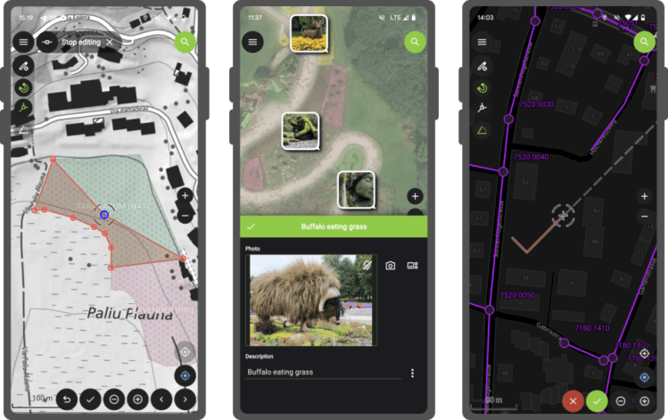

The launch of QField 3.0 was a big deal, but now we’re back to focusing on smaller, more frequent updates. Don’t let the shorter change log for 3.1 trick you – there are lots of cool new features in this update!
## Main highlights

One of the main improvements in this release is the brand-new functionality to enable **snapping to common angles** while digitizing. When enabled, the coordinate cursor will snap to configured angles alongside a visual guideline. This comes in handy when adding new geometries while surveying features with regular angles (e.g. buildings, parking lots, etc.). As QField gets more digitizing functionalities, we’ve taken the time to implement a nifty UI that collapses digitizing toggle buttons into a drawer,**leaving extra space for the map canvas** to shine through.
In addition, the vertex editor – one of QField’s most advanced geometry tools – received tons of love during this development cycle, focusing on improving its usability. Changes worth mentioning include:
  - A **new undo button allows users to revert individual vertex manipulations** in case of mistaken adjustment, which can save you from having to cancel a large set of ongoing manipulations;
  - The possibility to **select vertices using finger tapping on the screen** , dramatically improving the user experience;
  - Clearer on-screen markers to represent vertices and
  - Tons of bug fixes to the vertex editor itself, as well as the broader set of geometry tools.

It is now possible to **lock the** geometry of individual features within a single vector layer. While QField has long supported the concept of a locked geometry state for vector layers, that was until now a layer-wide toggle. With the new version of QField, a data-defined property can dictate whether a given feature geometry can be edited. Interested in **geofenced geometry editing**? We’ve got you covered 😉 This functionality requires the latest version of QFieldSync, which is available through QGIS’ plugin manager.
## Noticeably improvements
**Permission handling has been improved** across all platforms. On Android, QField now delays the permission request for camera, microphone, location, and Bluetooth access until needed. This makes for a much friendlier user experience.
QField 3.0 was one of the largest releases, with major changes in its underlying libraries, including a migration to Qt 6. With the community’s help, we have spent countless hours testing before release. However, it is never a bulletproof process, and that version came with a few noticeable regressions. In particular, camera handling on Android suffered from upstream issues with Qt. We’ve tracked as many of those as possible, making this new version much more stable. One lingering camera issue remains and will be fixed upstream in the next three weeks; we’ll update as soon as it is available.
Finally, long-time users of QField will notice improvements in how geometry highlights and digitizing rubber bands are drawn. We’ve doubled down on efforts to ensure that the digitized geometries and the coordinate cursor itself are always clearly visible, whether overlaid against the canvas’s light or dark parts.
We want to extend a heartfelt thank you to our sponsors for their generous support. If you’re inspired by the developments in QField and want to contribute, please consider [donating](<https://qfield.org/donate>). Your support will help us continue to innovate and improve this tool for everyone’s benefit.
### _Related_
