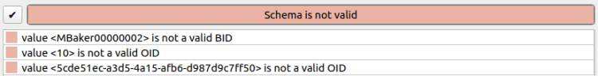
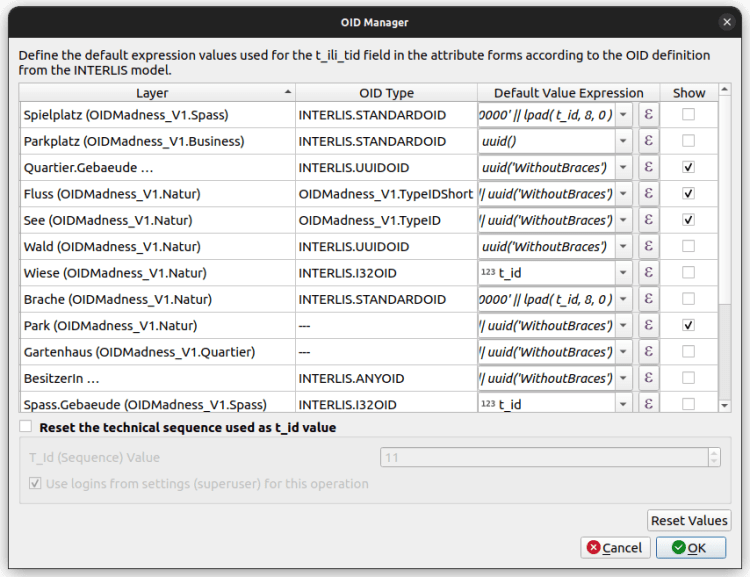

_****Letztes Jahr – pünktlich zu Weihnachten 2023 – ist[QGIS Model Baker Release 7.8](<https://github.com/opengisch/QgisModelBaker/releases/tag/v7.8.0>) erschienen. Dieser bietet dir ein optimiertes GUI, die Möglichkeit UsabILIty Toppings auf bestehende Datenquellen zu applizieren und die angenehme Handhabung von OIDs. Denn OIDs sind oft mühsam zu erfassen und können generell verwirren. In diesem Blogpost wird versucht, dieOIDs einfach zu erklären und zu zeigen, wie man sie in Model Baker verwalten kann.****_
## Probleme mit OIDs
Wenn du dich noch nie mit OIDs herumschlagen hast müssen, verwendet dein Umfeld entweder konsequent [UUID](<https://datatracker.ietf.org/doc/html/rfc4122>)s oder du bist anderweitig von der Fortuna gesegnet worden. Denn viele kennen diese Fehlermeldungen beim Validieren der Daten.

## Was sind denn genau OIDs?
Objekt-IDs (OID) sind systemübergreifend eindeutige Zeichenketten, die ein INTERLIS Objekt identifizieren. Damit lassen sich solche Objekte über verschiedene Stellen austauschen und updaten. Es gibt keine Konflikte, denn diese IDs sind einmalig.
In der Transferdatei ist die OID unter TID einsehbar (hier als Beispiel „chMBAKER00000100“)
    
    <City_V1.Constructions.Buildings TID="chMBAKER00000100"><Street>Rue des Fleures</Street><Number>1</Number></City_V1.Constructions.Buildings>
    
### Weshalb TID und nicht OID?
Eine OID ist im XTF eine TID, umgekehrt ist aber eine TID nicht zwingend eine OID. Denn man muss nicht unbedingt mit OIDs arbeiten. Eine XTF Datei funktioniert auch ohne OIDs, braucht aber TIDs für Referenzen etc. Wenn man keine OIDs benutzt, sind die TIDs einfach irgendwelche Nummern oder Zeichen. Die XTF Datei benutzt dann IDs, die zwar innerhalb der Datei konsistent sind, aber keine systemübergreifende Stabilität garantieren.
### Und was sind t_id und t_ili_tid?
Wenn mit ili2db aus einem INTERLIS Modell ein physisches Datenbankschema erstellt wird, findet man in den Tabellen immer eine Spalte `t_id` und meistens auch eine Spalte `t_ili_tid`. Die `t_ili_tid` entspricht der TID in der Transferdatei und somit der OID, sofern OIDs verwendet werden. Falls keine OIDs verwendet werden und so bei der Erfassung die `t_ili_tid` leer bleibt, dann wird bei einem Datenexport die `t_id` in die TID geschrieben, was dem oben genannten Fall entspricht, dass die XTF Datei zwar konsistente IDs hat, diese aber keine systemübergreifende Identifikatoren sind.
Denn die `t_id` ist bloss eine systeminterne Sequenz-Nummer. Sie startet bei 1 und wird hochgezählt für alle Objekte in dem spezifischen Schema. Diese `t_id` wird auch als Fremdschlüssel verwendet.
> Es gibt also eine systeminterne ID (`t_id`) und eine systemübergreifende ID`(t_ili_tid`). Dass nicht die `t_ili_tid` als Fremdschlüssel verwendet wird macht insofern Sinn, da zBs. Strukturen gar keine `t_ili_tid` haben können (keine OIDs), da es ja keine Struktur-Objekte gibt, sondern diese nur Bestandteile von Klassen-Objekten sind. Also haben sie keine eigene „Zeile“ im XTF und folglich keine TID. Ein weiterer Grund ist, dass `t_ili_tid`s aufgrund der OID-Spezifikation unterschiedlich sein können, was somit je nach Vererbungsstrategie in einer Fremdschlüsselspalte unterschiedliche Typen voraussetzen würde.
### Muss ich denn OIDs verwenden?
  
Sobald mehr als eine Stelle Daten sammelt und verwaltet, macht es Sinn mit OIDs zu arbeiten. Meistens hat man aber sowieso keine Wahl, sondern es werden im INTERLIS Modell die OIDs vorausgesetzt. Dazu dient eine Spezifizierung pro Topic oder pro Class.
    
    [...]
      TOPIC Constructions =
        BASKET OID AS INTERLIS.UUIDOID;
        OID AS INTERLIS.STANDARDOID;
    [...]
    
Das heisst also, dass du für jedes einzelne Objekt, das du erfasst, eine OID – in diesem Fall als UUID – eintragen musst. Das kann mühsam sein doch glücklicherweise gibt es in QGIS Standardwerte und mit dem neuesten Release von Model Baker werden diese auch bereits korrekt konfiguriert bzw. wenn nötig zur einfachen Nachkonfiguration aufgearbeitet.
## Arten von OIDs
Leider sind es nicht immer UUIDs. Im INTERLIS Modell können die OIDs in den folgenden Formaten vorausgesetzt werden:
  - UUIDOID
  - I32OID
  - STANDARDOID
  - ANYOID
  - Benutzerdefinierte OID

### `UUIDOID`
… Ist definiert als „OID TEXT*36“ und muss eine [UUID](<https://datatracker.ietf.org/doc/html/rfc4122>) sein. Obwohl die Wahrscheinlichkeit, dass eine UUID dupliziert wird, nicht Null ist, wird sie im Allgemeinen als nahe genug an Null betrachtet, um vernachlässigbar zu sein. Ich glaube mal gehört zu haben, dass eher ein Meteorit auf mein Haus stürzt, als dass ich einen UUID Konflikt erleben würde. Somit könnte man, hätte man dieses unwahrscheinliche Erlebnis, ja nur froh sein.
Anyway. Model Baker konfiguriert im QGIS Projekt den Standardwert für die `t_ili_tid` daher folgendermassen:
    
    uuid('WithoutBraces')
    
### `I32OID`
… Ist als `OID 0 ... 2147483647` definiert, was bedeutet, dass sie ein positiver 4-Byte-Integer-Wert sein muss.
Als Zähler nehmen wir den, der durch die `t_id` Sequenz in der Datenbank bereitgestellt wird.
Model Baker konfiguriert im QGIS Projekt den Standardwert für die `t_ili_tid` daher folgendermassen:
    
    t_id
    
#### `STANDARDOID`
… Ist definiert als `OID TEXT*16` und folgt einigen spezifischen Anforderungen.
Sie erfordert ein 8 Zeichen langes Präfix und ein 8 Zeichen langes Postfix:
  - **Präfix (2 + 6 Zeichen):** Länderkennung + ein  _globaler Identifikationsteil_. Der globale Identifikationsteil kann bei der [offiziellen Behörde](<https://www.interlis.ch/dienste/oid-bestellen>) bestellt werden.
  - **Postfix (8 Zeichen):** Sequenz (numerisch oder alphanumerisch) Ihres Systems als  _lokaler Identifikationsteil_.

Model Baker weiß nicht, was dein  _globaler Identifikationsteil_ ist und verwendet ein Platzhalter-Präfix `%change%`. Diesen Teil musst du mit deinem eigenen Präfix ersetzen.
Als  _lokalen Identifikationsteil_ schlägt Model Baker den Zähler vor, der durch die `t_id`-Sequenz in der Datenbank bereitgestellt wird.
Model Baker konfiguriert im QGIS Projekt den Standardwert für die `t_ili_tid` daher folgendermassen:
    
    '%change%' || lpad( T_Id, 8, 0 )
    
#### `ANYOID`
Die „ANYOID“ definiert kein Format für die OID, sondern nur, dass eine OID in allen erweiterten Modellen definiert werden muss.
#### Benutzerdefinierte OIDs und nicht definierte OIDs
Für benutzerdefinierte OIDs oder wenn OIDs nicht definiert sind, versucht Model Baker, etwas Vernünftiges vorzuschlagen.
Wenn es keine Definition mit OID AS gibt, geht ili2db von TEXT aus und daher müssen Identifier die Regeln des XML-ID-Typs erfüllen. Das heisst, das **erste Zeichen** muss ein **Buchstabe oder Unterstrich** sein, gefolgt von Buchstaben, Zahlen, Punkten, Minuszeichen, Unterstrichen; keine Doppelpunkte (!), siehe [www.w3.org/TR/REC-xml](<http://www.w3.org/TR/REC-xml>).
Model Baker konfiguriert im QGIS Projekt den Standardert für die `t_ili_tid` daher folgendermassen:
    
    '_' || uuid('WithoutBraces')
    
## Anpassung der Standardwerte
Das erkennen des OID Typs und das setzen der Default-Werte für die `t_ili_tid` Felder ist also die eine Funktionalität, die Model Baker mit dem neuen Release gekriegt hat. Doch ist es nun so, dass du einige dieser Default-Werte auch anpassen musst oder willst.
Damit du nicht mühsam in jede Layer-Konfiguration gehen musst, werden sie dir gesammelt und in einem GUI bereitgestellt.
Der **OID Manager** wird im Wizard beim Erstellen des QGIS Projektes miteinbezogen. Allerdings kannst du auch bereits erstellte Projekte nachkonfigurieren. Öffne den **OID Manager** einfach über das Menü  _Datenbank > Model Baker_.

Hier kannst du den gewohnten QGIS Expression Dialog verwenden, um den Default-Wert für das Feld `t_ili_tid` jedes Layers zu bearbeiten.
Um die `t_ili_tid` im Formular anzuzeigen, kannst du  _**Show**_ anwählen.
Wenn du einen Zähler brauchst, kannst du das oben beschriebene Feld `t_id` verwenden. Du kannst diese Sequenz auch zurücksetzten. Achte aber darauf, sie nicht niedriger zu setzen als die bereits in Ihrem Projekt vorhandenen `t_id`s. Siehe dazu auch die aufgeführten Limitierungen in der [Doku](<https://opengisch.github.io/QgisModelBaker/de/background_info/oid_tid_generator/#limitations>).
## Frohes Backen
Ich hoffe, das war einigermassen verständlich. Ansonsten check mal die [Doku](<https://opengisch.github.io/QgisModelBaker/background_info/oid_tid_generator/>). Fals dennoch Fragen oder Probleme bestehen, dann erfasse einen Issue auf <https://github.com/opengisch/QgisModelBaker/issues>
Ansonsten: Happy Baking! 🧁
### _Related_
