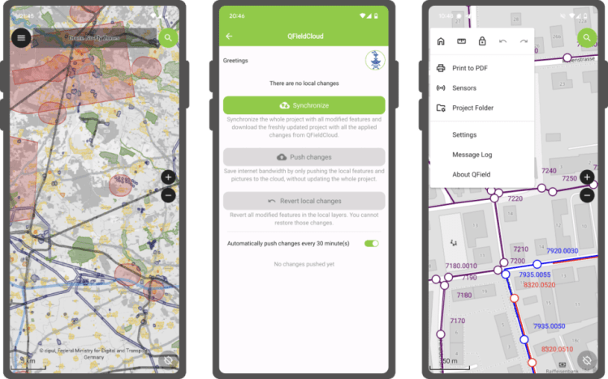
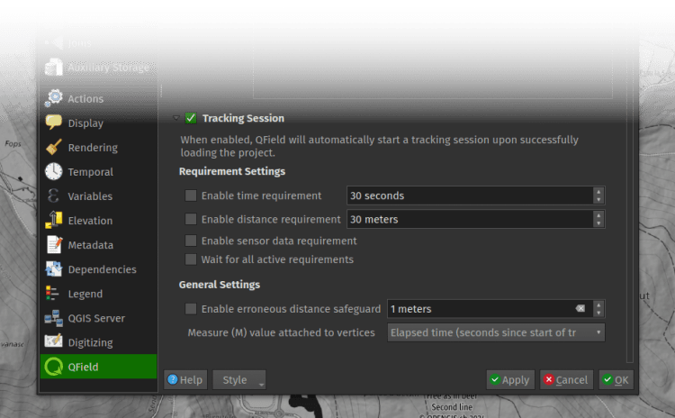

Focused on stability and usability improvements, most users will find something to celebrate in QField 3.2
## **Main highlights**

This new release introduces **project-defined tracking sessions, which are automatically activated when the project is loaded**. Defined while setting up and tweaking a project on QGIS, these sessions permit the automated tracking of device positions without taking any action in QField beyond opening the project itself. This liberates field users from remembering to launch a session on app launch and lowers the knowledge required to collect such data. For more details, please read the [relevant QField documentation section](<https://docs.qfield.org/how-to/tracking/#configure-a-project-tracking-session>).

As good as the above-described functionality sounds, it really shines through in cloud projects when paired with two other new featurs.
First, cloud projects can now automatically push accumulated changes at regular intervals. The functionality can be manually toggled for any cloud project by going to the synchronization panel in QField and activating the relevant toggle (see middle screenshot above). It can also be turned on project load by enabling automatic push when setting up the project in QGIS via the project properties dialog. When activated through this project setting, the functionality will always be activated, and the need for field users to take any action will be removed.
Pushing changes regularly is great, but it could easily have gotten in the way of blocking popups. This is why QField 3.2 can now push changes and synchronize cloud projects in the background. We still kept a ‘successfully pushed changes’ toast message to let you know the magic has happened 🚀
With all of the above, cloud projects on QField can now deliver near real-time tracking of devices in the field, all configured on one desktop machine and deployed through QFieldCloud. Thanks to [Groupements forestiers Québec](<https://groupementsforestiers.quebec/>) for sponsoring these enhancements.
Other noteworthy feature additions in this release include:
  - A **brand new undo/redo mechanism allows users to rollback feature addition, editing, and/or deletion** at will. The redesigned QField main menu is accessible by long pressing on the top-left dashboard button.
  - Support for projects‘ **titles and copyright map decorations as overlays** on top of the map canvas in QField allows projects to better convey attributions and additional context through informative titles.

## **Additional improvements**

The **QFieldCloud user experience continues to be improved**. In this release, we have reworked the visual feedback provided when downloading and synchronizing projects through the addition of a progress bar as well as additional details, such as the overall size of the files being fetched. In addition, a visual indicator has been added to the dashboard and the cloud projects list to alert users to the presence of a newer project file on the cloud for projects locally available on the device.
With that said, if you haven’t signed onto [QFieldCloud](<https://app.qfield.cloud/>) yet, try it! Psst, the community account is free 🤫
The **creation of relationship children during feature digitizing is now smoother** as we lifted the requirement to save a parent feature _before_ creating children. Users can now proceed in the order that feels most natural to them.
Finally, Android users will be happy to hear that a **significant rework of native camera, gallery, and file picker** activities has led to increased stability and much better integration with Android itself. Activities such as the gallery are now properly overlayed on top of the QField map canvas instead of showing a black screen.
### _Related_
