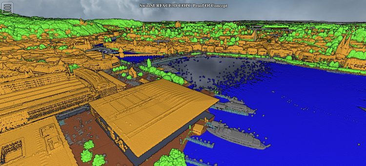

Cloud-optimized formats are changing how we handle geospatial data, making it easier to access and work with large datasets directly in the cloud. These formats reduce the need to download entire datasets, facilitating quicker and more focused data analysis and visualization. For those interested in the specifics of these advancements, our recent [Cloud Optimized Geospatial Formats – Status Report](</download.opengis.ch/Cloud_Optimized_Geospatial_Formats-Report.pdf>), offers an introduction into the topic, recommendations for usage and an overview of promising formats.
Within this project, we also released a sample of various tiles downloaded from [swissSURFACE3D](<https://www.swisstopo.admin.ch/de/hoehenmodell-swisssurface3d>) as a single cloud optimized point cloud file and made it accessible also via a [potree powered web viewer](<https://copc-swisssurface3d.sos-ch-dk-2.exo.io/copc-poc/index.html>) that demonstrates how one single file can be used for visualization in the web and making accessible for applications like QGIS and QField via the direct access URL .

I would like to thank [GeoStandards.ch](<https://geostandards.ch/>) and [SGS](<https://www.kgk-cgc.ch/koordination/sgs>) to allow us working on this.
We’re keen to hear from you as well. Please share your experiences or additional insights and formats in the comments.
### _Related_
