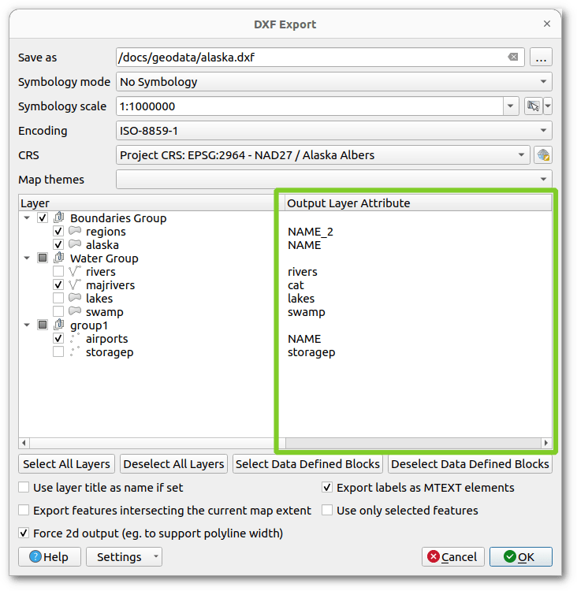
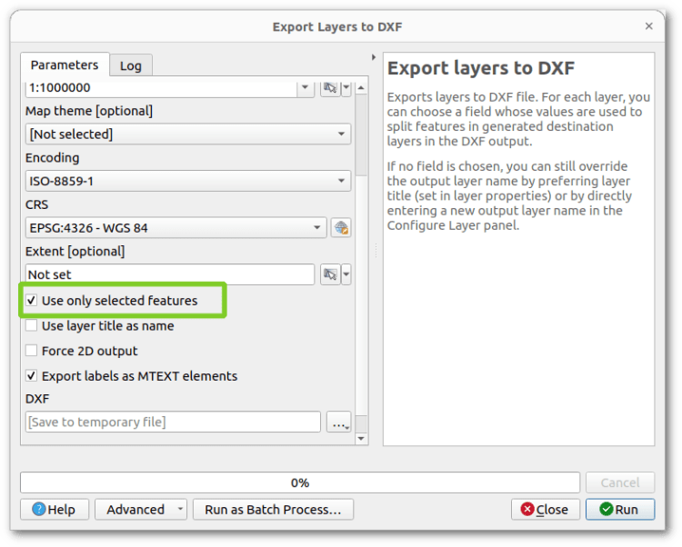
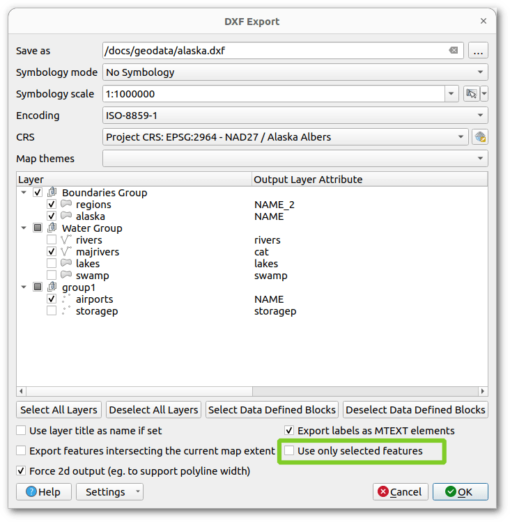

At OPENGIS.CH, we’ve been working lately on improving the **DXF Export** QGIS functionality for the upcoming release 3.38. In the meantime, we’ve also added nice UX enhancements for making it easier and much more powerful to use!
Let’s see a short review.
### DXF Export app dialog and processing algorithm harmonized
You can use either the [app dialog](<https://docs.qgis.org/latest/en/docs/user_manual/managing_data_source/create_layers.html#creating-new-dxf-files>) or the [processing algorithm](<https://docs.qgis.org/latest/en/docs/user_manual/processing_algs/qgis/vectorgeneral.html#export-layers-to-dxf>), both of them offer you equivalent functionality. They are now completely harmonized!
### Export settings can now be exported to an XML file
You can now have multiple settings per project available in XML, making it possible to reuse them in your workflows or share them with colleagues.
Load DXF settings from XML.
### All settings are now well remembered between dialog sessions
QGIS users told us there were some dialog options that were not remembered between QGIS sessions and had to be reconfigured each time. That’s no longer the case, making it easier to reuse previous choices.
### “Output layer attribute” column is now always visible in the DXF Export layer tree
We’ve made sure that you won’t miss it anymore.

### Possibility to export only the current map selection
Filter features to be exported via layer selection, and even combine this filter with the existing _map extent_ one.
 
### Empty layers are no longer exported to DXF
When applying spatial filters like feature selection and map extent, you might end up with empty layers to be exported. Well, those won’t be exported anymore, producing cleaner DXF output files for you.
### Possibility to override the export name of individual layers
It’s often the case where your layer names are not clean and tidy to be displayed. From now on, you can easily specify how your output DXF layers should be named, without altering your original project layers.
Override output layer names for DXF export.
We’ve also fixed some minor UX bugs and annoyances that were present when exporting layers to DXF format, so that we can enjoy using it. Happy DXF exporting!
We would like to thank the Swiss QGIS user group for giving us the possibility to improve the important DXF part of QGIS 🚀🚀🚀



[https://videopress.com/embed/Bil3Kbew](<https://videopress.com/embed/Bil3Kbew>)



[https://videopress.com/embed/IPjIkQxv](<https://videopress.com/embed/IPjIkQxv>)

### _Related_
