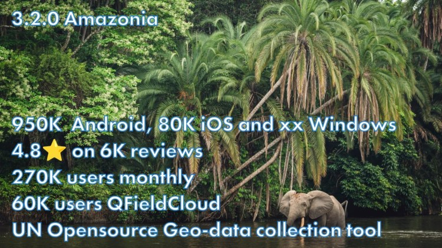
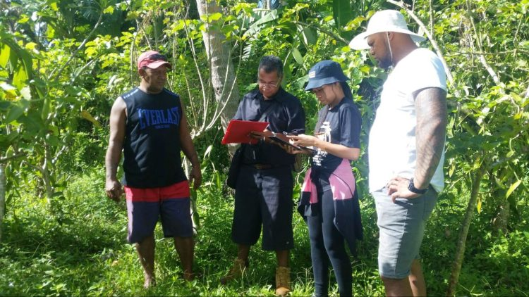
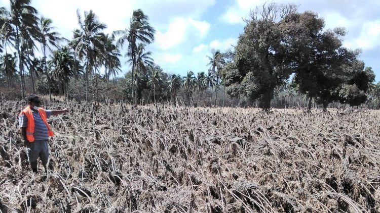
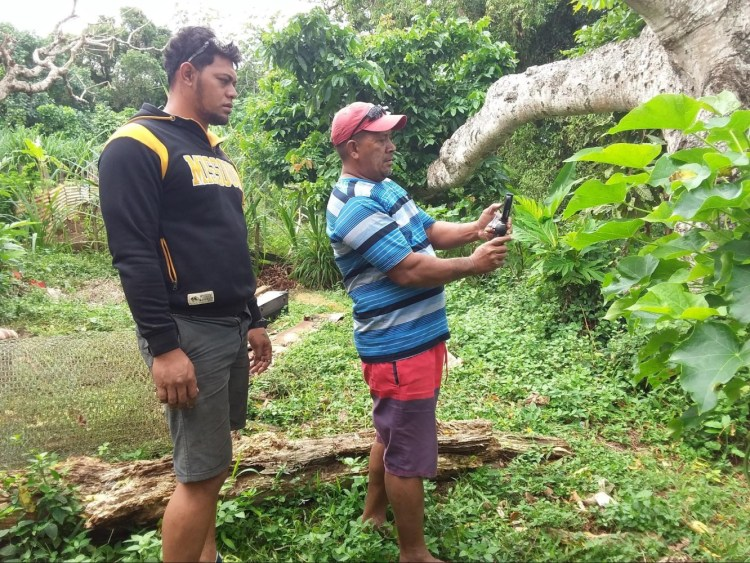
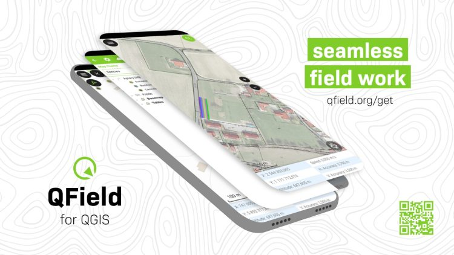
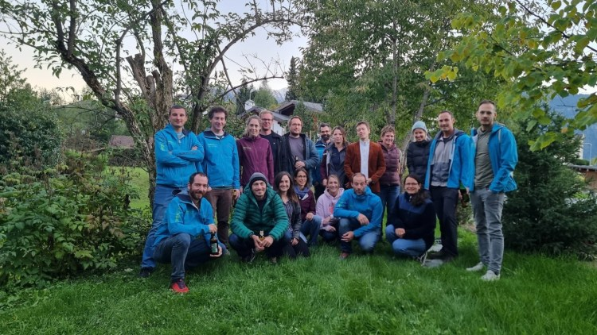

**We are thrilled to announce that the**[Best of Swiss Apps](<https://www.linkedin.com/company/best-of-swiss-apps/>)**Enterprise winner 2022, QField, has been officially recognized as a Digital Public Good by the UN-endorsed**[Digital Public Goods Alliance](<https://digitalpublicgoods.net/>)**. This prestigious recognition highlights QField’s significant contributions to six key Sustainable Development Goals (SDGs): SDG 6 (Clean Water and Sanitation), SDG 9 (Industry, Innovation, and Infrastructure), SDG 11 (Sustainable Cities and Communities), SDG 13 (Climate Action), SDG 15 (Life on Land), and SDG 16 (Peace, Justice, and Strong Institutions). The “Swiss Made Software” QField is the leading fieldwork application with almost 1 Million downloads worldwide.**
### Leading the Way in Fieldwork Technology
QField stands out as the leading fieldwork app, designed to bring the power of geospatial data collection and management to the fingertips of users worldwide. Developed with a user-centric approach, QField allows seamless integration with [QGIS](<https://qgis.org/>), providing a robust and intuitive platform for data collection, visualization, and analysis directly in the field. This recognition as a Digital Public Good underscores QField’s vital role in advancing digital solutions for sustainable development.
QField 3.2 Statistics
### Accessible for Everyone
One of QField’s key strengths is its ease of use, making it accessible not only to professionals but also to students, researchers, and community members. Its intuitive interface ensures that users with varying levels of technical expertise can efficiently collect and manage geospatial data. This inclusivity promotes wider adoption and engagement, enhancing the app’s impact across different sectors and communities.
Land surveying project Tonga
### Exemplary Open Source Project
At the heart of QField’s success is its commitment to technological excellence and open-source principles. As an exemplary open-source project, QField fosters a collaborative environment where developers and users alike contribute to continuous improvement and innovation. QField frequently contributes back to its upstream project, QGIS, ensuring mutual growth and enhancement of both platforms. This community-driven approach not only enhances the app’s functionality but also ensures that it remains accessible and adaptable to diverse needs across the globe.
### Supporting Sustainable Development Goals
QField’s capabilities extend beyond just one aspect of the United Nations Sustainable Development Goals (SDGs); they intersect with multiple goals, enhancing efforts towards a sustainable future:
  - **SDG 6: Clean Water and Sanitation** : QField facilitates efficient water quality monitoring and management, ensuring communities have access to clean and safe water.
  - **SDG 9: Industry, Innovation, and Infrastructure** : By providing cutting-edge tools for infrastructure planning and development, QField drives innovation in various industries.
  - **SDG 11: Sustainable Cities and Communities** : QField supports urban planning and sustainable development, contributing to the creation of resilient and inclusive cities.
  - **SDG 13: Climate Action** : The app enables precise data collection for climate research and environmental monitoring, aiding in climate action initiatives.
  - **SDG 15: Life on Land** : QField aids in biodiversity assessments and conservation efforts, promoting the sustainable use of terrestrial ecosystems.
  - **SDG 16: Peace, Justice, and Strong Institutions** : Through its reliable and transparent data management capabilities, QField supports the development of strong institutions and governance systems.

Post-disaster assessment Tonga
### A Future of Innovation and Sustainability
As we celebrate this recognition, we remain committed to pushing the boundaries of what is possible in fieldwork technology. QField will continue to evolve, driven by the needs of its global user base and the imperative to support sustainable development. We invite all stakeholders to join us on this journey towards a more sustainable and equitable future.
Land surveying project Tonga
For more information about QField and its contributions to the SDGs, please visit <https://qfield.org/sdgs.html>
### Media Contact:
Marco Bernasocchi is happy to receive interview requests or queries about the project.   
**Email:** [marco@opengis.ch](<mailto:marco@opengis.ch>)  
**Phone** : +41 79 467 24 70 (14:00 – 18:00 CET) 
[OPENGIS.ch](</index.html>) GmbH   
Via Geinas 2   
CH-7031 Laax
* * *
### About the OPENGIS.ch product „QField“ application
[QField](<https://qfield.org/>) is an open-source fieldwork app that integrates seamlessly with #QGIS, providing a powerful platform for data collection, visualization, and analysis. Designed for professionals across various sectors, QField empowers users to efficiently manage and analyze geospatial data in the field, contributing to sustainable development and innovation worldwide. Link: [https://qfield.org](<https://qfield.org/>)

### About the OPENGIS.ch service QFieldCloud
#QFieldCloud is a spatial cloud service integrated in #QField that allows remote provisioning and synchronisation of geodata and projects. Although „QFieldCloud“ is still in an advanced beta stage, it is already being used by many groups to significantly improve their workflows. Link: [https://qfield.cloud](<https://qfield.cloud/>)
### About OPENGIS.ch:
[OPENGIS.ch](<https://www.linkedin.com/company/opengisch/>) GmbH is a Swiss software development company based in Laax. [OPENGIS.ch](</index.html>) employs 19 people and works mainly in the field of spatial software development, geodata infrastructure deployments and professional support. Personalised open-source GIS solutions are often planned and developed as desktop or mobile applications. [OPENGIS.ch](</index.html>) finances itself through tailor-made customer solutions, professional support and adaptations. Link: [https://opengis.ch](</index.html>)
OPENGIS.ch
### About Digital Public Goods Alliance (DPGA)
The [Digital Public Goods Alliance](<https://www.linkedin.com/company/dpgalliance/>) is a multi-stakeholder initiative endorsed by the United Nations Secretary-General, working to accelerate the attainment of the Sustainable Development Goals in low- and middle-income countries by facilitating the discovery, development, use of, and investment in digital public goods.
For more information on the Digital Public Goods Alliance please reach out to [hello@digitalpublicgoods.net](<mailto:hello@digitalpublicgoods.net>).
* * *
Images for editorial purposes are freely available for download if the copyright [©OPENGIS.ch](<http://xn--opengis-nja.ch/>) is mentioned: [https://download.opengis.ch/2024_qfield_sdgs_images.zip](</download.opengis.ch/2024_qfield_sdgs_images.zip>)
### _Related_
