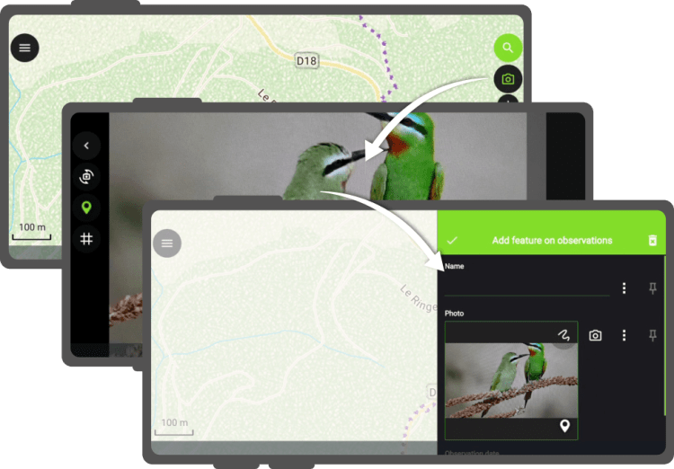
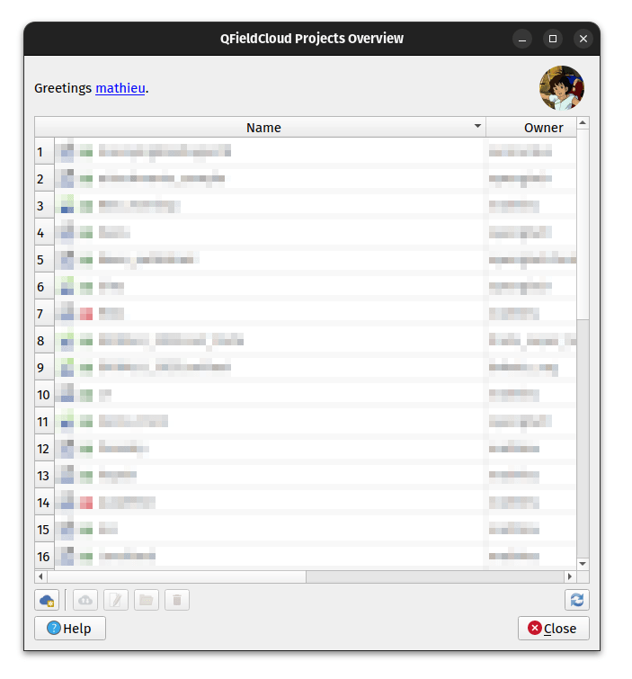
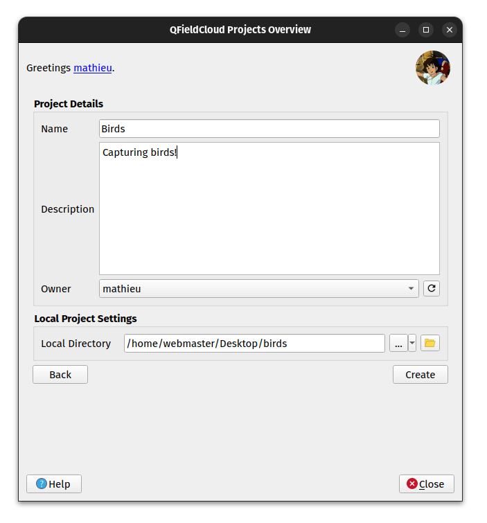
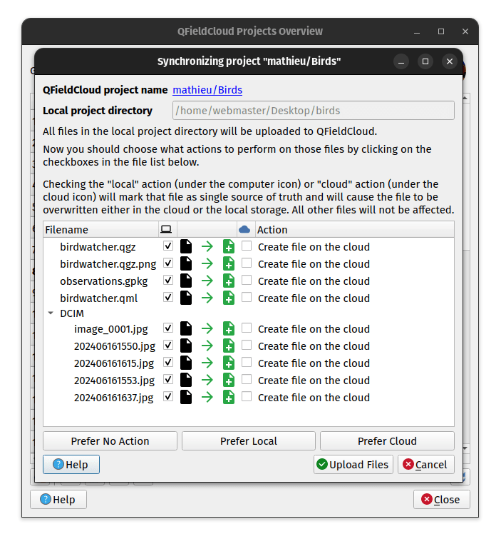
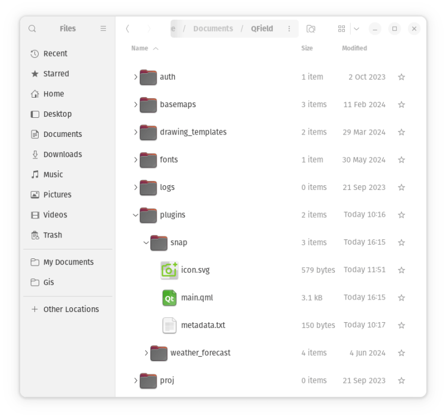
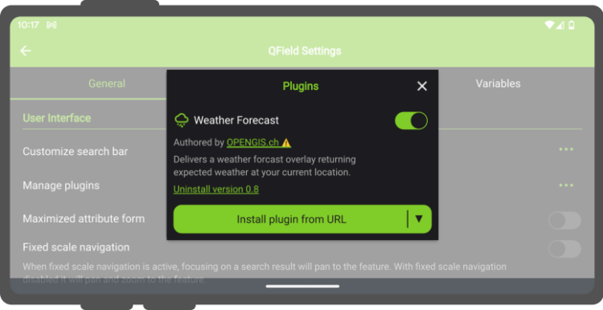

_This blog post will introduce QField’s brand new plugin framework and walk through the creation of a plugin to support bird watchers in need of a quick way to digitize photos of spotted birds onto a point vector layer._
QField Plugin [Snap!](<https://github.com/opengisch/qfield-snap>) in action
## A plugin framework is born!
As [announced recently](</11/qfield-3-3-darien-it-is-just-the-beginning/index.html>), QField now empowers users through a brand new [plugin framework](<https://docs.qfield.org/how-to/plugins/>) allowing for simple customization on the way the application behaves or looks all the way through to creating completely new functionalities.
The plugin framework relies on [Qt’s QML engine and JavaScript](<https://doc.qt.io/qt-6/qmlreference.html>), allowing for cross-platform support out of the box. This means that plugins will run perfectly fine on all platforms currently supported by QField: Android, iOS, Windows, Linux, and macOS.
## App-wide plugin vs. project plugin
First, let’s look at the two types of plugins supported by QField: app-wide plugins and project plugins. As their names imply, the main difference is their scope. An enabled app-wide plugin will remain active as long as QField is running, while project plugins are activated on project load and deactivated when the project tied to the plugin is closed.
Project plugins are shipped alongside a given project file (`.qgs`/`.qgz`). Project plugins must share the same name of the project file with a `.qml` extension. For example, if your project file is `birdwatcher.qgz`, QField will look for the presence of a` birdwatcher.qml `to activate the project plugin. For app-wide plugins, installation is done via the plugins manager popup; more on this below.
Distribution of project plugins can be greatly facilitated through [QFieldCloud](<https://qfield.cloud/>). The presence of project plugins within a cloud project environment will be automatically detected and packaged alongside the project file and its datasets when deployed to QField devices.
## Starting with a project plugin
We will start with looking into a simple project plugin that offers a new digitizing mechanism focused on snapping photos as a trigger for point feature addition. This plugin will demonstrate how new functionalities and behaviors can be added to QField to serve specific needs. In this case, the new digitizing mechanism could come in handy for bird watchers and other users in need of a quick way to snap photos!
It’s advised to download a version of QField running on your desktop environment while testing plugins. Links to [Windows, Linux, and macOS builds are available here](<https://docs.qfield.org/get-started/>). Once installed, [download this project archive containing a tiny birdwatcher sample project](<https://github.com/opengisch/qfield-snap/releases/download/v1.0/qfield-snap-sample-project.zip>) and extract it into a new directory on your local machine.
The project archive consists of a point vector layer (`observations.gpkg`), a project file (`birdwatcher.qgz`) as well as a project plugin (`birdwatcher.qml`) which we will look into below. Please note that the point vector layer’s attribute form is already configured to display captured photos. We will not spend time on attribute form setup in this post; [see this relevant documentation page](<https://docs.qfield.org/how-to/attributes-form/#configure-attachment-widget>) if you are interested in knowing how that was achieved.

We can now test the project plugin by opening the project (`birdwatcher.qgz`) in QField. Users familiar with QField will notice a new ‘camera’ tool button present on the top-right corner of the map canvas. This button was added by the project plugin. You can press on it, to open the QField camera, take a photo (of yourself, a random object on your table, or with a bit of luck a bird), and witness how that leads to a point feature creation.
## Digging into the project plugin file
Let’s open the project plugin file (birdwatcher.qml) in your favorite text editor. The first few lines define the QML imports needed by the plugin:
    
    import QtQuick
    import QtQuick.Controls
    
    import org.qfield
    import org.qgis
    import Theme
    
    import "qrc:/qml" as QFieldItems
Beyond the two QtQuick imports, we will make use of QField-specific types and items as well as QGIS ones ([registered and declared in this source file](<https://github.com/opengisch/QField/blob/master/src/core/qgismobileapp.cpp#L362>)), a Theme to retrieve icons and colors as well as QField items such as tool buttons ([see this source directory](<https://github.com/opengisch/QField/tree/master/src/qml/imports/Theme>)), as well as the QField QML items embedded into the application itself to make use of the camera.
The next line declares an generic Item component which will be used by QField to initiate the plugin. This must be present in all plugins. As this plugin does, you can use the `Component.onCompleted` signal to trigger code execution. In this case, we are using iface to add a tool button on top of the map canvas:
    
    Component.onCompleted: {
      iface.addItemToPluginsToolbar(snapButton)
    }
Just above these lines, the plugin declare a number of properties pointing to items found in the main QField ApplicationWindow:
    
    property var mainWindow: iface.mainWindow()
    property var positionSource: iface.findItemByObjectName('positionSource')
    property var dashBoard: iface.findItemByObjectName('dashBoard')
    property var overlayFeatureFormDrawer: iface.findItemByObjectName('overlayFeatureFormDrawer')
Users can reach through to any items within [QField’s ApplicationWindow](<https://github.com/opengisch/QField/blob/master/src/qml/qgismobileapp.qml>) provided they have an objectName property defined. The string value is used in the `iface.findItemByObjectName()` function to retrieve the item.
The rest of the file consists of a loader to activate the QField camera, a tool button to snap a photo, and a function to create a new feature within which the current position is used as geometry and the snapped photo is attached to the feature form.
The function itself provides a good example of what can be achieved by using the parts of QGIS exposed through QML, as well as utility functions and user interface provided by QField:
    
    function snap(path) {
      let today = new Date()
      let relativePath = 'DCIM/' + today.getFullYear()
                                  + (today.getMonth() +1 ).toString().padStart(2,0)
                                  + today.getDate().toString().padStart(2,0)
                                  + today.getHours().toString().padStart(2,0)
                                  + today.getMinutes().toString().padStart(2,0)
                                  + today.getSeconds().toString().padStart(2,0)
                                  + '.' + FileUtils.fileSuffix(path)
      platformUtilities.renameFile(path, qgisProject.homePath + '/' + relativePath)
      
      let pos = positionSource.projectedPosition
      let wkt = 'POINT(' + pos.x + ' ' + pos.y + ')'
      
      let geometry = GeometryUtils.createGeometryFromWkt(wkt)
      let feature = FeatureUtils.createFeature(dashBoard.activeLayer, geometry)
          
      let fieldNames = feature.fields.names
      if (fieldNames.indexOf('photo') > -1) {
        feature.setAttribute(fieldNames.indexOf('photo'), relativePath)
      } else if (fieldNames.indexOf('picture') > -1) {
        feature.setAttribute(fieldNames.indexOf('picture'), relativePath)
      }
    
      overlayFeatureFormDrawer.featureModel.feature = feature
      overlayFeatureFormDrawer.state = 'Add'
      overlayFeatureFormDrawer.open()
    }
The QGIS API Documentation site is a good resource for learning what parts of the many QGIS classes are exposed to QML. For example, the [QgsFeature documentation page ](<https://api.qgis.org/api/classQgsFeature.html>)contains a Properties section and a Q_INVOKABLE prefix next to functions indicating their availability within a QML/JavaScript environment.
## Deployment of a project plugin via QFieldCloud
As mentioned above, QFieldCloud greatly eases the deployment of project plugins to devices in the field. We will now go through the steps required to create a cloud project environment based on the birdwatcher sample project, and witness it handling the project plugin automatically.
This will require you to registered for a freely available QFieldCloud community account if you haven’t done so yet ([it takes a minute to do so](<https://app.qfield.cloud/accounts/signup/>), what are you waiting for 😉 ). We will also need the QFieldSync plugin in QGIS, which can be enabled through the QGIS plugin manager.
Let’s open QGIS, and log into QFieldCloud by clicking on the QFieldSync toolbar’s blue cloud icon. Once logged in, click on the ‘Create New Project’ tool button found at the bottom of the dialog.

In the subsequent panel dialog, choose the ‘Create a new empty QFieldCloud project’ and then hit the ‘Next’ button. Give it a name and a description, and for the local directory, pick the folder within which you had extracted the birdwatcher project, then hit the ‘Create’ button.

QFieldSync will then ask you to upload your newly created cloud project environment to the server. Notice how the project plugin file (birdwatcher.qml) is part of the files to be delivered to the cloud. Confirm by clicking on the ‘Upload to server’ button.

When QFieldSync is finished uploading, you are ready to take your mobile device, open QField, log into your QFieldCloud account and download the cloud project. Once the cloud project is loaded, you will be asked for permission to load the project plugin, which you can grant on a permanent or one-time basis.
Bravo! You have successfully deployed a project plugin through QFieldCloud.
## Creating an app-wide plugin directory
Let’s move on to creating a functional app-wide plugin directory. [Download this sample app-wide plugin](<https://github.com/opengisch/qfield-snap/releases/download/v1.0/qfield-snap-plugin.zip>) and extract it into a new directory placed in the ‘plugins’ directory, itself found within the QField app directory. The location of the app directory is provided in the ‘About QField’ overlay, take note of it prior to extracting the plugin if you have not done so yet.

As seen in the screenshot above, which demonstrates the directory hierarchy, a given plugin directory must contain at least two files: a main.qml file, which QField will use to activate the plugin, and a metadata.txt file containing basic information on the plugin, such as the plugin name, author details, and version.
Here’s a sample metadata.txt from the birdwatcher project plugin upgraded into an app-wide plugin:
    
    [general]
    name=Snap!
    description=Digitize points through snapping photos
    author=OPENGIS.ch
    icon=icon.svg
    version=1.0
    homepage=https://www.opengis.ch/
Opening main.qml in your favourite text editor will reveal that it has the exact same content as the above-shared project plugin. The only change is the renaming of birdwatcher.qml to main.qml to take into account this plugin’s app-wide scope.
PSA: we have setup this [GitHub QField template plugin repository](<https://github.com/opengisch/qfield-template-plugin>) to ease creation of plugins. Fork at will!
## Deploying app-wide plugins
While currently not as smooth as deploying a project plugin through QFieldCloud, app-wide plugins can be installed onto devices using a URL pointing to a zipped archive file containing the content of a given plugin directory. The zipped archive file can then be hosted on your own website, on a GitHub or GitLab repository, a Dropbox link, etc.
In QField, open the plugins manager popup found in the settings panel, and use the ‘Install plugin from URL’ button to paste a URL pointing to a zipped plugin file.

You should keep the zipped archive file name consistent for a better user experience, as it is used to determine the installation directory. This is an important consideration to take into account when offering plugin updates. If your zipped plugin file name changes, the plugin will not be updated but rather added to a new directory alongside the previously installed plugin.
QField does allow for a version tag to be added to a zipped archive file name, provided it is appended at the end of the file name, preceded by a dash, and includes only numbers and dots. For example, myplugin-0.0.1.zip and myplugin-0.2.1.zip will install the plugin in the myplugin directory.
## Empowering users as well as developers
Here at OPENGIS.ch, we believe this new plugin framework empowers not only users but also developers, including our very own ninjas! With plugin support, we now have the possibility to develop answers to specific field scenarios that would not necessarily be fit for QField-wide functionalities. We would love to hear your opinion and ideas. 
If you would like to supercharge your fieldwork and need some help, do not hesitate to [contact us](</index.html#contact>) – your projects are our passion 💚
P.S. If you are developing a cool QField plugin, also let us know! 🙂  

    
    Bird SVG in video CC-BY <https://svgrepo.com/svg/417419/bird>



[https://videopress.com/embed/2EEGokQ2](<https://videopress.com/embed/2EEGokQ2>)

### _Related_
