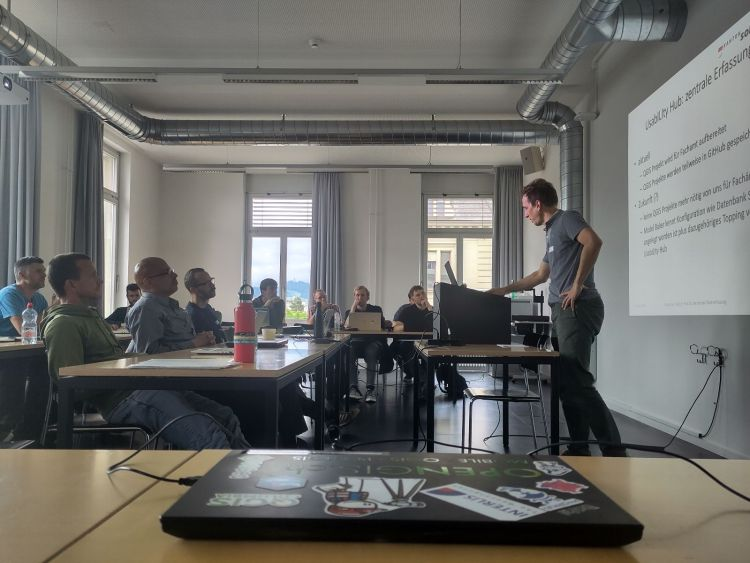

Pendant la pandémie, nous avons remarqué à quel point le travail à distance pouvait être efficace, à quel point les visioconférences pouvaient être productives et à quel point les webinaires fonctionnaient bien. Au sein d’OPENGIS.ch, ce n’était pas une nouveauté car nous travaillions déjà à 100% à distance. Mais ce qui nous a vraiment manqué, comme la plupart des gens dans notre secteur, c’était de rencontrer les parties prenantes en personne, de se réunir, de réseauter et d’échanger des idées sur un sujet commun. Pas lors de réunions planifiées, mais dans des discussions ouvertes, autour d’un café, sur le chemin des toilettes, en prenant l’air ou lors d’une bière après le travail au soleil. Nous sommes donc très heureux que la Journée des utilisateurs QGIS Suisse ait eu lieu pour la deuxième fois depuis lors, la semaine dernière.
OPENGIS.ch s’est investi dans QGIS depuis sa création, en fait même avant; notre PDG Marco a commencé à travailler avec QGIS 0.6 en 2004 et notre CTO Matthias avec la version 1.7 en 2012. Et depuis 2019, nous sommes l’entreprise avec le plus grand nombre de contributeurs core de QGIS. Nous pouvons définitivement dire qu’OPENGIS.ch a été l’un des principaux moteurs de l’adoption massive de QGIS en Suisse et dans le monde.

En termes de contribution au code de QGIS, nous sommes de loin l’entreprise la plus prolifique en Suisse et la deuxième au monde, juste derrière North Road Consulting. De plus, nous avons été la première – et sommes toujours l’une des deux seules – entreprises à [soutenir QGIS.org à un niveau _Large_](<https://qgis.org/fr/site/about/sustaining_members.html>) depuis 2021.
Cela nous rend très fiers et c’est pourquoi nous sommes encore plus heureux de voir à quel point ce qui se passe autour de QGIS en Suisse s’aligne avec les visions et les objectifs que nous nous sommes fixés il y a des années.

La journée a commencé par une présentation de notre CTO Matthias Kuhn « Quoi de neuf dans QGIS » mettant en avant de nombreux travaux sponsorisés par le Groupe d’utilisateurs suisse. Les améliorations de DXF, la sortie de SwissLocator 3.0 avec l’intégration de swissalti3d et des tuiles vectorielles, ainsi qu’une mise à jour sur les avancements dans la gestion des arcs de cercle dans QGIS, une condition préalable à la gestion correcte des données de la mensuration officielle en Suisse, étaient quelques-uns des points forts.
Le highlight secret de la présentation de Matthias était une meilleure intégration des API OGC dans QGIS, qui a également été soulignée dans une présentation ultérieure sur Kablo, montrant comment la prochaine génération des modules métier pourrait être mise en œuvre.
    
    Slides: [Neues aus der QGIS Welt - QGIS Anwendertag 2024](<https://docs.google.com/presentation/d/1ITN71d_Otv3e0DH63Muod9kpdE1FMd-wRmSPUVO-1Yg/edit?usp=sharing>)
Ensuite, une courte présentation sur le projet DMAV (Modèle de géodonnées de la mensuration officielle) a eu lieu, où Christoph Lauber a présenté un projet visant à mettre en œuvre un module métier pour la mensuration officielle avec QGIS. Quelle coïncidence…
Adrian Wicki de l’Office fédéral de l’environnement (OFEV) et Isabel ont présenté comment OPENGIS.ch et les partenaires Puzzle et Zeilenwerk aident l’OFEV avec le projet SAM à évaluer les dangers des inondations, des incendies de forêt ou des glissements de terrain, et à avertir les autorités et la population. Grâce à une organisation de projet agile, ce projet complexe réussit à répondre aux exigences en appliquant des concepts de développement centrés sur l’utilisateur. QGIS est utilisé pour visualiser et analyser les données et aider les prévisionnistes à obtenir des informations sur la situation actuelle.
    
    Slides: [BAFU_SAM](<https://docs.google.com/presentation/d/18bGeUzrVw7g58VxKrdLuAhTVt-BEYMpTvIDVTp4ZMJY/edit?usp=sharing>)
Andreas Neumann de l’ETH Zurich et Michael ont présenté le projet qgis-js au Groupe d’utilisateurs QGIS Suisse. qgis-js est un effort pour porter le noyau de QGIS sur WebAssembly afin qu’il puisse être exécuté dans un navigateur web. Bien que le projet en soit encore à la phase expérimentale, il a un grand potentiel pour exploiter de nouveaux cas d’utilisation intéressants qui n’étaient même pas envisageables auparavant.
    
    Slides: <https://boardend.github.io/qgis-js-demo/> 
Olivier Monod de la ville d’Yverdon a présenté [Kablo](<https://kablo.ch/>), un projet pilote de gestion de l’électricité de nouvelle génération développé en collaboration avec OPENGIS.ch. En appliquant un middleware basé sur les API OGC et Django, Kablo montre comment surmonter les limitations courantes des modules métier actuels (comme la gestion des autorisations et les opérations atomiques) et comment les solutions desktop et web peuvent être couplées plus fortement.
    
    Slides: [kablo-qgis-user-days](<https://docs.google.com/presentation/d/1PQx48mr33cJcppWhoswofSj0zxGpHmncsjj24OtUCtI/edit?usp=sharing>)
Évidemment, il n’y avait pas qu’OPENGIS.ch. Sandro Mani de Sourcepole a présenté les dernières améliorations sur [QWC2](<https://github.com/qgis/qwc2>), comme l’intégration de Street View et de nouvelles fonctionnalités utiles de QGIS dans un beau SIG web. Andreas Schmid du canton de Soleure a présenté à quel point le Cloud optimized GeoTIFF (COG) peut être pratique, mais aussi quels défis il peut amener du point de vue de l’infrastructure. Intéressé par le sujet ? Lisez [notre rapport](</04/09/cloud-optimized-geospatial-formats/index.html>) sur les formats optimisés pour le cloud. Mattia Panduri du canton du Tessin a expliqué comment QGIS a été utilisé pour harmoniser l’ensemble des données des bâtiments cantonaux. Et Timothée Produit d’IG Group SA a présenté comment pic2map aide à apporter des photos sur les cartes.
Pour conclure la matinée, Nyall Dawson de North Road Consulting a fait une session en direct depuis l’autre bout du monde pour montrer les derniers développements sur le filtrage de données d’altitude dans QGIS.
La journée a continué au travers d’ateliers. Claas Leiner a dirigé un atelier sur les expressions QGIS tandis que Matthias et Michael ont montré comment exploiter les outils de traitement QGIS pour construire des flux de traitement de données géospatiales. 
Dans la troisième salle, la première réunion des utilisateurs de [QGIS Model Baker](<https://modelbaker.ch/>) a eu lieu, où nous avons discuté de cet outil fantastique que nous avons développé pour rendre le travail avec INTERLIS plus intuitif et plus productif.

Ce fut une Journée des utilisateurs QGIS Suisse très riche et constructive. Nous sommes rentrés chez nous forts de nouvelles idées et avec un sentiment d’accomplissement en voyant à quel point notre communauté est devenue importante.
Un grand merci au comité du groupe et à toutes les personnes qui ont contribué à rendre cet événement possible. Seule la bière au soleil a été littéralement arrosée par la pluie. Néanmoins, il y a eu des discussions passionnantes au bistrot de la gare ou dans les wagons-restaurants sur le chemin du retour.
Nous vous disons à la prochaine fois, et d’ici là, continuez à aider à améliorer QGIS et sa communauté.
Nous remercions toutes les personnes qui ont contribué à façonner QGIS au fil des ans, ensemble nous continuerons à faire de notre mieux pour les années à venir 🙂
### _Related_
