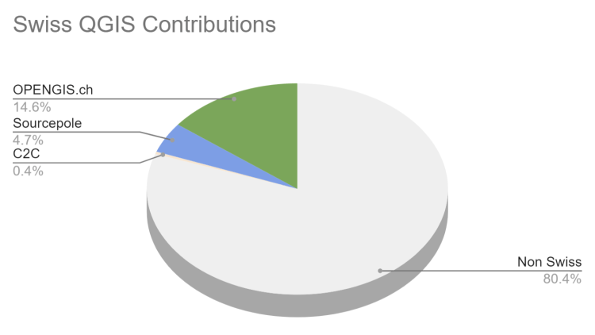
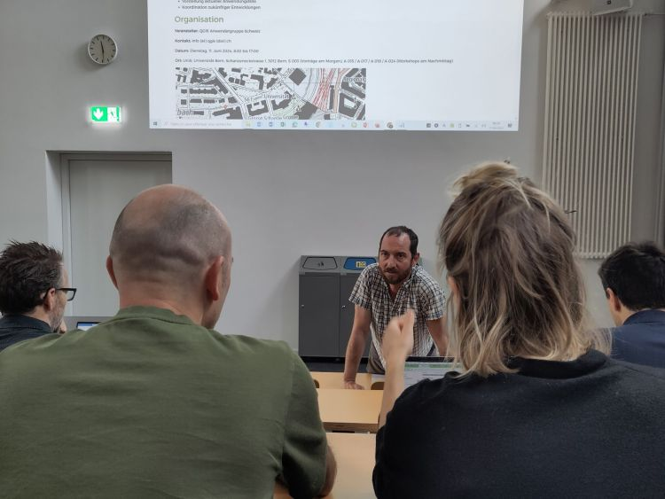

During the pandemic, people noticed how well they could work remotely, how productive meetings via video call could be, and how well webinars worked. At OPENGIS.ch, this wasn’t news because we have always been 100% remote. However, we missed the unplanned, in-person interactions that occur during meetups with a 🍺or ☕. That’s why we’re very pleased that last week we could join the Swiss QGIS user day for the second time after the pandemic.
OPENGIS.ch has been invested in QGIS since its inception in 2014, actually even before; our CEO Marco started working with QGIS 0.6 in 2004 and our CTO Matthias with version 1.7 in 2012. Since 2019, we have also been the company with the most core committers. We can definitely say that OPENGIS.ch has been one of the main driving forces behind the large adoption of QGIS in Switzerland and worldwide. 
Contributions to the QGIS core measured in commit numbers
Looking at the work done in the QGIS code we’re by far the most prolific company in Switzerland and second worldwide only to North Road Consulting. On top of it, we were the first – and still only one of two- companies to [sustain QGIS.org at a Large level](<https://qgis.org/en/site/about/sustaining_members.html>) since 2021.
This makes us very proud and it is why we’re even happier to see how much that is happening around QGIS in Switzerland aligns with the visions and goals we set out to reach years ago.
The morning started with a presentation by our CTO Matthias “What’s new in QGIS” featuring plenty of work sponsored by the Anwendergruppe CH.
Our CTO Matthias answering QGIS questions
DXF Improvements, the release of SwissLocator 3.0 with swissalti3d and vector tiles integration, and an update on the advances towards solid curve handling in QGIS, a prerequisite for properly handling AV data in Switzerland, were only some of the many noteworthy points he touched.
The highlight of Matthias’ presentation was the better OGC API Features support in QGIS, which was also highlighted in a subsequent talk about Kablo, showing how the next generation of industry solutions (Fachschalen) will be implemented.
    
    Slides: [Neues aus der QGIS Welt - QGIS Anwendertag 2024](<https://docs.google.com/presentation/d/1ITN71d_Otv3e0DH63Muod9kpdE1FMd-wRmSPUVO-1Yg/edit?usp=sharing>)
Following was a short presentation on the project DMAV, Christoph Lauber introduced a project that aims to implement an industry solution for official cadastral surveying with QGIS.
Adrian Wicki of the Federal Office for the Environment (FOEN) and Isabel presented how OPENGIS.ch and the partners Puzzle and Zeilenwerk help the FOEN with the SAM project with assess the hazards of flood, forest fire, or landslides, and warn authorities and the population. With an agile project organisation, the complex project succeeds in fulfilling requirements by applying user-centred development concepts. QGIS is used for visualizing and analyzing data and helping forecasters gain insights into the current situation.
    
    Slides: [BAFU_SAM](<https://docs.google.com/presentation/d/18bGeUzrVw7g58VxKrdLuAhTVt-BEYMpTvIDVTp4ZMJY/edit?usp=sharing>)
Andreas Neumann from ETH Zurich and Michael presented the [qgis-js project](<https://github.com/qgis/qgis-js>). QGIS-js is an effort to port QGIS core to WebAssembly so that it can be run in a web browser. Although still in the early experimentation phase, this project has great potential to leverage interesting new use cases that weren’t even thinkable before.
    
    Slides: <https://boardend.github.io/qgis-js-demo/> 
Olivier Monod from the City of Yverdon presented [Kablo](<https://kablo.ch/>), an electricity management proof of concept of the next generation implementation for industry solutions developed in collaboration with OPENGIS.ch.
By applying a middleware based on OGC API Features and Django, Kablo shows how common limitations of current industry solutions (like permission management and atomic operations) can be overcome and how the future brings desktop and web closer together.
    
    Slides: [kablo-qgis-user-days](<https://docs.google.com/presentation/d/1PQx48mr33cJcppWhoswofSj0zxGpHmncsjj24OtUCtI/edit?usp=sharing>)
Obviously, it wasn’t just OPENGIS.ch. Sandro Mani from Sourcepole presented the latest and greatest improvements on [QWC2](<https://github.com/qgis/qwc2>), like street view integration and cool QGIS features brought to a beautiful web gis. Andreas Schmid from Kt. Solothurn presented how cool cloud-optimized geotiff (COG) is and what challenges come with it. Interested in the topic? Read more in our [report about cloud optimized formats](</04/09/cloud-optimized-geospatial-formats/index.html>). Mattia Panduri from Canton Ticino explained how they used QGIS to harmonise the cantonal building datasets and Timothée Produit from IG Group SA presented how pic2map helps bring photos to maps. 
To round up the morning, Nyall Dawson from North Road Consulting did a live session around the world to show the latest developments around elevation filtering in QGIS.
In the afternoon, workshops followed. Claas Leiner led a QGIS expression one while Matthias and Michael showed how to leverage QGIS processing for building geospatial data processing workflows. 
The first [QGIS model baker ](<https://modelbaker.ch/>)user meeting took place in the third room. The participants discussed this fantastic tool we developed to make INTERLIS work smarter and more productive.
First ModelBaker user meeting
It was a very rich and constructive QGIS user day. We came home with plenty of new ideas and a sense of fulfilment, seeing how great the community we observed and helped grow has become.
A big thanks go to the organisers and everyone involved in making such a great event happen. Only the beer in the sunshine was literally watered by the rain. Nevertheless, there were exciting discussions in the station bistro or in the restaurant coaches on the way home.
See you next time and keep contributing 🙂
### _Related_
