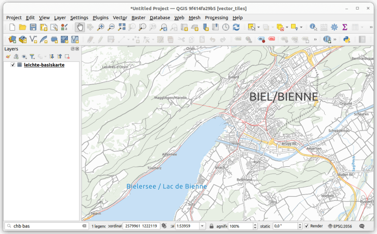
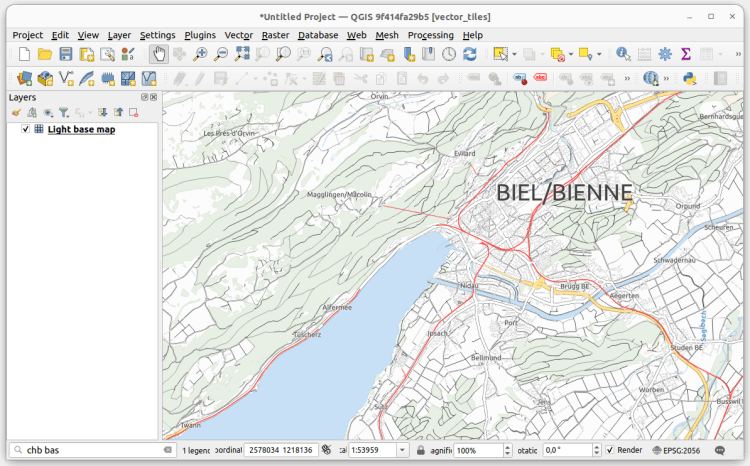
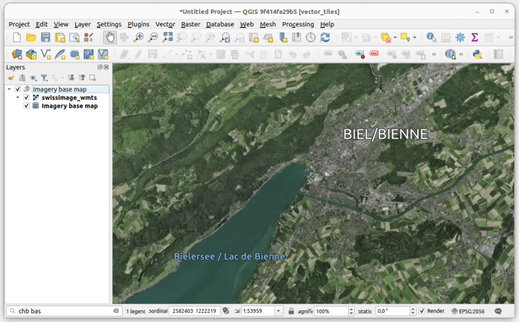
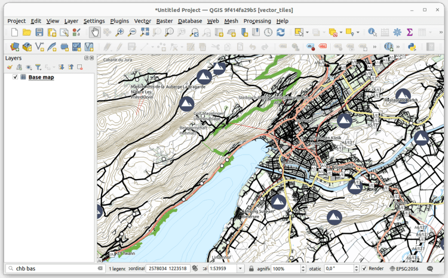

## Swiss elevation profiles
Get high-precision elevation profiles in QGIS right from Swisstopo’s official [profile service](<https://api3.geo.admin.ch/services/sdiservices.html#profile>), based on [swissALTI3D](<https://www.swisstopo.admin.ch/en/height-model-swissalti3d>) data!
Swiss elevation profiles are available with QGIS 3.38.
Thanks to this integration, you can take advantage of existing QGIS features, such as exporting 2d/3d features or distance/elevation tables, as well as displaying profiles directly in QGIS layouts.
**Tip** : Swiss elevation profiles will be available as long as the Swiss Locator plugin is installed and active. Should you need to turn Swiss elevation profiles off to create other profiles with your own data, go to the Plugin manager and deactivate the plugin in the meantime.
#### For developers
We’re paving the way for adding custom elevation profiles to QGIS. For that, we’ve added a [QGIS profile source registry](<https://api.qgis.org/api/classQgsProfileSourceRegistry.html>) so that plugin developers can register their own profile sources (e.g., based on profile web services, just like we did here) and make them available for QGIS end users. The registry is available from QGIS 3.38. It’s your turn! 👩‍💻
Thanks to the [QGIS user group Switzerland](<https://qgis.ch/>) for funding this feature! 👏
## Swiss vector tiles base maps
Loading Swiss vector tiles is now easier than ever. Just go to the locator bar, type the prefix « `chb` » (add a white space after that) and you’ll get a list of available and already styled Swiss vector tiles layers. Some of them will even load grouped auxiliary imagery for reference.
Vector tiles will be loaded at the bottom of the QGIS layer tree as base maps, so you will see all your data on top of them.
Vector tiles are optimized for local caching and scale-independent rendering. This also makes it a perfect fit for adding it to your [QField](<https://qfield.org/>) project.
There are a couple of different vector tile sets available:
#### leichte-basiskarte

#### Light base map
Similar to the _leichte-basiskarte_ layer, but using an older version of the data source and adjusted styles.

#### leichte-basiskarte-imagery (with WMTS sublayer)

#### Imagery base map (with WMTS sublayer)
This layer is similar to the _leichte-basiskarte-imagery_ layer, but it uses an older version of the data source and adjusted styles.

#### Base map

See the [official services documentation](<https://www.geo.admin.ch/en/vector-tiles-service-available-services-and-data>) for details on data sources and styles.
## Fixes
Thanks to your feedback, we’ve also fixed some issues. Don’t hesitate to reach out to us at [GitHub](<https://github.com/opengisch/qgis-swiss-locator/>) if you’d like to suggest or report something related to the Swiss Locator plugin.
Happy (and now more powerful) mapping! 🗺️🚀

  <iframe
    src="https://videopress.com/embed/GVxzoz7j"
    title="VideoPress video"
    loading="lazy"
    allow="autoplay; encrypted-media; picture-in-picture; fullscreen"
    allowfullscreen>
  </iframe>

[https://videopress.com/embed/GVxzoz7j](<https://videopress.com/embed/GVxzoz7j>)

### _Related_
