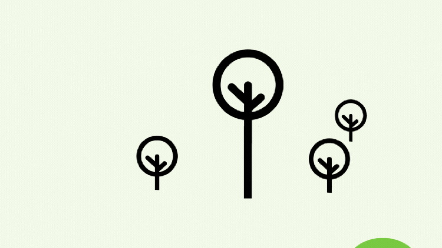

With the current release of the **QField Series 3** , the significance of forests is reflected in the naming, underscoring the importance of **environmental protection** and the role of QField in forest management. This update not only recognizes the ecological value of our forests but also introduces numerous new features that **redefine data collection and management** across various sectors.

**NEW FUNCTIONALITIES ABOUND**  
  
The latest updates of QField introduce a wealth of **new features** that are revolutionizing the collection and management of field data. Critical updates include the ability to sketch over photos and drawing templates, undo/redo functionality, and improvements in tracking. Enhanced form widgets and a new snapping tool simplify fieldwork during digitization, while support for text widgets and relationship management within forms deepens data handling.  
  
**QFieldCloud’s** user experience got even better: background synchronisation at regular intervals, a progress bar and file size details for project downloads and syncs, along with dashboard indicators for new cloud updates. [Haven’t tried QFieldCloud yet? Give it a go!](<https://qfield.cloud/>)  
  
Particularly noteworthy is the QField **plugin framework** , which lays a truly revolutionary foundation. Discover more about QField Plugins by visiting the [dedicated documentation page](<https://docs.qfield.org/how-to/plugins/>) or [discover existing plugins](<https://github.com/topics/qfield-plugin>). Additionally, We are organizing a **webinar** to get started with QField plugin development.
[Register your seat now](<https://forms.clickup.com/2192114/f/22wqj-35495/8X7D0GB303ZDD9VL39>)
With these updates, QField continues to redefine the mobile GIS experience. Our roadmap is already filled with further new feature requests. Keep an eye out for the possibility to perform powerful operations on objects directly in the field using QGIS’ processing algorithms.  

**All of this would not be possible without the support of our great sponsors. We are always looking for more funding and welcome new feature requests from users at[sales@qfield.org](<mailto:sales@qfield.org>).**
**A REVITALIZED QFIELD IDEA PLATFORM**  
  
While not every feature can be sponsored immediately, we highly value your contributions to the roadmap. The **QField Idea Platform** has been rejuvenated, offering a space for users to actively put forward their suggestions and ideas. This platform celebrates the collaborative nature of the **QField community** , allowing you to propose and endorse new features, thereby steering the app’s future direction. We are excited to see your creative ideas. Contribute your thoughts, cast your votes, and take part in sculpting the future of QField: [Post and Vote – NOW!](<https://ideas.qfield.org/>)  
  
**SHOWCASES THAT INSPIRE  
**  
QField is used in a variety of exciting projects. In this issue, we would like to highlight three impressive use cases from our customers, whom we not only thank for essential features but are also very happy to offer our support and thus expand an excellent collaboration.  
  
**National Land Survey of Finland  
** Let’s start with the [National Land Survey of Finland](<https://www.maanmittauslaitos.fi/en>), where QField plays a crucial role in surveying and maintaining high-quality data. Together, we ensure that the app meets all the requirements in this complex field. Thanks to the NLS’s commitment to QField, we were finally able to bring a processing framework and the first algorithm to orthogonalize polygons.  
  
**German Archaeological Institute  
** Another remarkable project is that of the [German Archaeological Institute](<https://www.dainst.org/en/>), where QField serves as a support tool for the « [Cultural Heritage Rescuers](<https://www.kulturgutretter.org/en/home-2/>) » project group to secure mobile and immobile cultural assets after natural disasters. Collecting information about these objects and buildings at the disaster site ensures that crucial historical information is preserved for future generations. True heroes indeed need a super support tool!  
  
**Groupements Forestiers Québec  
** Finally, we would like to shed light on the topic of forests again by briefly presenting the cooperation with the forestry association named [Groupements Forestiers Québec](<https://groupementsforestiers.quebec/>). They have recognized that QField plays an essential role in the management of forests. By keeping track of the work done, they gain essential knowledge and insights to plan ahead in a time when the future conditions for forests are challenged by changing climate. Since the forests being planted today will endure into the next century, it is crucial to cultivate them with a sustainable composition. Their use of QField is diverse, thanks to its ability to work entirely offline in remote areas, coupled with its user-friendly design that remains effective even in challenging conditions like rain and rough weather.
**If you would also like to advance your project with us, please**[contact us](<mailto:sales@qfield.org>)**. We are happy to help with everything from idea generation using design thinking methods to the deployment of a ready-to-use QField project.**

#### ******Stay tuned for new features – we’ve got some exciting updates coming your way soon!******
To better serve you and continue improving our projects, please take a moment to fill out our survey. Your feedback is invaluable to us:
[LINK TO THE SURVEY](<https://opengisch.surveysparrow.com/n/2024q2/ntt-eM9wwtcuvnNaWUAKvBiA6h>)
### _Related_
