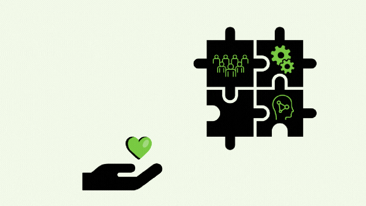

**MEET US AT THESE UPCOMING EVENTS  
**  
Calling all geo-enthusiasts! We’ve curated an exclusive list of must-attend events for you. These gatherings are the perfect opportunity to meet and engage with our GeoNinjas – the pioneers of geospatial technology who are shaping the future of GIS. Whether you’re looking to network, learn, or share your passion for projects, these events are where you need to be:  
  
**JULY** 1-7: Foss4G Europe – Tartu, Estonia (Gold sponsors)  
**SEPTEMBER** 9-14: QGIS Conference – Bratislava, Slovakia (Gold sponsors)  
**SEPTEMBER** 24-26: Intergeo 24 – Stuttgart, Germany (Hall: 3 Booth: G3.085)  
**DECEMBER** 1-9: Foss4G – Belém, Brazil
**SOCIAL INITIATIVES AND SPONSORSHIPS**  
  
But that’s not all – we’re also thrilled to unveil our engagements towards a more sustainable **open-source geospatial ecosystem**. By supporting these organizations, we’re not just fostering innovation; we’re also nurturing a shared vision for a more connected and spatially aware world.  
  
**OSGeo Sponsoring** : Since 2022, our company has been a proud Diamond sponsor of the Open Source Geospatial Foundation (OSGeo), supporting the foundation’s mission to promote the global adoption of open geospatial technology.  
  
**QGIS Sponsoring** : OPENGIS.ch has been a dedicated sustaining member of QGIS for many years. We were also the first—and still only one of two—companies to sustain QGIS.org at a large level since 2021. Our contributions aid in the development and enhancement of this powerful open-source GIS.  
  
**Sustainability Initiative Report** : We are committed to sustainability in various ways. We are building our business on open-source software, and we care deeply about the ecosystem that forms our roots. That’s why, some years ago, we launched the sustainability initiative, which allows us to support the continuous integration test infrastructure for QGIS and QField, review pull requests, and address various bugs.  
We have already allocated 25 developer days to the initiative in 2024; this would not be possible without all the companies who have a [support and maintenance contract](</qgis-support/index.html>) with us, which allows them to benefit from dedicated assistance and helps foster a sustainable and vibrant open-source ecosystem.
[Get a support contract](</qgis-support/index.html>)
**Our Vision and Mission: Shaping the Future of Open-Source GIS**  
Our vision is to establish open-source GIS as the industry standard. We’re committed to delivering high-quality products and pioneering technologies that set new benchmarks in the field. Our mission revolves around developing, deploying, and maintaining innovative solutions that add substantial value for our customers. We’re dedicated to excellence, ensuring that our efficient practices and iterative feedback loops not only meet but exceed customer expectations, turning them into advocates for open-source GIS.  
  
**Values That Drive Us**  
**Give Back:** Our existence is intertwined with open-source projects, and we are dedicated to their ongoing technological and economic prosperity.  
  
**Love Nature:** As outdoor enthusiasts, we cherish our environment. Our remote work policy eliminates unnecessary commuting, we favour public transportation, and we offset our carbon footprint when flying is necessary. We’re also transitioning our servers to CO2-neutral hosting solutions.  
  
**Reduce Inequalities:** We believe in democratizing access to the best tools and knowledge. Our commitment to developing open-source applications ensures that everyone, regardless of their background, has access to powerful tools for planning, reviewing, and addressing geospatial challenges.  
  
**Our Team – Our Heart:** Since the beginning, OPENGIS.ch has been about empowering our team to achieve the perfect work-life balance. We support each team member in organizing their work hours and locations to harmonize with their personal lives.  
**Your Project, Our Passion**
**Every project we undertake is fueled by our passion for open-source GIS and our commitment to our clients and community. Let’s advance the world of geospatial technology together.**

#### ******Stay connected, and get ready to join a community that inspires!******
To better serve you and continue improving our projects, please take a moment to fill out our survey. Your feedback is invaluable to us: 
[LINK TO THE SURVEY](<https://opengisch.surveysparrow.com/n/2024q2/ntt-eM9wwtcuvnNaWUAKvBiA6h>)
### _Related_
