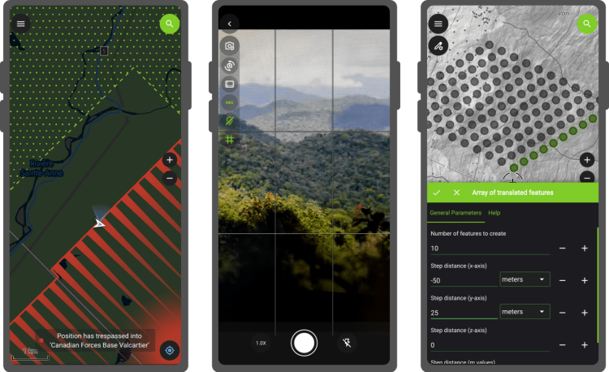
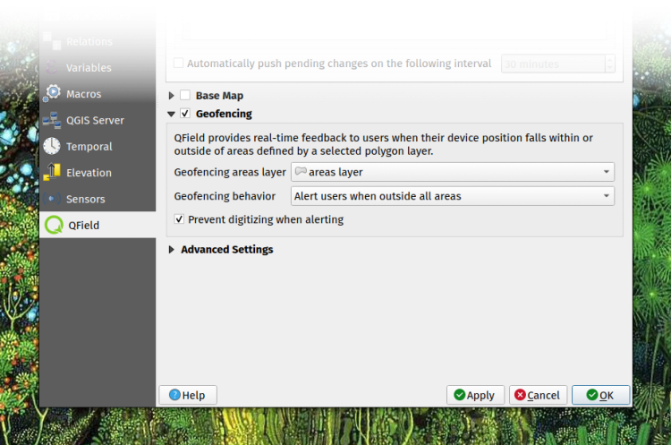
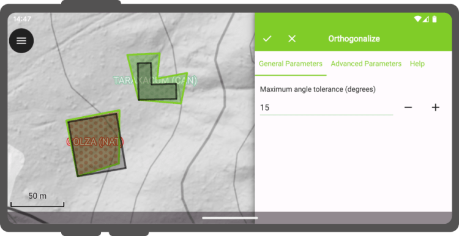

QField 3.4 is out, and it won’t disappoint. It has tons of new features that continue to push the limits of what users can do in the field.
## Main highlights

  
A new **geofencing framework** has landed, enabling users to configure QField behaviors in relation to geofenced areas and user positioning. Geofenced areas are defined at the project-level and shaped by polygons from a chosen vector layer. The three available geofencing behaviours in this new release are:
  - Alert user when _inside_ an area polygon;
  - Alert user when _outside_ all defined area polygons and
  - Inform the user when entering and leaving an area polygons.

In addition to being alerted or informed, users can also prevent digitizing of features when being alerted by the first or second behaviour. The configuration of this functionality is done in QGIS using QFieldSync.

> Pro tip: geofencing settings are embedded within projects, which means it is easy to deploy these constraints to a team of field workers through [QFieldCloud](<https://qfield.cloud/>). Thanks [Terrex Seismic](<https://www.terrexseismic.com/>) for sponsoring this functionality.
QField now offers users access to a brand new **processing toolbox containing over a dozen algorithms****for manipulating digitized geometries** directly in the field. As with many parts of QField, this feature relies on QGIS’ core library, namely its processing framework and the numerous, well-maintained algorithms it comes with.
The algorithms exposed in QField unlock many useful functionalities for refining geometries, including orthogonalization, smoothing, buffering, rotation, affine transformation, etc. As users configure algorithms’ parameters, a grey preview of the output will be visible as an overlay on top of the map canvas.

To reach the processing toolbox in QField, select one or more features by long-pressing on them in the features list, open the 3-dot menu and click on the process selected feature(s) action. Are you excited about this one? Send your thanks to the [National Land Survey of Finland](<https://www.maanmittauslaitos.fi/>), who’s support made this a reality.
QField’s camera has gained support for **customized ratio and resolution of photos** , as well as the **ability to stamp details – date and time as well as location details – onto captured photos**. In fact, QField’s own camera has received so much attention in the last few releases that we have decided to make it the default one. On supported platforms, users can switch to their OS camera by disabling the native camera option found at the bottom of the QField settings’ general tab.
## Wait, there’s more
There are plenty more improvements packed into this release from **project variables editing using a revamped variables editor** through to **integration of QField documentation help in the search bar** and the **ability to search cloud project lists**. Read the [full 3.4 changelog](<https://github.com/opengisch/QField/releases/tag/v3.4.0>) to know more, and enjoy the release!
### _Related_
