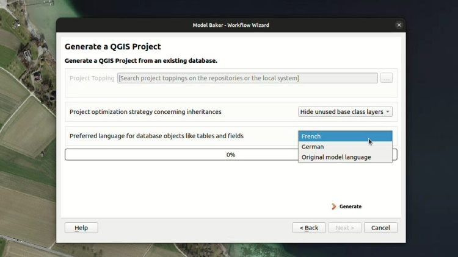
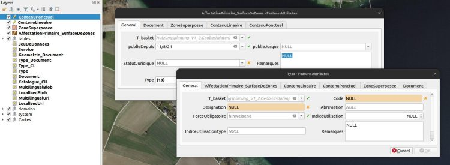
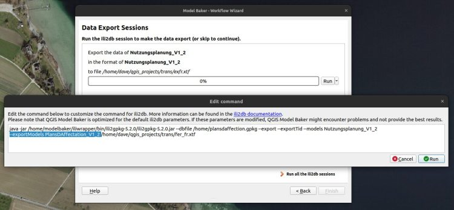

**La semaine dernière, les participant·e·s de la journée INTERLIS à Yverdon-les-Bains ont pu tester la toute nouvelle version expérimentale du[QGIS Model Bakers Version 7.10](<https://github.com/opengisch/QgisModelBaker/releases/tag/v7.10.0>). Et par la même occasion, l’implémentation de la gestion des modèles de traduction. Un plaisir pour toutes les régions linguistiques de la Suisse. **

La Suisse est quadrilingue et c’est magnifique. En tant que Suisse alémanique, je maîtrise à peine 1,75 de ces langues, mais j’écoute volontiers la sonorité et la poésie des trois autres. En revanche, en tant que passionné de technologie, je souhaite parfois une norme, un standard, une seule langue. Mais laquelle choisir?
Je ne suis probablement pas seul à ressentir ce besoin d’une seule langue, car la plupart des [modèles de données géographiques minimaux (MGDM) de la Confédération](<https://models.geo.admin.ch/>) sont en allemand.
«Pourquoi en allemand?», m’a demandé ma collègue de Suisse romande.  
«Dans quelle langue devraient-ils être?», ai-je répondu.  
«En français, bien sûr!», a-t-elle rétorqué.
Lors d’une séance d’assistance à un service fédéral pour la modélisation INTERLIS, nous nous étions mis d’accord pour écrire les modèles en anglais. L’anglais est la langue technique et ne discrimine aucune des langues nationales suisses. Plus tard, j’ai rencontré un utilisateur d’INTERLIS venant du Tessin qui m’a dit:  
«Pourquoi en anglais? Dois-je maintenant comprendre l’allemand et également l’anglais?»
C’est donc un sujet sensible.
## Heureusement, il existe des modèles de traduction
Le fait que les modèles INTERLIS soient écrits dans une seule langue – quelle qu’elle soit – est une réalité, tout comme le fait que quelqu’un aimerait les avoir dans une autre langue. C’est exactement pour cela qu’il existe des modèles de traduction. On les reconnaît à la syntaxe suivante:
    
    MODEL PlansDAffectation_V1_2 (fr)
    AT "https://models.geo.admin.ch/ARE/"
    VERSION "2023-03-20"
    TRANSLATION OF Nutzungsplanung_V1_2 ["2023-03-20"] =
      [...]
    
Par exemple, le modèle de traduction français [`PlansDAffectation_V1_2`](<https://models.geo.admin.ch/ARE/PlansDAffectation_V1_2.ili>) et l’italien [`PianiDiUtilizzazione_V1_2`](<https://models.geo.admin.ch/ARE/PianiDiUtilizzazione_V1_2.ili>) sont des traductions du modèle [`Nutzungsplanung_V1_2`](<https://models.geo.admin.ch/ARE/Nutzungsplanung_V1_2.ili>).
Les deux modèles (traduction et original) doivent structurellement être identiques. Ils ne peuvent différer que par les noms des thèmes, des classes et des attributs. Voir le [Referenzhandbuch](<https://geostandards-ch.github.io/doc_refhb24/#_modelle>) ou un guide pratique sur la création d’un modèle de traduction dans le [forum INTERLIS](<https://interlis.discourse.group/t/translation-of-1-modell-in-mehreren-sprachen/304>).
## Et que faisons-nous maintenant?
Jusqu’à présent, lorsqu’on importait un modèle de traduction dans le Model Baker, quelque chose d’assez inattendu se produisait: le schéma de la base de données était créé par ili2db dans la langue du modèle original, et le Model Baker générait le projet QGIS dans la langue originale. Noms des couches, noms des champs, nom des domaines – tout restait en allemand. Jusqu’à maintenant…
Désormais, avec la version 7.10 de Model Baker et ili2db 5.2.0, de nouvelles possibilités s’ouvrent. On peut d’une part, implémenter la structure de la base de données traduite et d’autre part, traduire l’interface utilisateur.
### Comportement standard avec interface traduite
Afin de maintenir le Model Baker aussi intuitif et simple que possible, nous implémentons uniquement ce qui est nécessaire et utile.
Après quelques discussions, nous avons supposé que lorsqu’une personne importe un modèle de traduction en français, elle s’attend principalement à ce que l’interface utilisateur du projet QGIS soit en français. Cela n’était pas le cas auparavant, mais c’est maintenant le comportement par défaut.
Cependant, on suppose aussi que la structure de la base de données reste dans la langue de l’original, afin de garantir la compatibilité des scripts SQL existants. Vous pouvez créer la structure de la base de données dans la langue de la traduction, mais ce n’est pas encore le cas d’utilisation standard dans le Model Baker.
Lors de la création d’un schéma pour le modèle de traduction `PlansDAffectation_V1_2` avec le Model Baker, le paramètre `--createNlsTabs` est transmis.
> Techniquement, cela signifie qu’ili2db crée une table de correspondance et que Model Baker peut en lire les valeurs traduites.
Lors de la création du projet QGIS, vous pouvez désormais choisir si vous souhaitez que l’interface utilisateur soit en allemand ou en français.

Et voilà!

Si vous êtes satisfait, vous pouvez arrêter de lire ici. Mais peut-être souhaitez-vous en savoir plus…
### Traduction de la structure de la base de données
Il se peut que vous souhaitiez également traduire la structure de la base de données. Cela n’est pas encore pleinement intégré dans Model Baker, mais vous pouvez y parvenir en configurant manuellement le paramètre approprié.

Avec le paramètre ili2db `--nameLang fr` , vous pouvez importer le `PlansDAffectation_V1_2` de manière à ce que la structure de la base de données soit en français. La traduction de l’interface utilisateur reste disponible en français ou en allemand.
### Et que contient le XTF?
Les données de transfert peuvent également être dans la langue traduite. Elles peuvent être importées facilement dans un schéma de base de données dans la langue originale. Inversement : un fichier de transfert dans la langue originale peut être importé dans un schéma dont la structure est traduite.
    
    <Nutzungsplanung_V1_2.Geobasisdaten BID="_43cb6b90-6cfb-434c-83b0-63911ad0785b">
    <Nutzungsplanung_V1_2.Geobasisdaten.Objektbezogene_Festlegung TID="_4eb738f1-4ff2-447c-9c7a-e4effcea0143"><publiziertAb>2024-11-09</publiziertAb><publiziertBis>2024-11-07</publiziertBis><Rechtsstatus>AenderungMitVorwirkung</Rechtsstatus><Bemerkungen>Ein Kommentar bleibt ein Kommentar.</Bemerkungen><Typ REF="_5a088bd2-20ee-4dfb-82d9-e510e5ec6fb6"></Typ><Geometrie><COORD><C1>2708924.348</C1><C2>1278301.089</C2></COORD></Geometrie></Nutzungsplanung_V1_2.Geobasisdaten.Objektbezogene_Festlegung>
    
… correspond à:
    
    <PlansDAffectation_V1_2.GeodonneesDeBase BID="_43cb6b90-6cfb-434c-83b0-63911ad0785b">
    <PlansDAffectation_V1_2.GeodonneesDeBase.ContenuPonctuel TID="_4eb738f1-4ff2-447c-9c7a-e4effcea0143"><publieDepuis>2024-11-09</publieDepuis><publieJusque>2024-11-07</publieJusque><StatutJuridique>ModificationAvecEffetAnticipe</StatutJuridique><Remarques>Ein Kommentar bleibt ein Kommentar.</Remarques><Type REF="_5a088bd2-20ee-4dfb-82d9-e510e5ec6fb6"></Type><Geometrie><COORD><C1>2708924.348</C1><C2>1278301.089</C2></COORD></Geometrie></PlansDAffectation_V1_2.GeodonneesDeBase.ContenuPonctuel>
    
Par défaut, les données sont toujours exportées dans la langue originale. Cela signifie que pour le `Nutzungsplanung_V1_2`, les éléments dans le XTF seront en allemand.
Il est toutefois possible d’exporter dans la langue de la traduction, quelle que soit la langue dans laquelle le schéma ou le projet QGIS a été créé. Il suffit de spécifier le modèle de traduction lors de l’exportation: `--exportModels PlansDAffectation_V1_2`

Les modèles de traduction ne sont pas encore disponibles dans la sélection pour l’exportation. Mais cela pourrait être une amélioration pertinente à ajouter à Model Baker.
## Donc, à toi de jouer
Bien divertiment / Buon divertimento / Amuse-toi bien / Viel Spass!
### _Related_
