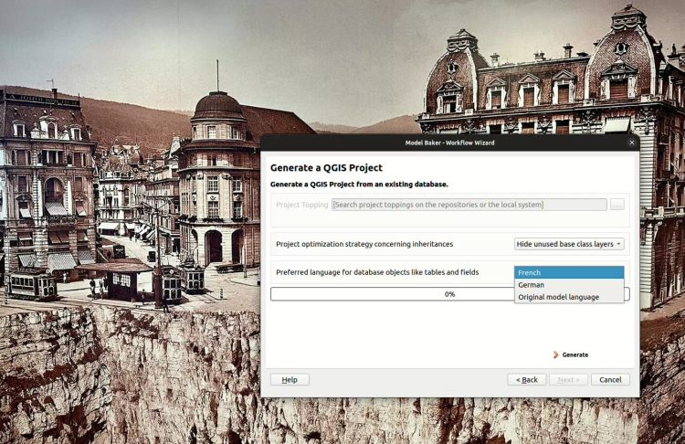
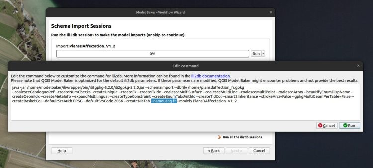

**Letzte Woche konnten die Teilnehmer:innen des INTERLIS Tages in Yverdon-les-Bains die brandneue Experimental Version des[QGIS Model Bakers mit der Version 7.10](<https://github.com/opengisch/QgisModelBaker/releases/tag/v7.10.0>) testen. Und damit auch die Implementierung zur Handhabung von Übersetzungsmodellen. Eine Freude für alle Sprachregionen der Schweiz.**

Die Schweiz ist viersprachig und das ist wunderschön. Wenn ich als Deutschschweizer auch nur maximal 1.75 dieser Sprachen beherrsche, lausche ich gerne dem Klang und der Poesie der anderen drei. Als eingefleischter Tech-Nerd hingegen, wünsche ich mir manchmal eine Norm, einen Standard, nur eine einzelne Sprache. Doch die Frage ist welche?
Mit dem Bedürfnis nach einer einzigen Sprache bin ich wohl nicht allein, denn die meisten [Minimalen Geodatenmodellen (MGDM) des Bundes](<https://models.geo.admin.ch/>) sind in Deutsch[.](<https://models.geo.admin.ch/>)
«Weshalb denn in Deutsch?», frage mich meine Mitarbeiterin aus der Romandie.   
«In welcher Sprache sollten sie denn sein?», fragte ich zurück.  
«In Französisch natürlich!», meinte sie.
Als ich dann einmal einer Bundesstelle bei der INTERLIS Modellierung assistierte, einigten wir uns darauf, die Modelle in Englisch zu schreiben. Englisch ist die technische Sprache und man diskriminiert damit keine Schweizer Landessprache. Später traf ich auf einen INTERLIS Nutzer aus dem Tessin der meinte:  
«Weshalb denn in Englisch? Muss ich jetzt neben Deutsch auch noch Englisch verstehen?»
Es bleibt also ein heikles Thema.
## Zum Glück gibt es Übersetzungsmodelle
Dass die INTERLIS Modelle in einer einzigen Sprache geschrieben sind – ganz gleich, in welcher, ist nun einmal Tatsache und dass irgendjemand es gerne in einer anderen Sprache hätte, als sie geschrieben sind, ebenfalls. Nun gibt es genau aus diesem Grund Übersetzungsmodelle. Man erkennt sie anhand folgender Syntax:
    
    MODEL PlansDAffectation_V1_2 (fr)
    AT "https://models.geo.admin.ch/ARE/"
    VERSION "2023-03-20"
    TRANSLATION OF Nutzungsplanung_V1_2 ["2023-03-20"] =
      [...]
    
Hier zum Beispiel das französische [`PlansDAffectation_V1_2`](<https://models.geo.admin.ch/ARE/PlansDAffectation_V1_2.ili>) und das italienische [`PianiDiUtilizzazione_V1_2`](<https://models.geo.admin.ch/ARE/PianiDiUtilizzazione_V1_2.ili>) als Übersetzungsmodelle der [`Nutzungsplanung_V1_2`](<https://models.geo.admin.ch/ARE/Nutzungsplanung_V1_2.ili>).
Die beiden Modelle (Übersetzung und Original) müssen strukturell exakt übereinstimmen. Sie dürfen sich nur in den verwendeten Namen der Topics, Klassen und Attribute unterscheiden. Siehe dazu auch das [Referenzhandbuch](<https://geostandards-ch.github.io/doc_refhb24/#_modelle>) oder eine bequeme Anleitung, wie du ein Übersetzungsmodell selbst erstellst im[ INTERLIS Forum](<https://interlis.discourse.group/t/translation-of-1-modell-in-mehreren-sprachen/304>)
## Und was machen wir jetzt damit?
Wenn wir  _bisher_ ein solches Übersetzungsmodell im Model Baker importiert hatten, passierte etwas eher Unerwartetes: Das Datenbankschema wurde von ili2db in der Sprache des Originalmodells erstellt und genauso generierte auch Model Baker das QGIS Projekt in der Originalsprache. Layernamen, Feldnamen, Domains – alles blieb auf Deutsch. Bis jetzt…
Doch seit der Model Baker Version 7.10 und dem ili2db 5.2.0 stehen dir neue Möglichkeiten offen. Einerseits könnten wir die Datenbank-Struktur übersetzt implementieren und andererseits das GUI.
### Standardverhalten mit übersetztem GUI
Damit wir den Model Baker so intuitiv und einfach wie möglich halten können, implementieren wir jeweils nicht alles, was möglich ist, sondern nur alles, was auch wirklich gebraucht wird.
Nach einigen Abklärungen, sind wir also davon ausgegangen, dass wenn jemand ein französisches Übersetzungsmodell importiert, primär auch das GUI im QGIS Projekt französisch erwartet. Dies war bis anhin nicht der Fall, doch nun ist das der Standard.
Ebenso wird aber auch davon ausgegangen, dass das die Datenbankstruktur in der Sprache des Originals gehalten werden soll. So bleiben bisher verwendete SQL Scripts kompatibel. Du kannst sie auch in der Übersetzungssprache erstellen, doch ist das (noch) nicht der standardmässig angebotene Use Case im Model Baker.
Erstellen wir nun ein Schema für das Übersetzungsmodell `PlansDAffectation_V1_2` mit dem Model Baker, wird im Hintergrund der Parameter `--createNlsTabs` dem ili2db übergeben.
> Technisch gesehen heisst das, dass ili2db eine Mapping-Tabelle erstellt und sich Model Baker die übersetzten Werte daraus lesen kann.
Beim erstellen des QGIS Projektes kannst du nun auswählen, ob du das GUI auf Deutsch oder Französisch haben möchtest.

Et voilà!

Wenn du nun glücklich bist, kannst du eigentlich auch aufhören mit lesen. Doch vielleicht möchtest du ja noch mehr wissen…
### Übersetzung der Datenbankstruktur
Denn es könnte natürlich auch sein, dass du auch die Datenbankstruktur übersetzt haben möchtest. Das ist zwar (noch) nicht in Model Baker vollintegriert, aber du kannst es erreichen indem du den Parameter manuell setzst.

Mit dem ili2db Parameter `--nameLang fr` kannst du beim Import des `PlansDAffectation_V1_2` erreichen, dass die Datenbankstruktur auf französisch ist. Die Übersetzung des GUIs steht dir nach wie vor in Französisch oder Deutsch offen.
### Und was steht im XTF?
Die Transferdaten könnten ebenfalls in der übersetzten Sprache sein. Sie können problemlos auch in eine Datenbankschema importiert werden, das in der Originalsprache steht. Und auch umgekehrt: Eine Transferdatei in Originalsprache kann auch in eine Datenbankschema importiert werden, dessen Struktur übersetzt ist.
    
    <Nutzungsplanung_V1_2.Geobasisdaten BID="_43cb6b90-6cfb-434c-83b0-63911ad0785b">
    <Nutzungsplanung_V1_2.Geobasisdaten.Objektbezogene_Festlegung TID="_4eb738f1-4ff2-447c-9c7a-e4effcea0143"><publiziertAb>2024-11-09</publiziertAb><publiziertBis>2024-11-07</publiziertBis><Rechtsstatus>AenderungMitVorwirkung</Rechtsstatus><Bemerkungen>Ein Kommentar bleibt ein Kommentar.</Bemerkungen><Typ REF="_5a088bd2-20ee-4dfb-82d9-e510e5ec6fb6"></Typ><Geometrie><COORD><C1>2708924.348</C1><C2>1278301.089</C2></COORD></Geometrie></Nutzungsplanung_V1_2.Geobasisdaten.Objektbezogene_Festlegung>
    
… entspricht:
    
    <PlansDAffectation_V1_2.GeodonneesDeBase BID="_43cb6b90-6cfb-434c-83b0-63911ad0785b">
    <PlansDAffectation_V1_2.GeodonneesDeBase.ContenuPonctuel TID="_4eb738f1-4ff2-447c-9c7a-e4effcea0143"><publieDepuis>2024-11-09</publieDepuis><publieJusque>2024-11-07</publieJusque><StatutJuridique>ModificationAvecEffetAnticipe</StatutJuridique><Remarques>Ein Kommentar bleibt ein Kommentar.</Remarques><Type REF="_5a088bd2-20ee-4dfb-82d9-e510e5ec6fb6"></Type><Geometrie><COORD><C1>2708924.348</C1><C2>1278301.089</C2></COORD></Geometrie></PlansDAffectation_V1_2.GeodonneesDeBase.ContenuPonctuel>
    
Standardmässig werden die Daten immer in Originalsprache exportiert. Das heisst bei der `Nutzungsplanung_V1_2` findest du die Elemente im XTF auf Deutsch vor.
Es wäre aber auch möglich in der Übersetzung zu Exportieren. Egal in welcher Sprache das Schema oder das QGIS Projekt erstellt wurde. Du musst beim Export nur das Übersetzungsmodell angeben: `--exportModels PlansDAffectation_V1_2`

Die Übersetzungsmodelle stehen in der Auswahl beim Export noch nicht zur Verfügung. Aber auch das wäre etwas, dass bei Bedarf in Model Baker Sinn machen könnte.
## Also dann
Bien divertiment / Buon divertimento / Amuse-toi bien / Viel Spass!
### _Related_
