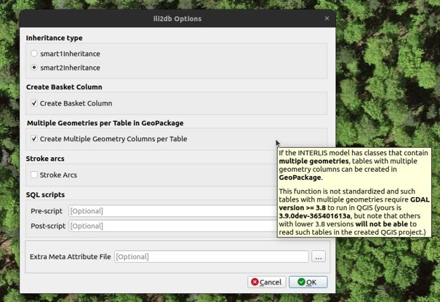
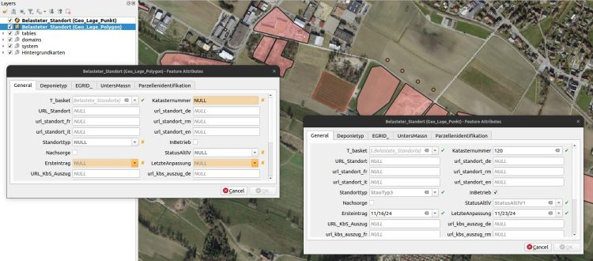

**Das INTERLIS Bundesmodell des Kasters der belasteten Standorte`KbS_V1_5` ohne Probleme in einem GeoPackage zu implementieren und zu bearbeiten? Lange nur ein ferner Traum, doch jetzt Realität. Mit Model Baker 7.10 und ili2db 5.2 kannst du deine INTERLIS Datensätze, die mehrere Geometriespalten pro Klasse enthalten, bequem auch im GeoPackage barbeiten.**

Ein seit Jahren bestehender Painpoint im Umgang mit Modellen wie dem des Kataster der belasteten Standorte oder Nutzungsplanung war, dass die Modelle **Klassen mit mehreren Geometrien** enthalten. Hier zum Beispiel eine Punkt- und eine Polygon-Geometrie.
    
    CLASS Belasteter_Standort =
        Katasternummer : MANDATORY TEXT;
        URL_Standort : MultilingualUri;
        Geo_Lage_Polygon : MultiPolygon;
        Geo_Lage_Punkt : GeometryCHLV95_V1.Coord2;
        [...]
    END Belasteter_Standort;
    
Bei der Implementierung dieser Klasse in eine relationale Datenbank stiess man teilweise an Limiten. Währenddem PostgreSQL damit keine Probleme hat und seit _scheinbar_ jeher Tabellen mit mehreren Geometrien erstellen kann, hatte man da mit GeoPackage ein Problem.
GeoPackage konnte nicht mehrere Geometriespalten in der gleichen Tabelle führen und diese folglich als zwei Layer mit derselben Source im QGIS visualisieren.
## Ummodellieren ist keine Option
Da denkt man sich vielleicht, dass man einfach das Modell auch so bauen hätte können, dass es funktioniert.
    
    CLASS Belasteter_Standort (ABSTRACT) =
        Katasternummer : MANDATORY TEXT;
        URL_Standort : MultilingualUri;
        [...]
    END Belasteter_Standort;
    
    CLASS Belasteter_Standort_Punkt EXTENDS Belasteter_Standort =
        Geo_Lage_Punkt : GeometryCHLV95_V1.Coord2;
    END Belasteter_Standort;
    
    CLASS Belasteter_Standort_Polygon EXTENDS Belasteter_Standort =
        Geo_Lage_Polygon : MultiPolygon;
        [...]
    END Belasteter_Standort;
    
Doch diese Variante – so schön sie auch für INTERLISies (pendant zu Swifties) erscheint – ist weniger leserlich als die erste Variante. Und ein Modell soll ja bekanntlich auch für thematische Fachpersonen ein konzeptionelles Dokument zum Verständnis der Datenstruktur sein.
Weiter hat mir mal einer der Tool-Entwickler gesagt, wenn er modelliert, dann modelliert er und nimmt keine Rücksicht darauf, ob die Tools es handhaben können oder nicht. Sonst bleibt man ja auch in der Tool-Entwicklung stehen. Auch das stimmt natürlich.
Und doch, ein Modell wie das des Katasters der Belasteten Standorte nicht in einem GeoPackage implementieren zu können, war eine sehr mühsame Einschränkung. Und die Bundesmodelle sind nun einmal vorgegeben und man kann nicht einfach nach belieben daran herumschrauben.
## Deshalb kommen die Tools
Der Zugzwang bestand also bei den Tools und um eine GeoPackage-Tabelle mit solchen Mehrfachgeometrien in QGIS bearbeiten zu können, war gleich der ganze Stack involviert:
  - ili2gpkg, um Tabellen mit mehreren Geometrien zu erstellen (ab 5.2.0)
  - GDAL (als Backendlibrary von QGIS), um solche Tabellen lesen zu können (ab 3.8)
  - QGIS Model Baker, um die Layer entsprechend ihren Eigenheiten zu erstellen und benennen (ab 7.10.0)

An dieser Stelle ein grosser Dank für die Zusammenarbeit. Doch ist auch wichtig zu erwähnen, dass die Umsetzung – insbesondere in GDAL – nicht dem allgemeinen Standard entspricht. Weshalb es gewisse Risiken geben kann und es sich empfiehlt, die Bearbeitung von Daten mit dieser Methode selbst vorher gut zu testen. Die Konfiguration ist in Model Baker auch nicht standardmässig aktiviert. 
Wenn du ein GeoPackage mit Mehrfachgeometrien erstellen möchtest, kannst du das über die Erweiterten Einstellungen beim Schema Import machen.

Dies setzt im Hintergrund den Parameter `--gpkgMultiGeomPerTable`. Hat es keine Klassen mit mehreren Geometrien im betreffenden Modell, macht dieser Parameter keinen Unterschied aus.
Beim Erstellen des QGIS Projektes wird der nächste Hinweis angezeigt. Arbeitest du mit einer QGIS Version, die im Backend eine GDAL Version unterstützt, die diese Implementierung bereits beinhaltet (ab GDAL 3.8), dann kannst du das QGIS Projekt erstellen, ansonsten ist es dir leider (noch) nicht möglich.

> Grundsätzlich bauen die neueren QGIS Projekte auf neuere Versionen als GDAL 3.8 auf. Zumindest auf Windows ab mindestens 3.36 und evtl. auch schon einige 3.34er Versionen. Auf Ubuntu kann es sein, dass man dieses Mal Pech hat. Das [offizielle Repo](<https://qgis.org/ubuntu>) hat noch die GDAL Version 3.4. Mit dem [ubuntugis Repository](<https://qgis.org/ubuntugis>)mit unstable dependencies hat man vermutlich mehr Erfolg.
So oder so aber bleibt zu beachten, für wen man dieses GeoPackage und QGIS Projekt erstellt. Denn auch wenn es bei dir läuft, möchtest du vielleicht auch deine Mitarbeiter:innen darauf loslassen und da musst du sicherstellen, dass auch sie die richtige QGIS Version verwenden.
## Also los!
Das ändert aber nichts an der Tatsache, dass du wir nun endlich unkompliziert und problemlos Daten des `KbS_V1_5` mittels QGIS im GeoPackage bearbeiten können. Und wir hoffen, dass auch du davon profitieren kannst.
Also backe das Projekt.

Und viel Spass damit!

## Und hier noch einige technische Details
Anstelle wie bisher zwei Tabellen, wird von ili2gpkg anhand des Parameters `--gpkgMultiGeomPerTable` nur eine Tabelle `belasteter_standort` erstellt. Dafür werden die beiden Geometriespalten in die technische Tabelle `gpkg_geometry_columns` eingetragen. Wenn in dieser Tabelle nun `belasteter_standort` mehrfach eingetragen ist, liefert OGR (GDAL) dem QGIS mehrere Layer mit eindeutigen Namen: `belasteter_standort (geo_lage_punkt) `und `belasteter_standort (geo_lage_polygon)`.
### _Related_
