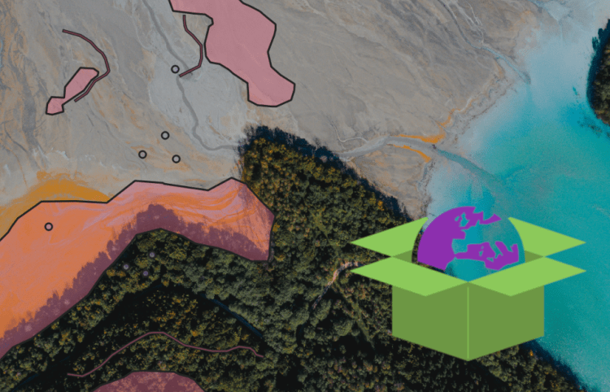
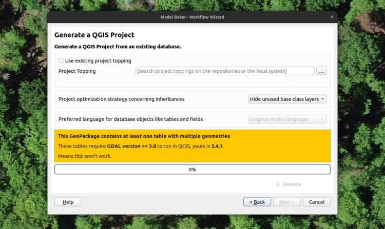
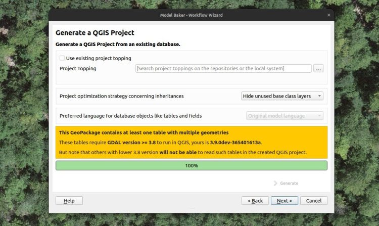

**Implémenter et modifier le modèle fédéral INTERLIS du cadastre des sites pollués`KbS_V1_5` sans problème dans un GeoPackage ? Un rêve lointain pendant longtemps, mais désormais réalité. Avec Model Baker 7.10 et ili2db 5.2, vous pouvez maintenant travailler confortablement avec vos ensembles de données INTERLIS contenant plusieurs colonnes de géométrie par classe dans un GeoPackage.**

Un point de douleur qui existe depuis des années dans le traitement de modèles comme celui du cadastre des sites pollués ou de la planification de l’utilisation, c’est que les modèles **contiennent des classes avec plusieurs géométries**. Par exemple, ici, une géométrie de type point et une géométrie de type polygone.
    
    CLASS Belasteter_Standort =
        Katasternummer : MANDATORY TEXT;
        URL_Standort : MultilingualUri;
        Geo_Lage_Polygon : MultiPolygon;
        Geo_Lage_Punkt : GeometryCHLV95_V1.Coord2;
        [...]
    END Belasteter_Standort;
    
Lors de l’implémentation de cette classe dans une base de données relationnelle, des limites sont apparues. Tandis que PostgreSQL n’a pas de problème à créer des tables avec plusieurs géométries, le GeoPackage rencontrait une difficulté.
Le GeoPackage ne pouvait pas gérer plusieurs colonnes de géométrie dans la même table et, par conséquent, ne pouvait pas visualiser ces géométries comme deux couches distinctes dans QGIS avec la même source.
## Reformuler le modèle n’est pas une option
On pourrait penser qu’il suffisait de reformuler le modèle pour que cela fonctionne.
    
    CLASS Belasteter_Standort (ABSTRACT) =
        Katasternummer : MANDATORY TEXT;
        URL_Standort : MultilingualUri;
        [...]
    END Belasteter_Standort;
    
    CLASS Belasteter_Standort_Punkt EXTENDS Belasteter_Standort =
        Geo_Lage_Punkt : GeometryCHLV95_V1.Coord2;
    END Belasteter_Standort;
    
    CLASS Belasteter_Standort_Polygon EXTENDS Belasteter_Standort =
        Geo_Lage_Polygon : MultiPolygon;
        [...]
    END Belasteter_Standort;
    
Mais cette variante – bien que séduisante pour les modélistes INTERLIS (équivalents des Swifties) – est moins lisible que la première version. Et un modèle doit, après tout, aussi être un document conceptuel compréhensible pour les professionnels du domaine, afin de comprendre la structure des données.
De plus, un développeur d’outils m’a dit une fois que, lorsqu’il modélise, il se concentre uniquement sur la modélisation sans se soucier de la capacité des outils à la gérer. Sinon, le développement d’outils s’arrête. Ce qui est également vrai.
Cependant, l’impossibilité de mettre en place un modèle tel que celui du cadastre des sites pollués dans un GeoPackage constituait une contrainte extrêmement difficile. De plus, les modèles fédéraux sont fixés et on ne peut pas simplement les modifier à sa guise.
## C’est pourquoi les outils arrivent
Le besoin était donc dans les outils, et pour pouvoir modifier une table du GeoPackage avec des géométries multiples dans QGIS, l’ensemble de la chaîne était impliqué :
  - ili2gpkg, pour créer des tables avec plusieurs géométries (à partir de la version 5.2.0)
  - GDAL (en tant que bibliothèque backend de QGIS), pour lire ces tables (à partir de la version 3.8)
  - QGIS Model Baker, pour créer et nommer les couches en fonction de leurs caractéristiques (depuis la version 7.10.0)

À ce point, merci beaucoup pour votre coopération. Il est toutefois important de mentionner que la mise en œuvre, notamment dans GDAL, ne respecte pas complètement la norme générale. C’est pourquoi il peut y avoir certains risques, et il est conseillé de tester cette méthode de modification des données au préalable. De plus, cette configuration n’est pas activée par défaut dans Model Baker.
Si vous souhaitez créer un GeoPackage avec des géométries multiples, vous pouvez le faire via les paramètres avancés lors de l’importation du schéma.

Cela active en arrière-plan le paramètre `--gpkgMultiGeomPerTable`. S’il n’y a pas de classes avec plusieurs géométries dans le modèle concerné, ce paramètre n’aura aucun effet.
Lors de la création du projet QGIS, le message suivant apparaît. Si vous travaillez avec une version de QGIS qui prend en charge une version de GDAL qui inclut déjà cette mise en œuvre (à partir de GDAL 3.8), vous pouvez créer le projet QGIS, sinon cela ne sera malheureusement pas encore possible.

> En principe, les projets QGIS plus récents reposent sur des versions de GDAL supérieures à 3.8. Au moins sur Windows dès la version 3.36 et peut-être aussi quelques versions 3.34. Sur Ubuntu, il est possible que vous ayez de la chance. Le [dépôt officiel](<https://qgis.org/ubuntu>) a encore la version 3.4 de GDAL. Avec le [dépôt ubuntugis](<https://qgis.org/ubuntugis>)avec des dépendances instables, vous aurez probablement plus de succès.
Quoi qu’il en soit, il est important de garder à l’esprit pour qui vous créez ce GeoPackage et ce projet QGIS. Car même si cela fonctionne pour vous, vous souhaiterez sûrement que vos collègues l’utilisent aussi, et vous devrez vous assurer qu’ils utilisent la bonne version de QGIS.
## Alors, allons-y !
Mais cela ne change rien au fait que nous pouvons désormais enfin modifier sans difficulté les données du `KbS_V1_5` via QGIS dans un GeoPackage. Ainsi, nous espérons que vous pourrez également en profiter.
Maintenant, préparez le projet.

Ensuite, amusez-vous bien !

## Quelques détails techniques
Au lieu de créer deux tables comme auparavant, ili2gpkg crée une seule table `belasteter_standort` grâce au paramètre `--gpkgMultiGeomPerTable`. Les deux colonnes de géométrie sont ensuite enregistrées dans la table technique `gpkg_geometry_columns`. Si `belasteter_standort` y apparaît plusieurs fois, OGR (GDAL) fournira à QGIS plusieurs couches avec des noms distincts : `belasteter_standort (geo_lage_punkt)` et `belasteter_standort (geo_lage_polygon)`.
### _Related_
