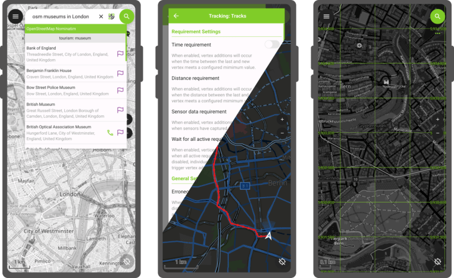
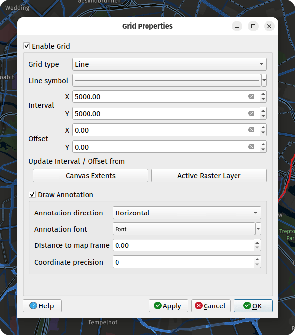
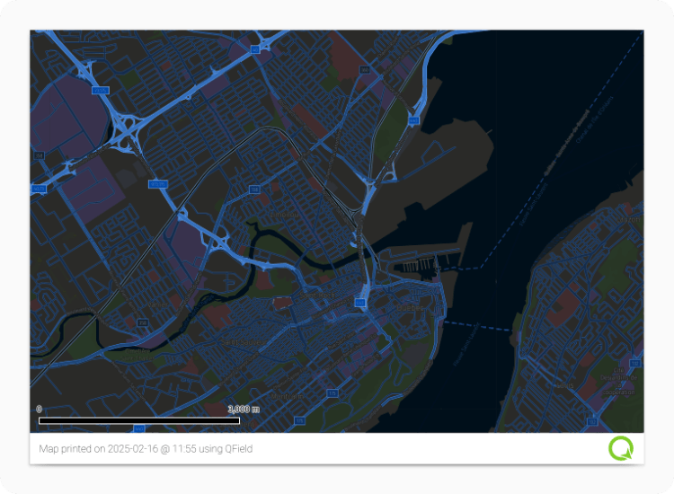
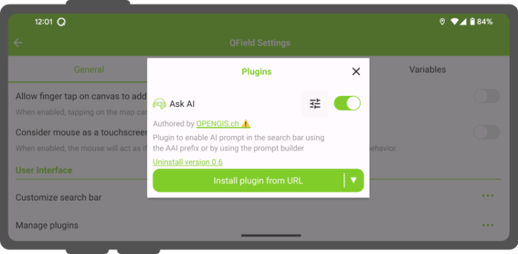

Let’s not bury the lead here: the long-awaited capability to track position while QField is in the background or the device is locked has arrived in this brand-new version of QField. This feels like a magical moment, so we settled for a fantastical forest for our release name.
## Main highlights

As highlighted above, QField 3.5 has unlocked **background position tracking** on the Android platform. This allows users to keep track of their positions even as they put QField in the background to conduct other tasks on their devices. It also means that tracking has become far more battery efficient, as users can lock/suspend their phones and tablets for long periods while QField continues to collect and track positions. On top of it all, this will work out of the book with internal GNSS as well as external high-precision GNSS devices.
This is a long-requested functionality for QField, and we couldn’t be prouder to deliver it to our hundreds of thousands of Android users. Big thanks to [Groupements forestiers Québec](<https://www.groupementsforestiers.quebec/>), [Biotope](<https://www.biotope.fr/>), and [Terrex Seismic,](<https://www.terrexseismic.com/>) who jointly sponsored the development.
Moving on to the next major feature added to this new version. Users can now easily import folders from WebDAV services and subsequently upload and download content to that remote folder within QField itself. This functionality eases friction on Android and iOS platforms where storage access is heavily regulated. This implementation highlights our commitment to providing QField users with the freedom they need to build their workflows; thanks to [Prona Romandie](<https://www.prona-romandie.ch/>), [AgaricIG](<http://www.agaricig.com/>), and [Oslandia](<https://oslandia.com/>) for commissioning this work.
It’s important to note that the WebDAV functionality does not provide data synchronization. The download and upload operations will overwrite datasets stored locally or remotely. [For users in need of synchronization and smooth project distribution, QFieldCloud is the way to go](<https://qfield.cloud/>). With this new version of QField, downloading large datasets from QFieldCloud has become much more reliable, especially on devices with low memory.
Last but not least, QField has gained **support****for project-configured grid decoration**. When activated, a grid is overlayed on top of the map canvas, which will dynamically render while panning and zooming around. The grid is configured and activated while setting up projects within QGIS itself.

Pro tip: this functionality can replace heavy grid datasets when covering a large dataset, something to consider when trying to optimize projects’ storage size. Big thanks to [Oester Messtechnik GmbH](<https://messtechnik.ch/>) for supporting the implementation of this fourth decoration following the arrival of title, copyright, and image decorations in earlier releases.
Other improvements in this release include **“forward” angle snapping** to digitize perfectly angled polygons, **pinch gesture-driven feature rotation** , and a new print template which unlocks printing of map canvas to PDF even when their projects have no layouts defined.

## **Plugin-specific improvements**
  
One of the main additions to QField’s plugin framework is the **capability to integrate custom results into the search bar**. Thanks to Kanton Basel-Landschaft for supporting the development, users can enjoy OpenStreetMap Nominatim search result integration by [installing this plugin](<https://github.com/opengisch/qfield-nominatim-locator>) (instructions available on the repository). This integration also opens up many new possibilities, such as enabling plugins to send prompts to AI, just like [this plugin](<https://github.com/mbernasocchi/qfield-ask-ai>) does.
Other noteworthy improvements include shipping **Quick3D QML modules, which allow authors to develop 3D overlays** , a new API to customize QField’s colour appearance and a new mechanism for plugins to add a configuration button within the plugin manager.

  
Users and plugin authors can expect an exciting year ahead as the QField plugin framework continues to grow with new functionalities and improvements. Watch this space!
### _Related_
