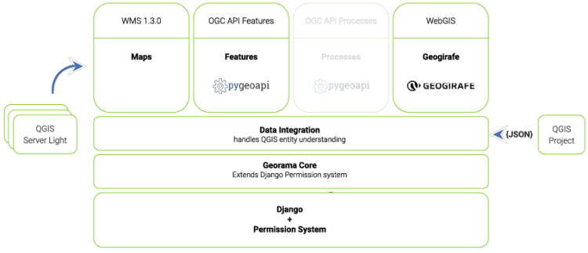
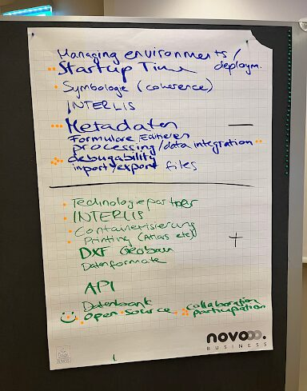

On the eve of our 10-year anniversary, the energy in the room was all about innovation and collaboration. The Georama workshop brought together top experts in geodata infrastructure **to** **dive into the platform’s capabilities and potential.**
**A Vision Unveiled**
Georama, this new geodata publication platform stands out for its modular design and adherence to OGC standards. **Built around a QGIS based core** which ensures excellent integration with state of the art geodata infrastructures, it comes with QGIS Server Light as its rendering engine. This scalable, cloud-native approach facilitates the seamless publishing of QGIS projects to the web with a blazing fast experience. Its Django foundation **opens doors to a vast ecosystem of applications** for typical requirements like authentication and modern web technologies.  

## **Industry Leaders Share Their Experience**
The **_Canton of Zug_ **highlighted the practical implementation of Georama in their presentation. Christian Sieber works in an service operations team who operates containerized environments for running SDI related services for years. They use QGIS and QGIS Server in such a deployment and now have the need for a more advanced authentication and authorization system as well as better possibilities to debug, scale and manage their deployments. In collaboration with OPENGIS.ch they work towards this goal with Georama.
Guillaume Remy from the _**Canton of Basel Stadt**_ is a driving force behind Geogirafe which forms the frontend module of Georama. He gave insights into their vision on a geodata publishing platform that is based on cloud optimized formats. Georama and QGIS Server Light play a pivotal roles in operating a cloud native system.
Olivier Monod from _**Yverdon-Les-Bains**_ rounded out the presentations with an integrated approach to geodata infrastructure. Next to publishing geodata, a typical role of a city is to also collect and manage data. His team is working towards domain-specific applications developed as Django apps that complement map publication. This way, the domain modules are all accessible through QGIS, QField, and browsers via REST and OGC web standards.

## **Collaborative Innovation**
What turned our gathering from a set of presentations into a workshop was the knowledge and engagement of our attendees. They actively **helped pinpoint key priorities** and**challenges in geodata infrastructure** , drawing from their own experience managing various systems. Their insights have helped us to complete, fine-tune and prioritize the Georama roadmap.

Going forward, this collaborative approach will continue to**shape Georama,** and we’ll soon follow up with more information about its state and real world usecases.
### _Related_
