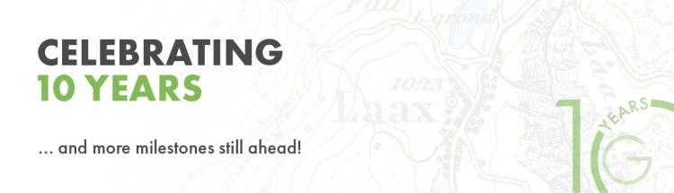
🎉 **10 years** of [OPENGIS.ch](</index.html>) 🎉
2024 marked a monumental milestone for **OPENGIS.ch** : a decade of growth, success, and connection with all of you. Let’s take a look back at the highlights! 
#### **MAPPING 10 YEARS OF SUCCESS**
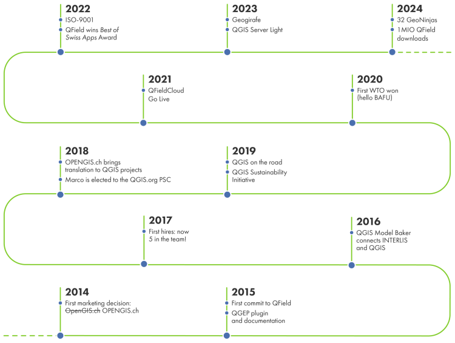
* * *
#### **A MEMORABLE GATHERING**
Our 10th anniversary was a wonderful opportunity to reflect on our journey so far and to anticipate the exciting path ahead. To conclude our year of celebration, we hosted a truly memorable event at the end of January in Bern, with workshops and a fondue gathering that left us all inspired and connected. Good food, great company, and **a** **shared vision** for the next decade!
A special thank you to our clients for their insightful presentations, which added value and depth to the event. We are grateful for your collaboration and continued support!
  - **Mehrjahresprogramm Natur und Landschaft (MJPNL)** – Odile Bruggisser, Kanton Solothurn | _Amt für Raumplanung_

  - **Scale Electrification Of Decentralized Areas With****connect2evolve** – Yohannes Ghermay, Siemens Energy | _Co-founder #connect2evolve_

  - **Model baker** – Romedi Filli, Kanton Schaffhausen | _Head of Geoinformation_

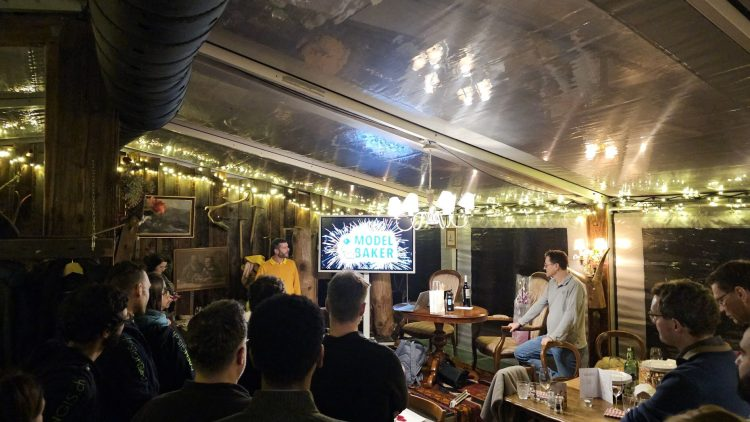 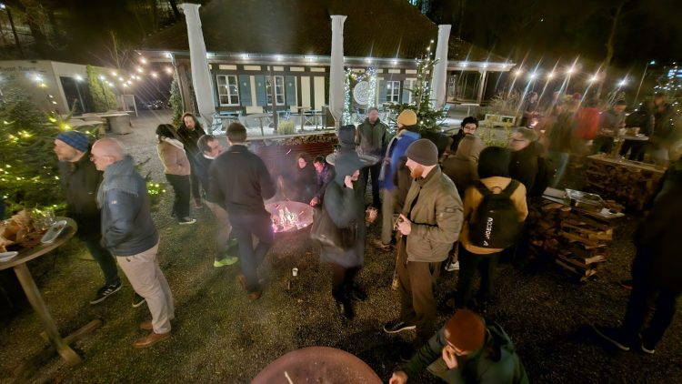  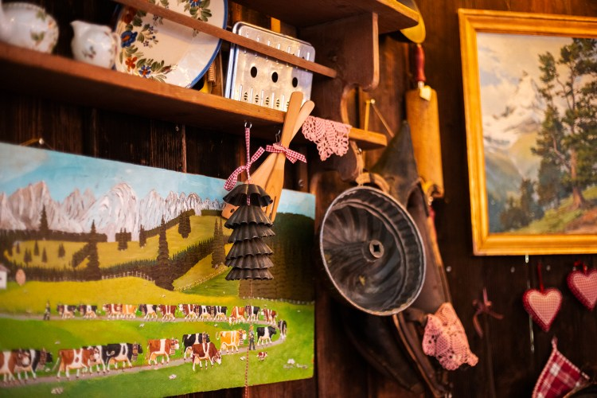 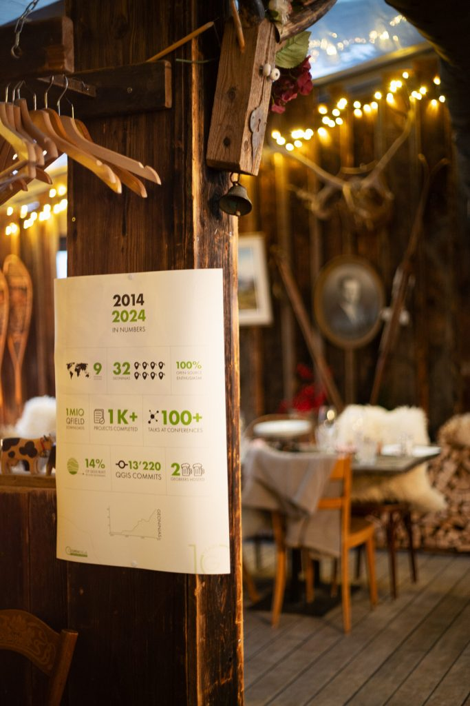
* * *
**THREE WORKSHOP**
Our event featured three **engaging** workshops:
**GEORAMA**
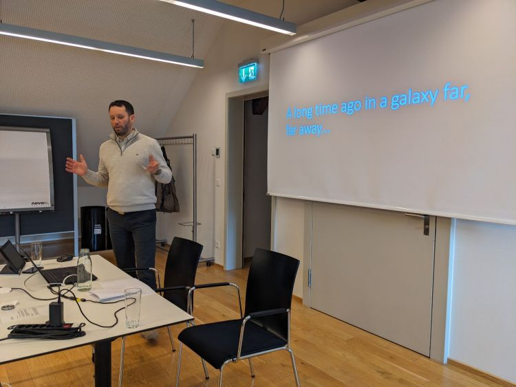
The workshop brought together top experts in geodata infrastructure to dive into the platform’s capabilities and potential.
**[Read more…](</georama-workshop-pioneering-the-future-of-geodata-infrastructure/index.html>)**
**QFIELD**
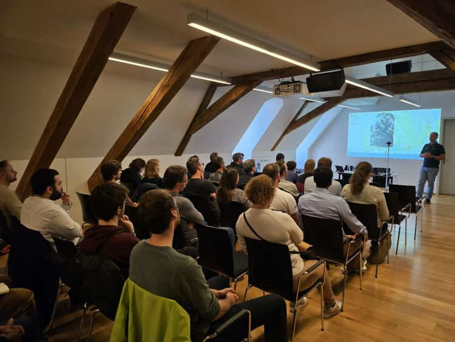
A glimpse of QField: its vision, where it will it go and what exciting features can future users look forward to.
**[Read more…](</unpacking-key-insights-from-our-qfield-workshop/index.html>)**
**QGIS PROCESSING**
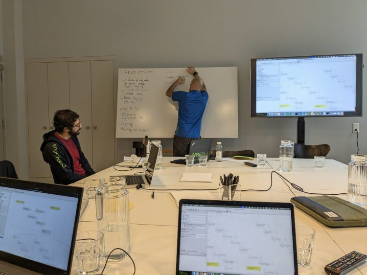
A mixed group of experienced QGIS users and developers got together to take a close look at the Graphical Modeler tool in QGIS.
**[Read more…](</a-brief-look-into-our-qgis-processing-workshop/index.html>)**
* * *
**OUR COMMITMENT TO OPEN-SOURCE**

**🚀 QField has officially hit 1 million downloads – thanks to you! 🎉**
This milestone is the result of years of dedication, with **over 50,000 hours** invested by our team. Our GeoNinjas contributed **stunning 14% of QGIS** , while also driving **open-source projects** like _ModelBaker_ and _SwissLocator_.
As a diamond sponsor of OSGeo and a large sustaining member of QGIS, we take pride in supporting and nurturing the growth of the open-source GIS ecosystem.
A huge thank you to our community. **Here’s to the next chapter!** 🚀
[Get QField](<https://docs.qfield.org/get-started/>)
* * *

**OUR SUSTAINABILITY INITIATIVE**
We created the **QGIS and QField Sustainability Initiative** to guarantee the long-term stability of these open-source tools. **For every support contract exceeding 10 days** , we allocateadditional days to this initiative, and **any** **unused hours at the end of the year are reinvested**. This allows us to focus on critical but often overlooked tasks like bug fixing, code reviews, and core maintenance; work that keeps the software reliable and evolving.
Through this initiative, we provide **monthly stability updates** to address critical bugs and conduct thorough code reviews to maintain high-quality standards. We also make sure that QGIS’s core remains stable, up to date, and easy to manage. By dedicating resources to these efforts, we help **sustain** and**improve** **QGIS and QField for the entire community.**
[Get a support contract](</qgis-support-wartung/index.html>)
* * *
On another note, we’ll be at [**FOSSGIS 2025**](<https://www.fossgis.de/>) starting tomorrow and we’re looking forward to seeing you there!
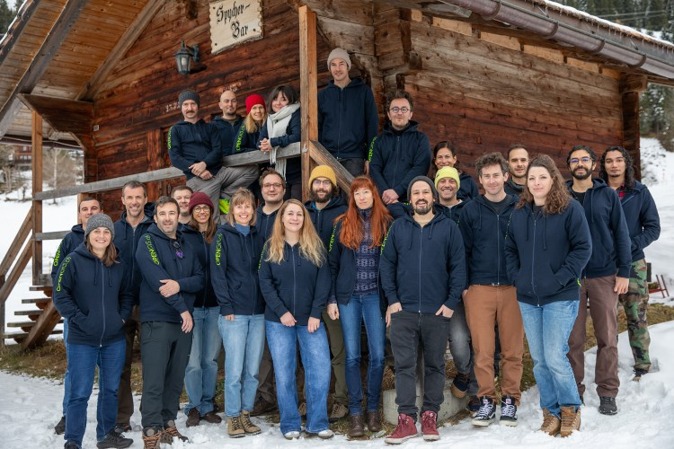 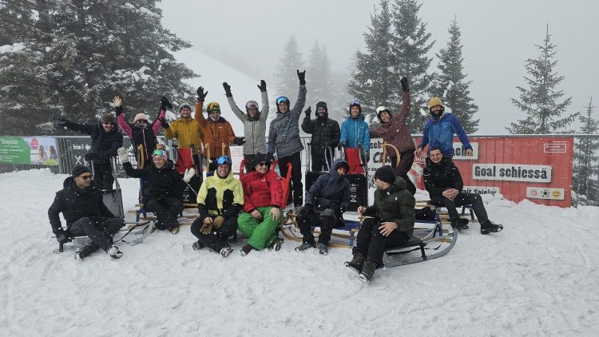
### _Related_
