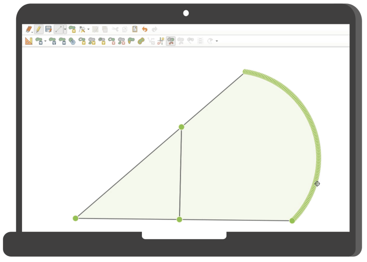
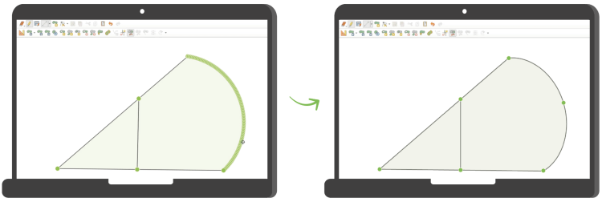

**Warum sie wichtig sind und wie du helfen kannst**.

In der Welt der Geodatenverarbeitung sind **Kreisbögen** (engl. _circular arcs_) ein häufig übersehenes, aber enorm wichtiges Element. In **QGIS** , der führenden Open-Source-GIS-Anwendungen, sind sie bislang nur eingeschränkt unterstützt – und genau das wollen wir ändern.
## **Was sind Kreisbögen – und warum sind sie wichtig**
Kreisbögen sind geometrische Elemente, die nicht aus geraden Liniensegmenten bestehen, sondern echte **Rundungen** darstellen. Sie sind definiert über drei Punkte: Anfangs- und Endpunkt sowie Scheitelpunkt (oder Zentrum des Kreises).
**Sie finden sich:**
  - Kreisverkehre
  - Einlenker
  - bei Planungs- und CAD-Daten,
  - und in der Amtlichen Vermessung

Echte Kreisbögen ermöglichen präzisere Analysen und bessere Ergebnisse bei der Weiterverarbeitung. Ohne sie müssen GIS-Systeme Rundungen oft in **viele kleine Linienstücke** aufteilen _(segmentieren)_ , was Genauigkeit kostet und die Daten unnötig aufbläht.
## **Was ist das aktuelle Problem in QGIS?**
Im Moment unterstützt QGIS Kreisbögen zwar nativ, in vielen Situationen aber **nur bedingt**. Stattdessen werden sie intern oft in kurze Liniensegmente aufgelöst – besonders dann, wenn Geometrien bearbeitet, verschnitten oder analysiert werden.
Das führt zu mehreren Problemen:
  - **Ungenaue Ergebnisse** : Aus einer schönen Kurve wird eine gezackte Linie.  

  - **Qualitätsverlust** : Dadurch entsteht ein unnötiger Qualitätsverlust  

  - **Fehlerquellen** : Manche räumliche Operationen liefern falsche Resultate, weil die Originalgeometrie nicht korrekt erhalten bleibt.  

Wenn Kreisbögen in einem Datensatz erhalten sind, in einem anderen dieselben Daten aber als segmentierte Version vorliegen führt das schnell zu Problemen.
* * *
## **Welche Bibliothek ist verantwortlich?**
Die Kernbibliothek, die geometrische Berechnungen in QGIS übernimmt, heisst **GEOS** (_Geometry Engine – Open Source_). GEOS ist extrem leistungsfähig – aber bislang kann sie echte Kreisbögen noch nicht **vollständig** verarbeiten. Alle GIS-Programme, die auf GEOS setzen, haben deshalb ähnliche Einschränkungen.
Das bedeutet: wenn wir Kreisbögen in GEOS verbessern, profitiert nicht nur QGIS, sondern **die gesamte Open-Source-GIS-Community** – von PostGIS bis GDAL.
## **Unser Crowdfunding: wir haben schon die Hälfte geschafft!**
Um dieses Problem nachhaltig zu lösen, haben wir im Jahr 2024 ein Vorprojekt durchgeführt und eine erste Integration von Kreisbögen ins Geometriemodell von GEOS umgesetzt. Dieses Jahr wollen wir **einen Schritt weiter gehen** und auch Algorithmen anpassen.
Im April haben wir dafür ein **Crowdfunding** gestartet. Unser Ziel:
  - die Overlay Engine in GEOS fit für Kreisbögen machen
  - und darauf aufbauend die Handhabung in QGIS massiv verbessern.  

* * *
**Die gute Nachricht:** wir haben bereits die Hälfte der Finanzierung zusammen! Jetzt brauchen wir **deine Hilfe** , um den Durchbruch zu schaffen.
Jede Unterstützung – ob finanziell, durch Teilen der Kampagne oder einfach durch Weitererzählen – bringt uns **einen Schritt näher** an ein besseres QGIS für alle.
🔗 **Hier geht’s zum Crowdfunding** 👇

* * *
## **Zusammen können wir es schaffen**
Die Open-Source-Welt lebt davon, dass Menschen zusammen an etwas Grossem arbeiten. Mit echter Unterstützung für Kreisbögen wird QGIS nicht nur präziser und schneller, sondern auch ein noch stärkeres Werkzeug für die Praxis.
**Hilf mit – für bessere Geodaten, für bessere Analysen, für bessere Ergebnisse!**



[https://videopress.com/embed/ZzDfFdzJ](<https://videopress.com/embed/ZzDfFdzJ>)

### _Related_
