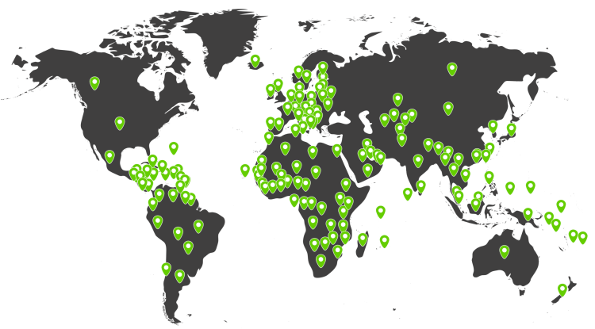
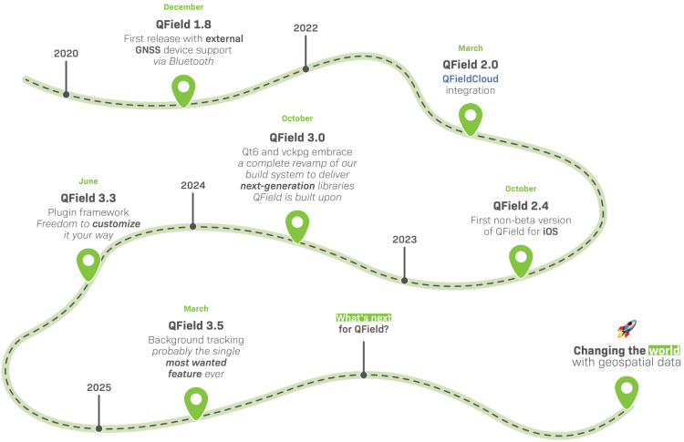

🚀 QField has officially hit **1 million downloads** – thanks to **you!** 🎉
Let’s not beat around the bush: QField has hit **1+ million downloads**. What started as an ambitious open-source project has transformed into **a global tool that’s changing how professionals collect spatial data in the field**. This big milestone is the result of years of dedication, with over 50,000 hours invested by our team. Our GeoNinjas contributed 14% of QGIS, while also driving open-source projects like _ModelBaker_ and _SwissLocator_.Thank you for making GIS nerds the **unsung heroes of fieldwork everywhere.** Here’s to changing the world, one field at a time!

* * *
[🚀 GET QFIELD NOW](<http://qfield.org/get>)
* * *
### From Switzerland to the world!🇨🇭
Born in the Swiss Alps, raised by open-source, and now**roaming the globe** , QField has gone international! What started in Switzerland is now in the hands of field mappers, researchers, and GIS pros on six continents. Thank you for taking QField **worldwide**! 🌍

#### **Mapping the world one field at a time.**
* * *
### The numbers tell a _story_ 📖
One million downloads might sound like just a number, but for us, it represents something much bigger. It’s 1’000’000 times someone chose **an innovative, flexible mobile mapping solution**. It’s 1’000’000 instances of fieldwork made **easier** , **more** **efficient** , and **more** **accurate**.
From humble beginnings to over 1 million downloads, QField has officially gone from “little app that could” to “open-source overachiever.**”** Thanks to the power of open source _(and probably some caffeine)_.

**QField has hit 1 million downloads in over 150 countries.**
* * *
### QField’s top user countries 🏆
QField’s passport is full! 🌍 We’re blown away by how far our geospatial tool has travelled: from mountaintops to city blocks, you’re mapping it all. **Our** **amazing global user community** is making QField a true #DigitalPublicGood.**** A map made in heaven! 💚
Mapping knows no borders, just like QField’s growing community.

* * *
### More than just an app 📱
This cross-platform flexibility helps professionals collect GIS data anywhere, anytime. QField goes wherever you do. Android? _Check_. iOS? _Check_. Desktop? _Check_. If it has a screen, we’re probably on it. Collect GIS data **anywhere, anytime.**

QField isn’t just software, it’s a **community-driven project** that turns complex geospatial challenges into precise, actionable data. **Every download represents a connection to our core mission: making professional-grade mobile GIS accessible, reliable, and straightforward.**
* * *
### QField’s Journey: Mapping our milestones 📍
Our roadmap is packed with milestones and highlights that will continue to**push the boundaries** **of mobile GIS.**

* * *
### QField to QFieldCloud ☁️
You can play a key role in the **sustainable growth of QField** , the open-source digital good. Your support can take many forms, like contributing… or:

This not only streamlines and enhances your fieldwork but also gives you **access to the full QField ecosystem** with all its advantages. At the same time, you directly **contribute** to the continuous improvement of QField, ensuring its impact grows for everyone.
[💚 SUPPORT US](<https://qfield.org/support-us>)
* * *
### _Related_
