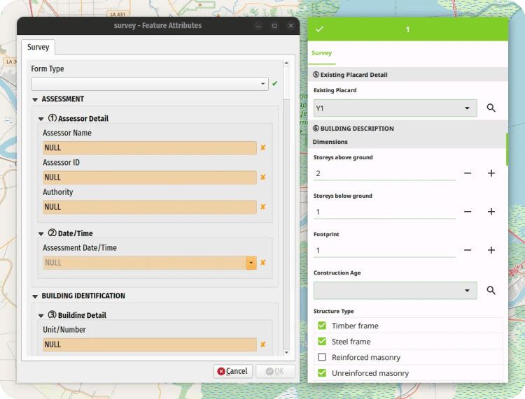
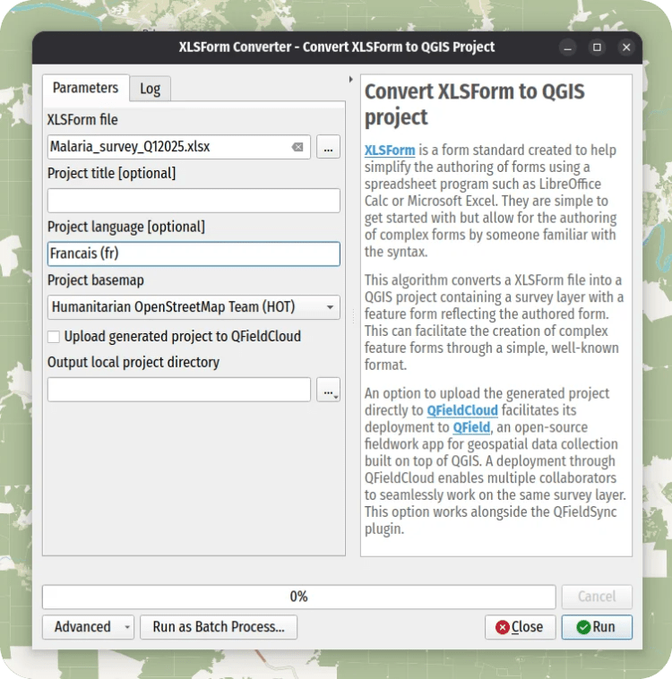

Today marks the initial release of our brand-new QGIS plugin, _XLSForm Converter_.  
As the name suggests, the plugin converts XLSForm survey files into ready-to-use QGIS projects with a preconfigured survey attribute form.
Migrating to QField was never easier!  

_The converted survey form as displayed on QGIS (left) and QField (right)_
Even more exciting is that the converted QGIS project includes all the necessary settings for use with QField, thanks to a nifty QFieldCloud integration. With just a single checkbox, you can upload your generated project to the cloud and begin gathering data—either as a standalone surveyor or collaboratively as part of a team.
We believe this provides a fantastic solution for organisations and groups familiar with XLSForm—or already working with templates—who want to leverage QGIS-powered QField to conduct spatial surveys.
## Plugin highlights
The plugin adds an algorithm to QGIS’ processing toolbox that converts a XLSForm file – Microsoft Excel’s .xls or .xlsx as well as LibreOffice Calc’s .ods – into a QGIS project containing a main survey layer and a basemap.
_The XLSForm Converter’s algorithm dialog_
The layer’s geometry type will reflect the first geometry-driven question type found in the XLSForm, namely a point geometry for geopoint, a line geometry for geotrace, or a polygon geometry for geoshape.
For XLSForm _repeat_ blocks, the algorithm generates additional layers and configures parent-child relationships to bind them to the main survey layer. These layers are hidden from the layer tree by default, keeping the project simple and user-friendly—even for users unfamiliar with QGIS.
For questions that capture media content—such as photographs, videos, and audio clips—the converter sets up the project so users can easily record them in QField with a single tap.
_Pro tip: Since the converter is an algorithm, you can use it to build complex, model-driven survey projects via the QGIS Processing Modeler. You can also run conversions in headless environments using`qgis_process`. The possibilities are endless!_
## QFieldCloud-facilitated deployment to QField
As mentioned earlier, the converted project can immediately be used in QField to conduct surveying. The best way to deploy these projects to your QField-running devices is via [QFieldCloud](<https://qfield.cloud/>). The algorithm comes with a parameter that – when checked – will automatically upload the generated project to QFieldCloud.
That functionality requires the QFieldSync plugin to be installed and enabled in QGIS. Just log in to your QFieldCloud account via QFieldSync, and let the algorithm take care of the rest. It’s magical! If you haven’t yet tried QFieldCloud, this might be [a good time to do so by signing up for a free community account](<https://qfield.cloud/>).
Of course, you’ll always be able to copy these projects manually onto devices via USB cable or the numerous file import options available in QField.
## XLSForm-what?
[XLSForm](<https://xlsform.org/>) is a form standard designed to simplify the authoring of forms using spreadsheet programs like LibreOffice Calc or Microsoft Excel. They are simple to get started with and allow for the authoring of complex forms in no time. The syntax is beginner-friendly, and the building of surveys by adding rows onto a spreadsheet is surprisingly intuitive.
The standard has been widely adopted across various sectors, including public health, humanitarian relief, disaster response, local governance, and non-profit organisations.
Over here at OPENGIS.ch, we believe this plugin can be instrumental to preexisting operations and projects interested in migrating to a QField surveying environment where spatial considerations are front and center. If you are interested in discussing this further, [do not hesitate to contact us](</index.html#contact>).
### _Related_
