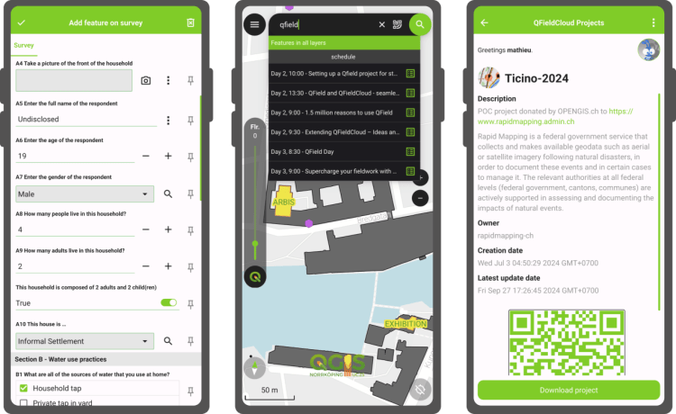
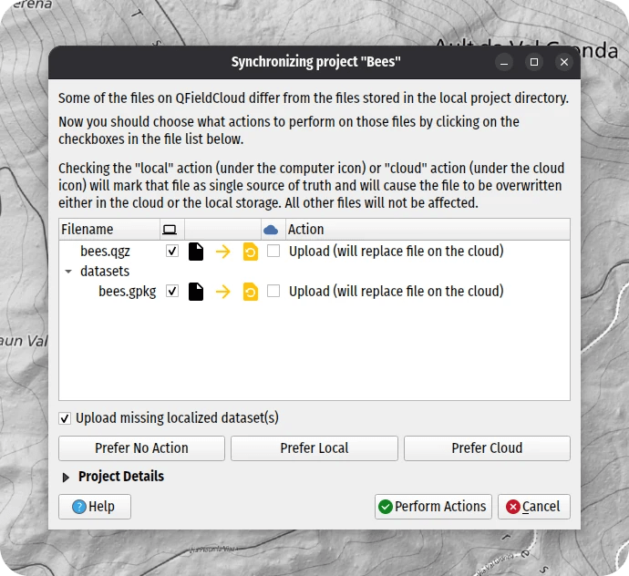

Building on top of the last release which introduced background tracking, this development cycle focused on polishing functionalities and building on top of preexisting features. The variety of improvements is sure to make our diverse user base and community excited to upgrade to QField 3.6.
## Main highlights

One of the most noticeable improvement in this version is the addition of “map preview rendering”. **QField now renders partial map content immediately beyond the edge of the screen** , offering a much nicer experience when panning around as well as zooming in and out. Long-time QGIS users will recognise the behaviour, and we’re delighted to bring this experience to the field
This upgrade was the foundation upon which we built the following enhancement: as of QField 3.6, **using the “lock to position” mode now keeps your position at the very center of the screen while the canvas slips through smoothly**. This greatly improves the usability of the function as your eyes never need to spend time locating the position within the screen: it’s dead center and it stays there!
_Reminder, the “lock to position” mode is activated by clicking on the bottom-right positioning button, with the button’s background turning blue when the mode is activated._
The improvements did not stop there. Panning and zooming around used to drop users out of the lock mode immediately. While this had its upsides, it also meant that simple scale adjustments to try and view more of the map as it follows the position was not possible. With QField 3.6, **the lock has been hardened. Moving the map around will temporarily disable the lock, with a visual countdown embedded within a toast message informs users of when the lock will return**. An action button to terminate the lock is located within the toaster to permanently leave the mode.
Moving on to QFieldCloud, this cycle saw tons of improvements. To begin with, **it is now possible to rely on shared datasets across multiple cloud projects**. Known as localised data paths in QGIS, this functionality enables users to reduce storage usage by storing large datasets in QFieldCloud only once, serving multiple cloud projects, and also easing the maintenance of read-only datasets that require regular updates.

_QFieldSync users will see a new checkbox when synchronising their projects, letting them upload shared datasets onto QFieldCloud._
Furthermore, **QField has****introduced a new cloud project details view to provide additional details** on QFieldCloud-hosted projects before downloading them to devices. The new view includes a cloud project thumbnail, more space for richer description text, including interactive hyperlinks, and author details, as well as creation and data update timestamps. Finally, the view offers a QR code, which allows users to scan it quickly and access cloud projects, provided they have the necessary access permission. Distributing a public project has never been easier!
Beyond that, tons more has made its way into QField, including **map layer notes viewable through a legend badge** in the side dashboard, **support for feature identification on online raster layers** on compatible WMS and ArcGIS REST servers, **atlas printing of a relationship’s child feature** directly within the parent feature form, and much more. There’s something for everybody out there.
## Focus on feature form polishing
This new version of QField coincides with the release of **[XLSForm Converter](</02/xlsform-converter-unlock-a-world-of-surveys-with-our-brand-new-qgis-plugin/index.html>)** , a new QGIS plugin created by OPENGIS.ch’s very own ninjas. As its title implies, the plugin converts an [XLSForm spreadsheet file (.xls, .xlsx, .ods)](<https://xlsform.org/en/>) into a full-fledged QGIS project ready to be used in QField with a pre-configured survey layer matching the content of the provided XLSForm.
This was a golden opportunity to focus on polishing QField’s feature form. As a result, advanced functionalities such as **data-driven editable flag and label attribute properties are now supported**. In addition, tons of paper-cut bugs, visual inconsistencies, and UX shortcomings have been addressed. Our favourite one might just be the ability to drag the feature addition drawer’s header up and down to toggle its full-screen state 🙂

  <iframe
    src="https://videopress.com/embed/kJg69l49"
    title="VideoPress video"
    loading="lazy"
    allow="autoplay; encrypted-media; picture-in-picture; fullscreen"
    allowfullscreen>
  </iframe>

[https://videopress.com/embed/kJg69l49](<https://videopress.com/embed/kJg69l49>)

### _Related_
