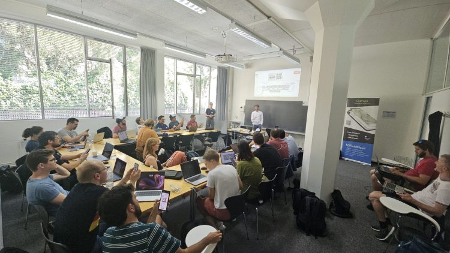
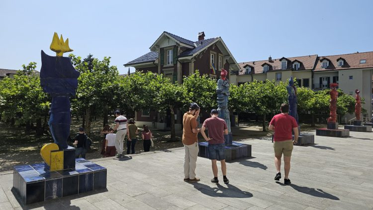
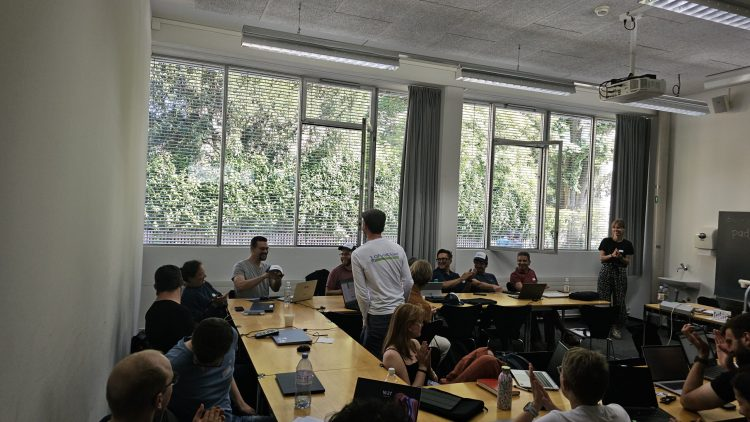

Lo scorso **martedì a Berna** , la comunità svizzera di QGIS si è riunita per l’edizione 2025 del **QGIS.ch User Meeting** — e noi di **OPENGIS.ch** siamo stati orgogliosi di partecipare attivamente durante tutta la giornata, con presentazioni, workshop e interventi tecnici.
## Condividere conoscenza e innovazione
La giornata si è aperta con il nostro CEO, **Marco Bernasocchi** , che ha inaugurato l’evento con un aggiornamento sul progetto **QGIS** , presentando le novità più attese: il rilascio di **QGIS 4** e il restyling in corso del sito web.  
👉 _(Slides [qui](</slides.opengis.ch/talk-qgis.org/qgisch2025.html>))_
Subito dopo, Marco è tornato sul palco per presentare gli ultimi sviluppi di **QField** , tra cui nuove funzionalità, miglioramenti all’esperienza utente (UX) e ottimizzazioni tecniche che rendono la raccolta dati sul campo sempre più efficace.  
👉 _(Slides[qui](<https://docs.google.com/presentation/d/1IMD93xeQy9aRbKWXdJDB8YvyKigZFLA8Llig37xLMro>))_
A seguire, il nostro CTO **Mathias Kuhn** ha tenuto una presentazione appassionante su **Machine Learning e intelligenza artificiale in QGIS** , mostrando casi d’uso reali e soluzioni innovative che integrano flussi geospaziali con automazione intelligente.
In collaborazione con **Timothée Produit** (IG GROUP SA), la nostra collega **Isabel Kiefer** ha illustrato strumenti e processi per **installare, gestire e aggiornare i moduli TEKSI** — una dimostrazione concreta del nostro impegno nel semplificare l’infrastruttura GIS in ambito pubblico e privato.
 
## Rafforzare la sicurezza di QGIS
Nel contesto della nostra strategia di sostenibilità e professionalizzazione dell’open source geospaziale, siamo anche fieri di essere **partner di Oslandia** nel **[QGIS Security Project](<https://security.qgis.oslandia.com/>)** , presentato durante l’evento da **Vincent Picavet**. Questo progetto mira a garantire che QGIS rispetti i più alti standard di sicurezza — un requisito fondamentale per la sua crescente adozione in infrastrutture critiche a livello globale.
* * *
## QField in pratica – in tre lingue!
Nel pomeriggio, OPENGIS.ch ha organizzato un **workshop QField multilingue** con **25 partecipanti** , completo. La sessione ha offerto un’esperienza pratica per imparare a portare i progetti QGIS sul campo, con spunti concreti, consigli utili e anche un bel po’ di sole ☀️
   
## Strumenti OPENGIS.ch protagonisti
Anche al di fuori delle nostre sessioni, **gli strumenti sviluppati da OPENGIS.ch** sono stati protagonisti della giornata:
  - **QField** è stato ampiamente utilizzato nella presentazione del **caso d’uso di Zermatt** , dimostrando la sua efficacia in ambienti alpini impegnativi.
  - Il plugin **ModelBaker** , è stato presentato con il suo nuovo supporto multilingue per i modelli QGIS — un passo importante per progetti internazionali e multilingue.

 
## Una comunità viva e attiva
Come sempre, il **QGIS.ch User Meeting** è stato un’ulteriore conferma della forza e della passione della comunità svizzera open source nel mondo geospaziale. Un enorme grazie a **organizzatori, relatori e partecipanti** per aver reso l’evento un successo — non vediamo l’ora della prossima edizione!
* * *
### Rimani in contatto:
👉 [Sito QField](<https://qfield.org/>)  
👉 [QFieldCloud](<https://qfield.cloud/>)  
👉 [Plugin ModelBaker](<https://modelbaker.ch/>)
### _Related_
