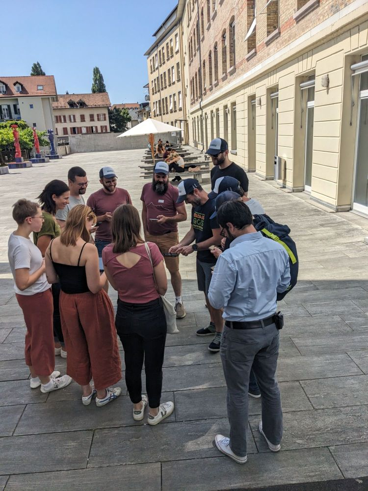

This past **Tuesday in Bern** , the Swiss QGIS community came together for the 2025 edition of the **QGIS.ch User Meeting** — and we at **OPENGIS.ch** were proud to be deeply involved across the entire event, from presentations to hands-on workshops.
## Sharing Insights and Innovation
The day began with our CEO, **Marco Bernasocchi,** opening the conference with an update on the **QGIS project** , covering exciting news about the upcoming **QGIS 4** release and the ongoing website revamp (slides [here](</slides.opengis.ch/talk-qgis.org/qgisch2025.html>)). Shortly after, he took the stage again to present the latest improvements in **QField** , including new features, user experience (UX) enhancements, and under-the-hood upgrades that continue to enable efficient field data collection (slides [here](<https://docs.google.com/presentation/d/1IMD93xeQy9aRbKWXdJDB8YvyKigZFLA8Llig37xLMro>)).
In collaboration with **Timothée Produit** from IG Group SA, our colleague **Isabel Kiefer** presented tools and streamlined processes for i**nstalling, managing, and updating TEKSI**(and other) **modules**. These solutions are a testament to our mission of simplifying complex GIS infrastructure in public and private organisations alike.
Later in the morning, our CTO **Mathias Kuhn** gave a compelling talk on **Machine Learning and AI in QGIS** , showing real-world use cases and technical innovations that bridge geospatial workflows with intelligent automation.
 
## Strengthening QGIS Security
As part of our commitment to sustainability and professionalisation in open source GIS, we are also proud to be a **partner of Oslandia in the[QGIS Security Project](<https://security.qgis.oslandia.com/>)**, which Vincent Picavet presented during the event. This initiative aims to ensure that QGIS continues to meet the highest standards of security — a crucial foundation for its growing adoption in critical infrastructures around the world.
## Hands-on with QField – in Three Languages!
In the afternoon, OPENGIS.ch hosted a fully booked, multilingual **QField workshop** , attended by 25 enthusiastic participants. The session provided hands-on experience for users who wanted to take their QGIS projects into the field and was an excellent opportunity to exchange best practices and tips from real-world use cases and get some sun 🙂
    
## OPENGIS.ch Tools in Action
Even outside of our sessions, tools developed by OPENGIS.ch were featured prominently throughout the day:
  - **QField** played a key role in the **Zermatt use case presentation** , demonstrating its flexibility and robustness in alpine field operations.
  - The **Model Baker plugin** , to which we contribute heavily, was showcased with its new **multilanguage support** for QGIS models — a significant step forward for the Swiss context and its multilingual projects.

 
## A Thriving Community
As always, the QGIS.ch user meeting was a reminder of the strength and passion of the Swiss open source geospatial community. A huge thank you to the organizers, speakers, and participants who made the event such a success — we’re already looking forward to the next one!
* * *
**Stay connected:**  
👉 [QField website](<https://qfield.org/>)  
👉 [QFieldCloud](<https://qfield.cloud/>)  
👉 [Model Baker plugin](<https://github.com/opengisch/QgisModelBaker>)
### _Related_
