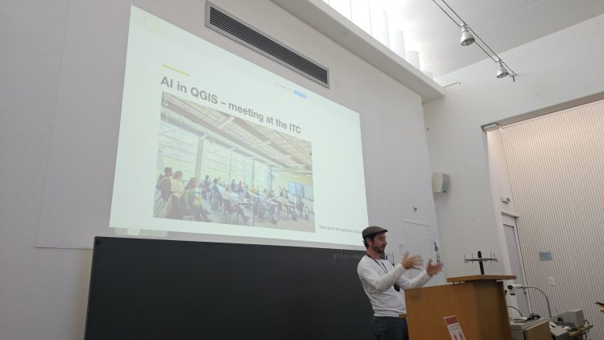
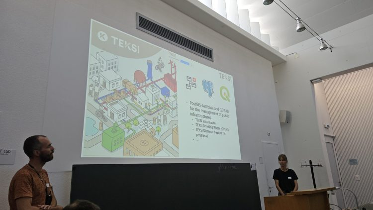
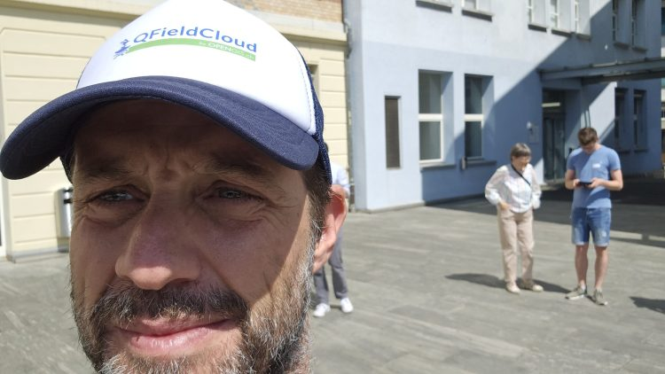
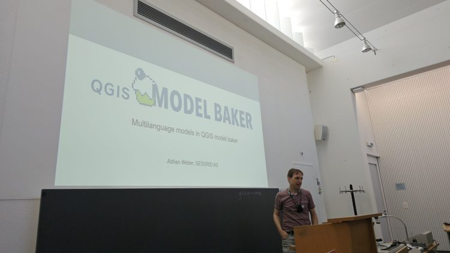
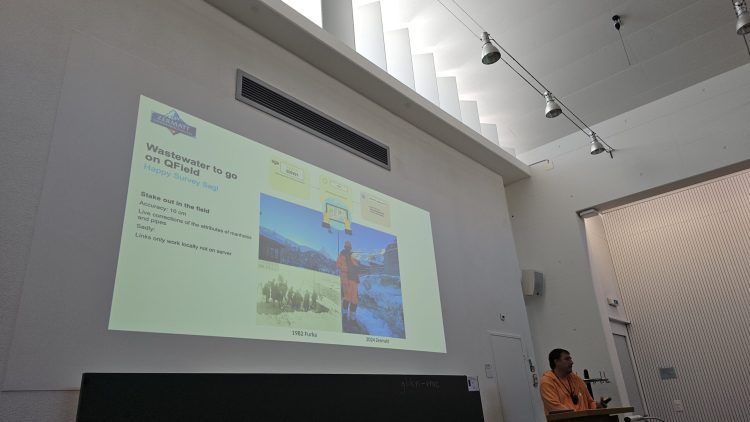

Am vergangenen **Dienstag in Bern** versammelte sich die Schweizer QGIS-Community zum **QGIS.ch Anwendertreffen 2025** – und wir von **OPENGIS.ch** waren stolz, in vielfältiger Weise aktiv am gesamten Anlass beteiligt gewesen zu sein: mit Präsentationen, Workshops und technischen Einblicken.
* * *
## Wissen und Innovation teilen
Der Tag begann mit unserem CEO **Marco Bernasocchi** , der die Veranstaltung mit einem Überblick über das **QGIS-Projekt** eröffnete. Er stellte spannende Neuigkeiten zur kommenden **QGIS 4-Version** sowie zur laufenden Überarbeitung der Website vor.  
👉 _(Folien[hier](</slides.opengis.ch/talk-qgis.org/qgisch2025.html>))_
Kurz darauf präsentierte Marco die neuesten Entwicklungen von **QField** – darunter neue Funktionen, Verbesserungen der Benutzerfreundlichkeit (UX) und technische Optimierungen, die eine effiziente Datenerfassung im Feld weiter vereinfachen.  
👉 _(Folien[hier](<https://docs.google.com/presentation/d/1IMD93xeQy9aRbKWXdJDB8YvyKigZFLA8Llig37xLMro>))_
Anschließend sprach unser CTO **Matthias Kuhn** über **Machine Learning und Künstliche Intelligenz in QGIS** , zeigte reale Anwendungsfälle und innovative Lösungen, die GIS-Workflows mit intelligenter Automatisierung verbinden und ging auf Herausforderungen in diesem Bereich ein.  
👉 _(Folien[hier](<https://docs.google.com/presentation/d/e/2PACX-1vSFapOPJzfF1Fw-KHw_PqTUjd3RHBdAuLSwdo8BsSU2qBHdrUZJ-qvLWQtw2ONdgDDXq_hDI8IP2BrY/pub?start=false&loop=false&delayms=3000&slide=id.g369116688fd_0_108>))_
Gemeinsam mit **Timothée Produit** von der IG Group SA stellte unsere Kollegin **Isabel Kiefer** Werkzeuge und optimierte Prozesse für die **Installation, Verwaltung und Aktualisierung von TEKSI-Modulen** vor – ein weiterer Beitrag zu unserem Ziel, komplexe GIS-Infrastrukturen zu vereinfachen, sowohl für öffentliche als auch private Organisationen.
Matthias talking AI Isa introducing the architectural work we did in Teksi
## Sicherheit für QGIS stärken
Im Rahmen unseres Engagements für Nachhaltigkeit und Professionalisierung in der Open-Source-GIS-Welt sind wir auch **Partner von Oslandia im[QGIS Security Project](<https://security.qgis.oslandia.com/>)**, das von **Vincent Picavet** vorgestellt wurde. Ziel dieses Projekts ist es, sicherzustellen, dass QGIS höchste Sicherheitsstandards erfüllt – besonders wichtig für den Einsatz in kritischen Infrastrukturen weltweit.
* * *
## QField zum Anfassen – in drei Sprachen!
Am Nachmittag führte OPENGIS.ch einen **ausgebuchten, mehrsprachigen QField-Workshop** mit **25 Teilnehmenden** durch. In der praxisnahen Session lernten die Teilnehmer:innen, wie sie ihre QGIS-Projekte effizient im Feld einsetzen können – inklusive wertvoller Tipps, realer Beispiele und ein wenig Sonne ☀️
 Digitising Got sun! and the winner is…
## OPENGIS.ch-Werkzeuge im Einsatz
Auch ausserhalb unserer eigenen Sessions wurden **Lösungen von OPENGIS.ch** während der Veranstaltung vielfach eingesetzt und vorgestellt:
  - **QField** spielte eine zentrale Rolle in der **Zermatt-Fallstudie** , die den Einsatz in anspruchsvoller alpiner Umgebung demonstrierte.
  - Das Plugin **Model Baker** , das von uns entwickelt wird, wurde mit seiner neuen **Mehrsprachigkeitsunterstützung für QGIS-Modelle** vorgestellt – ein grosser Fortschritt für die Schweiz mit ihren Sprachregionen.

Modelbaker in action QField usage in Zermatt
## Eine lebendige Community
Das **QGIS.ch Anwendertreffen** war einmal mehr ein Beweis für die Stärke und Leidenschaft der Schweizer Open-Source-GIS-Community. Ein grosses Dankeschön an die **Organisator:innen, Referent:innen und Teilnehmenden** , die diesen Tag möglich gemacht haben – wir freuen uns schon jetzt auf das nächste Treffen!
* * *
### Bleiben Sie in Verbindung:
👉 [QField Webseite](<https://qfield.org/>)  
👉 [QFieldCloud](<https://qfield.cloud/>)  
👉 [ModelBaker Plugin](<https://modelbaker.ch/>)
### _Related_
