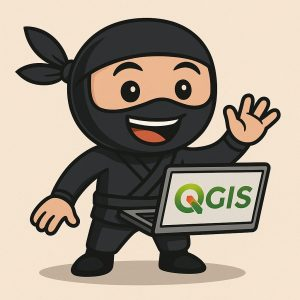

### **Titre du poste :** Expert·e QGIS & PostGIS
**Lieu :** Télétravail (depuis la Suisse un atout)
**Taux d’activité :** 80 à 100 %
**Entreprise :** OPENGIS.ch
* * *
### À propos de OPENGIS.ch
[OPENGIS.ch](</index.html>), c’est une équipe passionnée de GeoNinjas spécialisée dans le développement et le conseil en géoinformatique open source. Nous concevons des solutions sur mesure pour des client·e·s en Suisse et à l’international. Nous croyons fermement aux outils open source – flexibles, durables, évolutifs – et nous sommes activement impliqués dans la communauté géospatiale. Notre équipe distribuée fonctionne à merveille grâce à la collaboration, la diversité et l’entraide.
* * *
### Ton rôle

Nous cherchons une personne motivée et expérimentée pour renforcer notre équipe de conseil. Tu accompagneras nos client·e·s dans la mise en place et la gestion de bases de données PostGIS, de projets QGIS et de campagnes de terrain avec QField. Si tu aimes travailler en autonomie tout en faisant partie d’une équipe soudée, et si l’écosystème QGIS te fait vibrer, alors nous aimerions de te rencontrer !
* * *
### Tes missions
  - Configurer et gérer des projets QGIS professionels (connexions DB, mises en page, modèles, etc.)
  - Créer, adapter et migrer des bases PostGIS
  - Gérer de petits projets
  - Être à l’écoute des client·e·s et répondre à leurs besoins
  - (Optionnel) Donner des formations QGIS et QField (niveau débutant à avancé)

* * *
### Ton profil
  - Maîtrise de QGIS et PostGIS
  - Bonnes connaissances dans la modélisation des données
  - Connaître INTERLIS est un plus
  - Connaître QField et/ou QFieldCloud est un avantage (sinon, une formation est possible)
  - Des connaissances en Python, Git ou Docker sont un atout
  - Méthode de travail autonome et orientée vers les solutions
  - Plaisir du travail d’équipe et communication claire
  - Curieux·se, ouvert·e et envie d’apprendre
  - Langue maternelle français ou allemand et bonne compréhension de l’autre
  - Bonne maîtrise de l’anglais
  - De préférence domicile en Suisse

* * *
### Quelques questions pour toi
  - Quelle est ton expérience avec QGIS et PostGIS ?
  - Peux-tu nous raconter un projet récent où tu as utilisé des fonctionnalités avancées de QGIS et PostGIS ?
  - Qu’est-ce que tu as appris récemment juste par curiosité personnelle ?

* * *
**Prêt·e à postuler ?**
Si ce poste te parle et que tu penses correspondre, envoie ta candidature via [opengis.ch/jobs](</jobs/index.html>) – nous nous réjouissons de faire ta connaissance !
* * *
**Rejoins[OPENGIS.ch](</index.html>) et participe à façonner l’avenir des solutions géospatiales open source !** 🌍💻🚀
* * *
### _Related_
