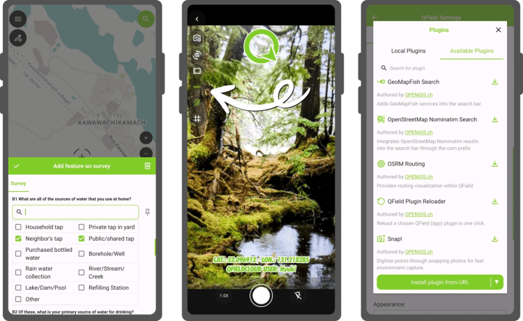
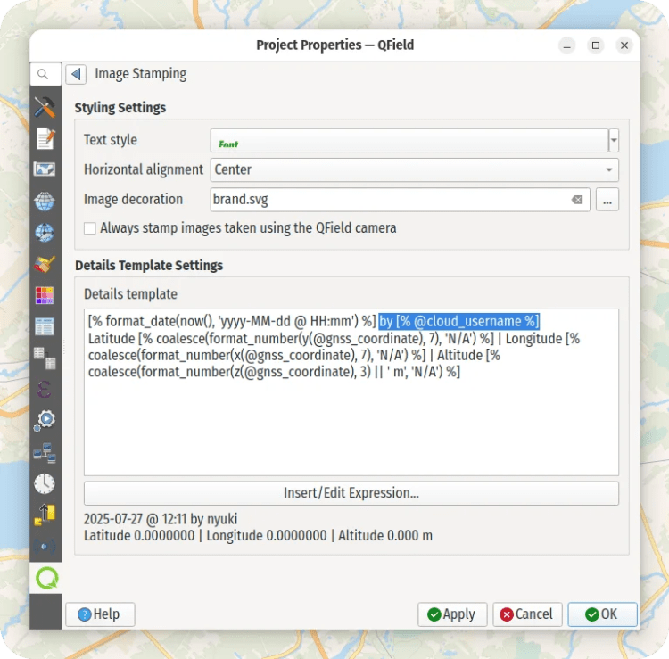
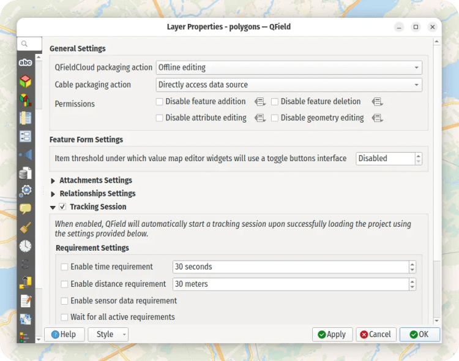

For QField 3.7, we opted for a shorter development cycle that focused on polishing preexisting functionalities from feature form editor widgets improvement through to better nearby Bluetooth device discovery. Of course, we couldn’t help ourselves and still packed in some nice functionality that we thought deserved to reach QField’s growing community as soon as possible.
## Main highlights

One of the most interesting new functionalities from this development cycle has been the ability to stamp details on photos taken by QField’s in-app camera. A basic version of this has been supported for a while now; this new version offers flexible customisation of details stamping onto photos, including changing the font size, colour, and horizontal position, as well as providing users with the ability to completely change the details via expression-driven templates and add image overlays onto the photo.
The custom details stamping configuration lives within project files, allowing for individual projects to drive styling and details. The configuration interface is provided by QFieldSync and can be found in the project properties dialog by switching to the QField panel when setting up projects in QGIS:

The other significant addition in this release is **the new plugin manager’s Available Plugins tab, which offers a curated list of plugins** that can easily be installed with a single tap. The list makes it much easier to discover plugin-delivered functionalities such as online routing, geocoding searches, and much more.
The plugin manager can also **alert users of available updates for their installed plugins, ensuring that crucial bug fixes and improvements are easily delivered**. When a new version is released, users can update via a single tap. We are looking into the possibility of enabling automated plugin upgrades soon.
Long-time users of QField are probably aware of a nifty feature that allowed individual project layers to be locked, and for that lock to be driven by a data-defined property expression. For this new version, we’ve supercharged the layer lock functionality by breaking it down into four distinct vector layer permissions that can be disabled: i) feature addition, ii) attribute editing, iii) geometry editing, and iv) feature deletion. These permissions can be disabled by activating a checkbox or conditionality turned on via a data-defined property expression.

The disabling of permissions using a data-defined property expression allows for interesting scenarios when paired with QField-driven expression context variables such as the user name of a logged-in QFieldCloud account (@cloud_username), GNSS positioning (@gnss_coordinate) and more. Users can easily restrict permissions based on the user interacting with a cloud project, or form advanced geofencing-like rules based on location, time of the day, etc. For more details on available variables, [read this page on QField’s growing documentation site](<https://docs.qfield.org/reference/expression_variables/>).
## Improvements all around
As mentioned above, this version focused on polishing preexisting functionality. Noteworthy improvements include:
  - support for **multiple column display** as well as the **ability to filter value relation lists** ;
  - support for **reversing the sorting order of the relationship editor’s children lists** ;
  - **smoother scanning process to discover nearby Bluetooth devices** when adding external GNSS devices; and
  - support for **feature identification against vector tile layers** (give that a try with the new OpenStreetMap shortbread vector tiles!).

Finally, life for QFieldCloud users has improved with the **support for resuming large fi** le downloads when fetching a cloud project, eliminating the need to restart from scratch after an interruption due to poor connectivity. In addition, users will notice a new notification badge on the top-left main menu button, indicating that a cloud project has pending changes ready to be pushed to the server.
We hope you enjoy this new version as much as we do delivering it to you. Happy field mapping!
### _Related_
