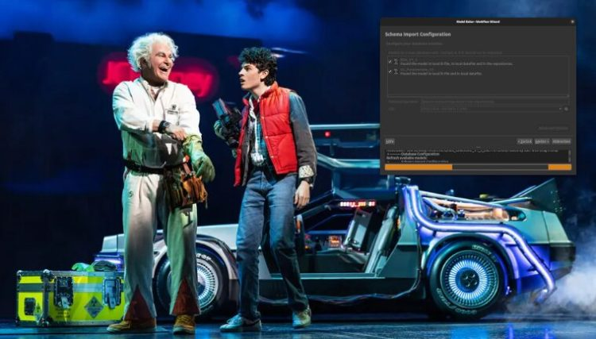
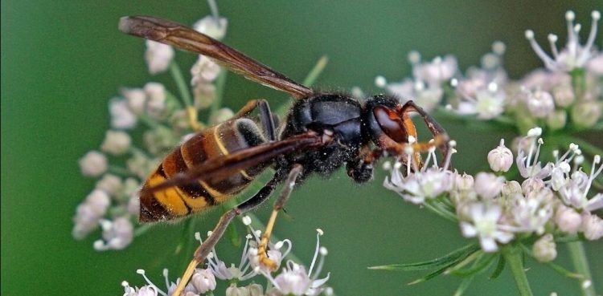
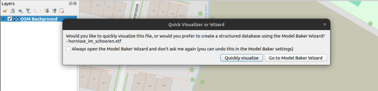
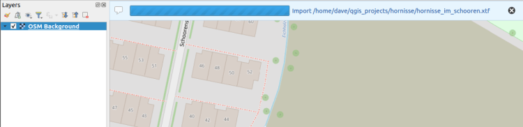
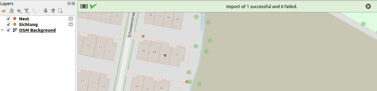
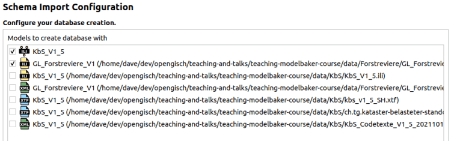
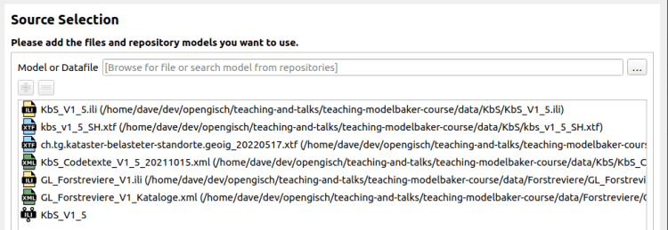
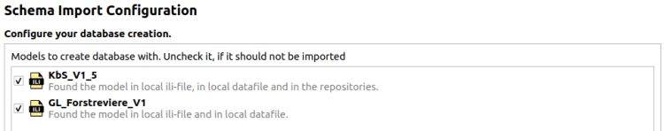
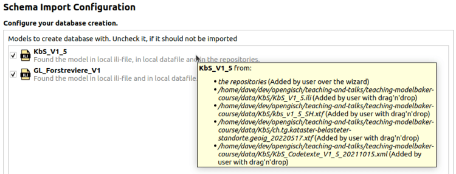
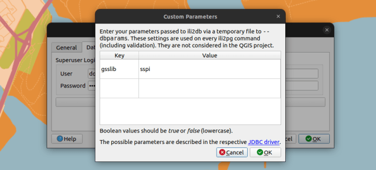

**Eine neue Major Version? Genau. Das ist[Model Baker 8](<https://github.com/opengisch/QgisModelBaker/releases/tag/v8.0.0>). Und der Grund für die Erhöhung der Version sind nicht etwa all die fancy neuen Features, sondern die Unterstützung von Qt6. Okay, natürlich auch die fancy neuen Features. Aber primär Qt6. Und weshalb das relevant ist, liest du unten.**
## Fit für die Zukunft
Qt6 ist die neueste Version des Frameworks, auf dem QGIS basiert. Der Wechsel zu Qt6 verschafft uns eine future-proof QGIS-Codebase und Verbesserungen in Bezug auf Performance und Sicherheit. Deshalb rüstet QGIS mit Version 4.0 auf. Mehr Info dazu auf dem [QGIS Blog](<https://blog.qgis.org/2025/04/17/qgis-is-moving-to-qt6-and-launching-qgis-4-0/>). Da alle QGIS-Plugins von dieser Version abhängig sind, muss auch Model Baker für Qt6 fit sein. Und das ist er. Ready to take off.
_Bild: Murphy / Zimmerman_
Nun aber genug des Langweiligen. Lasst uns mal die fancy neuen Features betrachten.
## Auf der Mauer, auf der Lauer – der neue Quick Visualizer
Ich persönlich habe kein Problem mit Insekten. Aber diese Stinkwanzen mag ich ganz und gar nicht. Weshalb sich diese invasiven Neophyten derart verbreiteten? Sie hatten lange Zeit keine natürlichen Feinde. Vor kurzem hat sich das geändert, doch leider ist das kein Grund zur Freude. Die Feindin heisst: Asiatische Hornisse.
_Bild: Charles J. Sharp_
Nicht nur ich als OPENGIS.ch Geoninja – und folglich grosser Bienenfreund – bin gegen die Verbreitung dieser Hornissen. Es wird viel dagegen unternommen. Man findet dazu sogar bereits INTERLIS Modelle.
Und stellen wir uns jetzt mal vor, so ein Hornissennesterzerstörer (ich bin mir nicht sicher, ob es sowas gibt, aber nehmen wir das doch mal an) hat gerade ein XTF gekriegt, wo die Nester zu finden sind. Die Daten werden aber invalide geliefert und die Kataloge dazu fehlen.
Die einfache Anzeige via GDAL-Treiber unterstützt INTERLIS 2.4 nicht mehr und folglich ist Drag-and-Drop in QGIS zum Anzeigen der Daten aus einer XTF-Datei nicht mehr möglich. Wir werden das Nest nicht finden. Die Hornissen werden sich überall ausbreiten. Eine Katastrophe! Panik macht sich breit. Oder doch nicht?
Zum Glück füllt die Quick Visualizer Funktion im Model Baker diese Lücke des fehlenden GDAL Supports.
Die Hornissennesterzerstörer zieht also das XTF ins QGIS…

… und er wird gefragt, ob er es „ordentlich“ mit dem Wizard importieren möchte oder mit dem Quick Visualizer. Für Ordentlichkeit hat der Hornissenzerstörer nun wirklich keine Zeit. Er wählt den Quick Visualizer.

Es wird ein GeoPackage im temporären Verzeichnis ohne Einschränkungen generiert und die Daten werden ohne Validierung importiert.

Der Hornissennesterzerstörer kann sich also um die Hornissen kümmern anstelle sich mit INTERLIS Modellen herumzuärgern. Alles gut und Happy End. Der Hornissenzerstörer fährt mit dem Elektroroller dem Sonnenuntergang entgegen
Mehr Infos zum Quick Visualizer findest du in der [Model Baker Doku](<https://opengisch.github.io/QgisModelBaker/user_guide/quick_visualizer/>).
## Keine Leichen mehr in den Join-Tabellen
Jetzt geht es nicht mehr um Bienenleichen, sondern um Datenleichen. Es wird ein bisschen technisch. Falls du noch nie Probleme mit Datenleichen hattest und dich Beziehungsstärken nicht die Biene interessieren, reicht dir vielleicht die Info, dass das Problem, das du nicht hattest, gelöst ist und du kannst folglich dieses Kapitel auch überspringen.
Für alle anderen kurz zusammengefasst: In INTERLIS kannst du drei Arten von Stärken einer Beziehung definieren.
  - Assoziation `..` : Objekte existieren unabhängig voneinander
  - Aggregation `.<>` : Untergeordnete Objekte gehören zu einem (oder keinem) übergeordneten Objekt. Sie sollten mit dem übergeordneten Objekt kopiert, aber nicht gelöscht werden.
  - Komposition `.<#>`: Untergeordnete Objekte gehören zu einem übergeordneten Objekt. Sie sollten zusammen mit dem übergeordneten Objekt kopiert und auch gelöscht werden.

Mehr Infos dazu im super coolen online [Referenzhandbuch (gilt diesbezüglich auch für 2.3)](<https://geostandards-ch.github.io/doc_refhb24/#_st%C3%A4rke_der_beziehung>), das mir ganz besonders Freude bereitet, weil man so einfach auf ein Kapitel verlinken kann.
Zurück zum Thema: normalerweise werden Kompositionen auch in QGIS zu Kompositionen und Assoziationen zu Assoziationen. Aggregationen – d. h. der Anwendungsfall mit Kopieren, aber ohne Löschen – werden in QGIS nicht unterstützt, weshalb sie ebenfalls zu Assoziationen werden.
Allerdings werden neu auch Assoziationen bzw. Aggregationen in QGIS _manchmal_ zu Kompositionen. Nämlich …
### 1\. … wenn die Kardinalität genau 1 ist:
    
        ASSOCIATION fakecomp1 =
          fakecomp_1a -- {1} ClassA1;
          fakecomp_1b -- {0..*} ClassB1;
        END fakecomp1;
Da ein solches Objekt ohne übergeordnetes Objekt nicht existieren kann.
### 2\. … oder wenn es sich um eine Verknüpfungstabelle handelt:
    
        ASSOCIATION assoc =
          assoc_a -- {0..*} ClassA1;
          assoc_b -- {0..*} ClassB1;
        END assoc;
Dies führt zu zwei QGIS-Relationen (normalisiert) mit einer Join-Tabelle dazwischen.
Wenn eines der übergeordneten Objekte gelöscht wird, wird nicht das verknüpfte Objekt, sondern der Eintrag in der Join-Tabelle gelöscht.
### Schlanker Layertree
Apropos Join-Tables: Bei der Verwendung von Katalogabfragen ist der ili2db-Parameter `coalesceCatalogueRef` sehr nützlich, um eine vereinfachte Datenbankstruktur zu erstellen. Kataloge (in INTERLIS 2.3) werden mit einer STRUCTURE erstellt, die sich auf eine CLASS bezieht, was zu ungenutzten Zwischentabellen führt.
Diese Tabellen haben zu Verwirrung geführt. Daher werden sie nicht nun mehr im Layertree angezeigt.
### GUI Tuning
Ebenfalls Verwirrungen – gerade bei neuen Usern – hat diese Page im Import/Export Wizard verursacht.

«Weshalb wird hier mehrmals dasselbe Model aufgeführt? Und welches soll ich jetzt da anwählen?»
Nun, wenn du all diese Quellen in QGIS reinlädst:

Werden die Modelle von Model Baker auf folgende Weisen erkannt:
  1. Vom manuell geladenen ILI-File
  2. Vom manuell ausgewählten Repository
  3. Aus den geladenen Katalog- und Transferfiles geparst
  4. Abhängiges Model eines Kataloges im ilidata.xml
  5. Als ili2db Attribut definiert im Metakonfigurationsfile, das über die UsabILIty Topping Funktion geladen wurde

Wenn ich also mehrere Files mit dem Model Baker öffne, dann findet es mir einerseits das KbS_V1_5, das ich über das Repository hinzugefügt habe, das aus dem im ILI File und dann noch drei mal dasselbe aus den XTF-Files geparst. Dazu wird auch GL_Forstreviere_V1 zwei mal erkannt, einmal aufgrund des ILI-Files und andererseits aufgrund des Transferfiles.
**_Doch den Usern ist zu 99% egal, woher das Modell erkannt wurde. Hauptsache das richtig Modell wird genommen._**
Deshalb wird es neu ganz einfach so zusammengefasst.

Falls du aber zum einen Prozent gehörst, das dennoch daran interessiert ist, woher genau die Modelle erkannt worden sind, gibt es den Tool Tip.

Und der Icon impliziert, woraus das Modell schlussendlich genommen wird. Sofern ein ILI-File übergeben wurde, wird das Modell auch daraus gelesen.
Weiteres Tuning wurde in der letzte Seite für die OID Konfiguration gemacht und im Validator wurde der Verbose Modus integriert und die Anzeige visuell verbessert. Weitere Infos dazu im [Changelog](<https://github.com/opengisch/QgisModelBaker/releases/tag/v8.0.1>) hier .
### Und zum Schluss noch die `dbparams`
Es ist möglich, dass du irgendwann spezifische Parameter für die Kommunikation mit der Datenbank dem ili2db übergeben möchtest . Es ist ein Side-Case, aber nur damit du informiert bist.
Zum Beispiel ist es so, dass einige Systeme mit Kerberos den Parameter `gsslib=sspi` benötigen. Dieser wird in libpq (was von QGIS verwendet wird) automatisch gesetzt, nicht aber mit JDBC. Und da ili2db JDBC verwendet, muss ihm ein File via dem Kommandoparameter `--dbparams` angegeben werden, das diesen Parameter definiert. Da es ein ziemlich generelles Setting ist, ist es im Model Baker auch generell über die Settings gelöst (und nicht in den Datenbank-Verbindungsparameter in jeder Import / Export Session).

Dies wurde übrigens vom Kanton Glarus finanziert. Vielen Dank! Die restlichen Features dieses Releases wurden von der QGIS Model Baker Gruppe ermöglicht. Genauso wie eine ordentliche Runde Bugfixing und Nachführen der Dokumentation. Und diese Gruppe wird von den Kantonen Schaffhausen, Schwyz, Thurgau, Glarus und Zug sowie der QGIS User Group Schweiz finanziert. Das sind die wahren Helden des Model Bakers. Sie stellen Unterhalt und Stabilität dieser Lösung sicher.
Für alle anderen Features und Bugfixes verweise ich gerne nochmals aufs [Changelog](<https://github.com/opengisch/QgisModelBaker/releases>). Ansonsten wünsche ich euch viel Spass! 🧁🧁🧁
### _Related_
