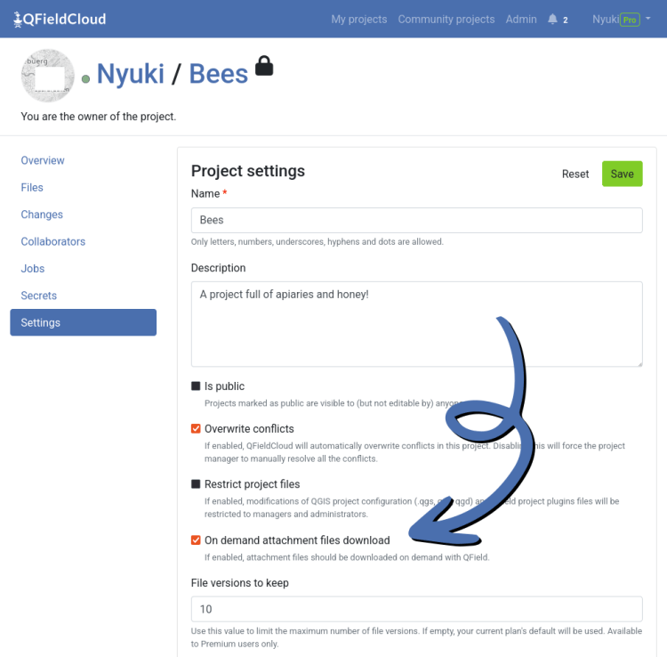

Our ninjas have been hard at work improving QFieldCloud!
In recent versions, a series of functionality improvements have had a significant impact on the way [QFieldCloud](<https://qfield.cloud/>) handles storage, and we want to tell the world!
Without further due…
## Shared datasets
Starting with version 3.6, QField supports shared datasets. Known in QGIS as “localized data paths”, this allows users to upload a single instance of a given dataset to QFieldCloud and have it embedded within multiple cloud projects.
For large datasets such as satellite imagery or topo basemaps, the benefits include:
  - Reduce the time QField users spend downloading large datasets. Once it’s fetched for one cloud project, it’ll remain available for other projects too.
  - Reduce storage usage on [QFieldCloud](<https://qfield.cloud/>) as the large datasets will only be stored on the server once.

In other words, whether you are on a free community plan or a paid subscription, you will get more value out of your QFieldCloud storage!
While the main gains are around storage, shared datasets also ease management of projects as read-only datasets such as administrative boundaries can be updated in a single location and have it reflected within all the projects using these datasets.
QField’s growing documentation site covers this functionality in depth, follow the link to [learn how to configure your projects with shared datasets](<https://docs.qfield.org/how-to/outside-layers/>).
## On-demand attachment download
A new project setting has made its way into[ QFieldCloud’s web interface](<https://qfield.cloud/>): on demand attachment file download. When turned on, QField will defer the download of image, video, audio and other file types until users open a feature form containing such an attachment.
This option can greatly reduce the time spent downloading and synchronizing projects when a large number of attachments is present.

For work in remote areas with poor connectivity, this option should not be used when users require access to attachments while offline.
However, this new behavior is ideal for fieldwork taking place within a well connected area, especially for projects spanning over a long period of time when gigabytes of accumulated attachment can transform project download into a real pain point.
## **Resumable cloud project download**
A nice QFieldCloud quality of life improvement worth highlighting here is the new ability to resume the download of large cloud project files following a connectivity failure. Driving through a tunnel in a train will never force you to lose half of your 1.5 gigabyte geotiff you had been in the process of downloading prior to losing signal! 🙂
This also means no more wasted bandwidth when connected through expensive internet service providers and mobile networks, which remains an issue in large parts of the world.
Speaking of big files, previously QFieldCloud did not support file sizes larger than 2 gigabytes. We didn’t think people should be held back here so we’ve moved the cap to 8,192 petabytes. Good luck reaching that! 😉
### _Related_
