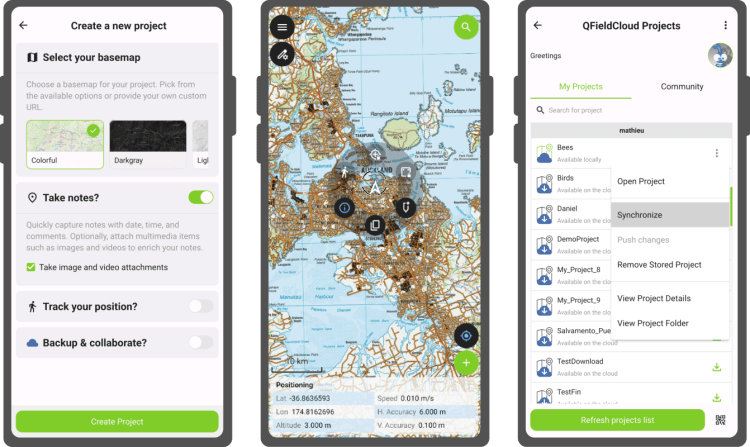
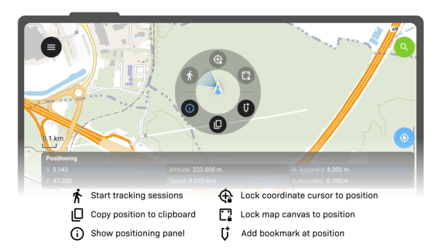

Just in time for the end of 2025, **QField 4.0** is now available in a virtual store near you. This release brings significant improvements and marks an important usability milestone, worthy of a new major version. It’s truly never been easier to get started with QField—whether you’re a seasoned GIS professional or new to spatial data collection.
## Main highlights

One of the most significant feature additions in this new version is right there on the welcome screen: **a simple wizard for creating new projects**. The wizard guides users through a set of questions covering the desired basemap style and actions such as note taking and position tracking. These projects can be published directly on [QFieldCloud](<https://qfield.cloud/>), so users can upload images, notes, and tracks that are accessible through web browsers or QGIS using QFieldSync.
The project creation framework also unlocked another feature we’re proud of: **on-the-fly conversion of imported projects to cloud projects**. The ability to upgrade pre-existing projects to cloud projects means that users can push spatial data and attachments residing on their devices to QFieldCloud and instantly collaborate with coworkers.
On the QFieldCloud front, we’ve done significant code refactoring to make synchronization and attachment uploads even more reliable. Users now see a progress bar showing attachment upload status.
The cloud projects list also lets users push changes and sync projects without opening them first. Indicator badges show whether you have pending local changes or if updates are available from the cloud.
## A leaner, clearer, and more focused user interface
Early on in this development cycle, our ninjas decided to make a significant leap forward with QField’s UX focusing on making the user interface leaner when possible, clearer when needed, and more focused throughout. 
QField now has a **vastly more readable feature form when** viewing feature attributes. We’ve also **made the interface more consistent** by updating all editor widgets to use Qt’s Material style, so comboboxes, text fields, and other elements now have a unified look.

We’ve also **simplified the user experience around positioning**. The map canvas now has a single positioning button at the bottom right. Click the location marker overlay to reveal a new pie menu with quick access to positioning features: start tracking sessions, copy position to clipboard, show the positioning panel, lock the coordinate cursor to position, lock the map canvas to position, and add bookmarks at your position.
Now when users set accuracy thresholds, tracking sessions and averaged positioning will automatically filter out “bad accuracy” readings.
QField also animates transitions when jumping to your GNSS position, features, or coordinates, making navigation feel smoother and more intuitive.
## Wait, there’s more
Beyond these major improvements, QField 4.0 includes tons of new features:
  - **Multilingual projects** – [a feature we added to QGIS several years ago](</2018/09/11/qgis-speaks-a-lot-of-languages/index.html>) – are now supported in QField
  - When connected to the internet, QField now displays online legend graphics for WMS and Esri map services, providing crucial context for field users
  - Additional feature form widgets are now supported, including the spacer widget and color editor widget, further improving interoperability with QGIS

A [complete list of changes is available in the QField release notes](<https://github.com/opengisch/QField/releases/tag/v4.0.0>) on GitHub.
## A new release cycle focused on water bodies
With the **QField 4.X** series, we’re introducing a new naming theme focused on **water bodies**.
Oceans, rivers, lakes, wetlands, and coastal waters are fundamental to life on Earth. They provide drinking water, support ecosystems and agriculture, regulate climate, and sustain communities worldwide. Yet these vital resources are increasingly under pressure from pollution, overuse, and climate change.
At **OPENGIS.ch** , we believe that better spatial data leads to better decisions. By making field data collection easier and more accessible, we aim to support those working to understand, protect, and manage these fragile systems. Dedicating this release cycle to water bodies reflects our commitment to using technology responsibly and connects naturally with the **United Nations Sustainable Development Goals** , which we consistently strive to support through our work.
For the first release in this cycle, we chose a water body of particular significance to QField: Switzerland’s longest river entirely within the country, **Aare**.
As always, we hope you enjoy this new release.  
Happy field mapping!
### _Related_
