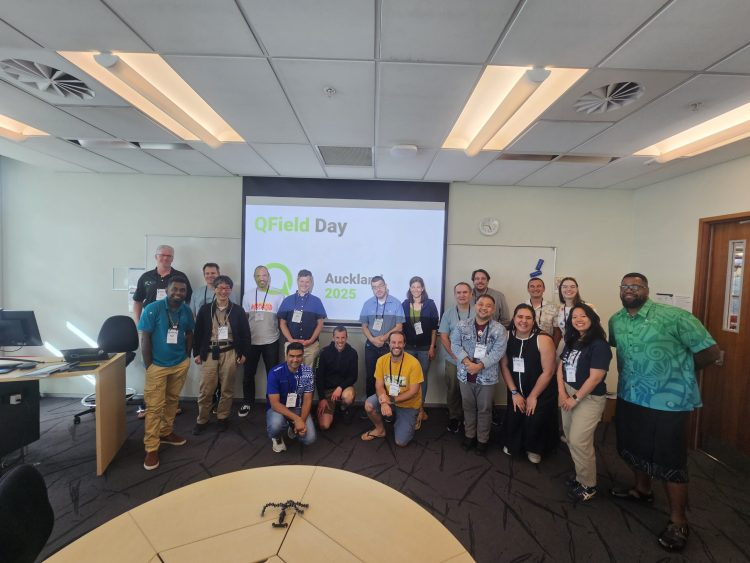
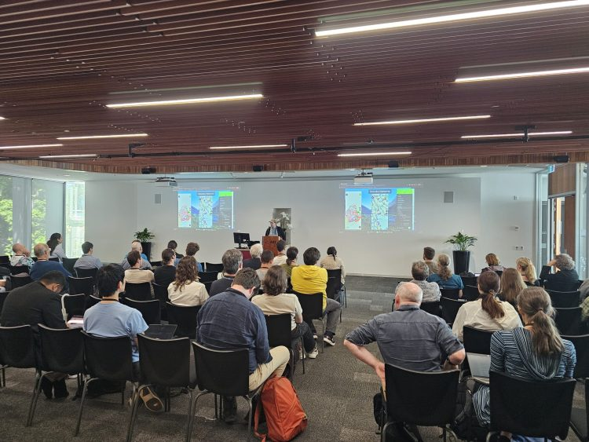
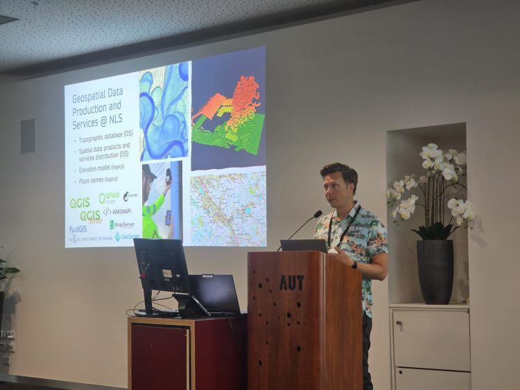
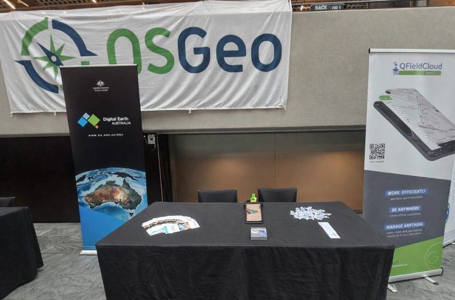

# **QField at FOSS4G 2025 Auckland: From Mobile App to Production Infrastructure**
Throughout the week, in workshops, presentations, and project showcases, a consistent theme emerged: QField is not just “the mobile companion to QGIS,” it is **production infrastructure for complete field-to-cloud-to-desktop workflows.**
It was incredible to see how present QField was throughout FOSS4G 2025 in Auckland. With around 20 presentations and workshops featuring QField, the conference showcased a wide range of real-world, production-grade use cases across many sectors. 
What stood out was not just the number of talks, but how consistently QField was presented as a trusted, operational tool rather than an experiment.
## The QField Ecosystem in Practice
**QGIS Desktop** for project design, analysis, and quality assurance  
**QField** for field capture, with offline-first capabilities when connectivity is limited  
**QFieldCloud** for real-time synchronization, team coordination, and project management  
**Plugins and APIs** for integration into broader organizational systems
This ecosystem approach transforms field data collection from an isolated task into an integrated workflow. It’s the difference between “collecting points” and “running a programme.”
## QField Day: A Community Deep Dive

Early in the conference, QField Day brought together practitioners, developers, and decision-makers for a focused exploration of the platform’s capabilities. The day emphasized practical implementation—what’s possible now, and what organizations are already achieving in production environments.
## Workshops
### Complete Lifecycle Management
The QField & QFieldCloud workshop covered the full data collection cycle: project setup in QGIS Desktop, field deployment with QField, synchronization through QFieldCloud, and integration back into desktop workflows for analysis and quality control. Participants worked through the entire pipeline, from initial design to final deliverables.

### Field-to-Analysis Integration
One workshop demonstrated the speed of modern field-to-cloud-to-analysis workflows by using Auckland itself as a live laboratory. Participants collected ground truth data with QField, then fed it directly into machine learning workflows running in Digital Earth Pacific’s Jupyter environment. The exercise highlighted how quickly iteration cycles can operate when field, cloud, and analysis infrastructure are properly connected.
### Plugin Development
For developers, the plugin authoring workshop signaled platform maturity. QField’s plugin framework—built on QML and JavaScript enables organizations to extend core functionality for specific operational requirements. Custom forms, specialized integrations, and domain-specific interfaces can be developed to address the edge cases that real field programmes encounter.
## Operational Workflows: Digital Earth Pacific
**Platform Integration** : [QField participatory mapping integration into Digital Earth Pacific](<https://www.youtube.com/watch?v=UxgZ8xCk0io>) demonstrated the technical workflow connecting field data collection to analysis infrastructure, using Digital Earth Pacific’s open data cube and Jupyter tooling.
**Applied Case Study** : [Identifying Forest Invasive Species in Fiji and Tonga Using Machine Learning](<https://www.youtube.com/watch?v=b_ikZUAboKM>) showed this workflow in action. Field teams collect confirmed invasive species locations using QField, then train detection models using time-series satellite data, iterating with domain experts and local partners to refine results.
## Production Deployments
### Conservation Operations
[Zero Invasive Predators](<https://www.youtube.com/watch?v=cNRbeHH85no>) showed QField and QFieldCloud integrated into operational fieldwork for predator eradication programmes across New Zealand. Planning happens in QGIS, capture in QField, and coordination through QFieldCloud—enabling systematic management of conservation campaigns across remote terrain.

### Government-Scale Implementation
[Finland’s National Land Survey](<https://www.youtube.com/watch?v=lVMLaTMP9qA>) presented their use of QField as part of national topographic data production infrastructure, deployed alongside QGIS and PostGIS. This represents enterprise validation: a national mapping agency selecting QField for production topographic surveying.

### Precision Agriculture
[Smart vineyards with QGIS & QField](<https://www.youtube.com/watch?v=YLIL6RHaI3U>) demonstrated advanced symbology, map themes, and structured capture workflows supporting precision agriculture operations—showing that the platform handles the level of detail and complexity that professional workflows require.
## Developer Infrastructure and Sustainability
### QFieldCloud API
The [QFieldCloud API session](<https://www.youtube.com/watch?v=tQeD31jiO1w>) focused on programmatic integration for organizations with existing systems. The API enables automation, custom integrations, and connection to enterprise infrastructure—essential for organizations moving beyond standalone deployments.
### Open Source Business Models
[Who Pays Your Bills?](<https://www.youtube.com/watch?v=9qffw5vdDek>) offered a transparent discussion of what it takes to build sustainable businesses around QGIS and QField. These conversations matter for the broader open-source geospatial ecosystem, addressing the practical realities of long-term project sustainability.
## Platform Maturity
[[Re]discover QField[Cloud]](<https://www.youtube.com/watch?v=1BqGF5mMkbs>) highlighted how platform maturity often manifests as steady capability growth—the accumulation of thoughtful improvements driven by real field workflows rather than flashy feature releases.
## Context: Open Tools for Public Good
Two presentations framed QField’s development within broader conversations about open tools and long-term impact.
[Mapping the World, Empowering People: QField’s Vision in Practice](<https://www.youtube.com/watch?v=r75sNMoTtk4>) connected QField’s technical capabilities to public-good outcomes, addressing how tools enable not just efficiency but meaningful impact.
[Open-source road infrastructure management and digital twin direction](<https://www.youtube.com/watch?v=rT2Jev2DubA>) demonstrated that open standards and open tooling are increasingly part of serious infrastructure conversations—and that many organizations are still transitioning from spreadsheet-based workflows to structured spatial data management.
## Looking Forward
FOSS4G 2025 Auckland was all about the conversations, and our small booth quickly became a popular meeting point — the **QField caps were gone within half a day**. We demonstrated the tight integration of[ **Happy Mini Q GNSS**](<https://happy-q.com/>) with **QField** , showing how sub-centimeter positioning can be used seamlessly in real field workflows. The booth also featured **[EGENIOUSS](<https://www.egeniouss.eu/>)** , an EU project where QField is part of the solution to complement GNSS with visual localisation, enabling accurate and reliable positioning even in challenging environments such as urban canyons where satellite signals alone fall short.

Thank you to everyone who took the time to share your workflows, your challenges, and your stories—whether in presentations, workshops, or over coffee between sessions.
Hearing how you’re using QField in the field, what’s working, what needs improvement, and what you’re building next helps us understand where the platform needs to go.
These conversations remind us that we’re building tools for real people doing important work, and that’s what keeps this community moving forward together.
### _Related_
